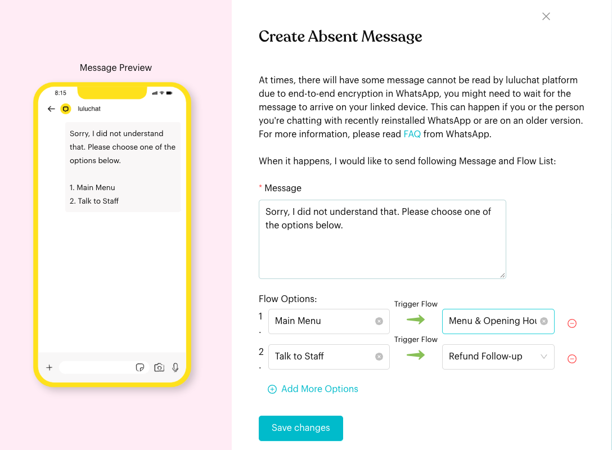

# Absent Flow

## What is Absent Flow?

The **Absent Message** is an automatic reply for messages that Luluchat can't read yet. It sends a message plus a numbered list of options, and each option starts one of your message flows.

In the app: "At times, there will have some message cannot be read by luluchat platform due to end-to-end encryption in WhatsApp, you might need to wait for the message to arrive on your linked device. This can happen if you or the person you're chatting with recently reinstalled WhatsApp or are on an older version."

Unlike the other basic flows, the Absent Message isn't built in the flow editor. You set it up in one window.

## When does it trigger?

* When a contact's WhatsApp message can't be read by Luluchat because of end-to-end encryption (for example, after the contact reinstalled WhatsApp).
* Only if the **Absent Message** card is switched **On**.

## How to set it up (Step by Step)



#### Create at least one active flow

The options in the Absent Message start your own message flows, so you need at least one flow that is switched **On**. If you don't have one, the window says "Please Create Message Flow before configure this section." and you can't save.



#### Click Configure on the Absent Message card

Go to **Automations** > **Message Flows**. Under **Basic Message Flow**, click **Configure** on the **Absent Message** card. The **Create Absent Message** window opens. The phone on the left shows a preview of what the contact will see.



#### Write the message

Under **Message**, write what the contact should read. A ready-made text is filled in for you: "Hi, unfortunately our inbox message is overflowing and we couldn't process your request at this moment. Please reply with the number that describes your interest in following options:"



#### Add the options

Under **Flow Options**, for each option:

1. Type the label the contact sees (**Enter Option Label**), for example "Main Menu".
2. Under **Trigger Flow**, choose the flow it should start.

Click **Add More Options** to add another option. Click the red **⊖** to remove one.

The options appear as a numbered list under your message (1. Main Menu, 2. Talk to Staff, and so on).



#### Save

Click **Save changes**. You see "Absent Message updated successfully." Then make sure the card is switched **On**.

<figure><figcaption>
Create Absent Message
</figcaption></figure>



## What happens after it triggers?

The contact receives your message with the numbered options. Each option is linked to the flow you chose under **Trigger Flow**.

## Important behavior to know

* **Set up in a window, not the editor**: The **Absent Message** card always shows **Configure**, even after you save. Click it to view or change your settings.
* **Only active flows can be chosen**: The **Trigger Flow** list only shows flows that are switched **On**.
* **On/Off**: The card's switch turns the Absent Message on or off.

## Common issues & solutions

* **"Please Create Message Flow before configure this section."**: You don't have any active flows. Create a flow (or switch one **On**) first.
* **"Please input message."**: The **Message** field is empty.
* **"Please input option label"**: An option has no label.
* **"Please select flow"**: An option has no flow under **Trigger Flow**.
* **A flow is missing from the Trigger Flow list**: That flow is switched **Off**. Turn it **On** on its card.

## Best practice 💡

* Offer 2–4 short options, such as "Main Menu" and "Talk to Staff".
* Link one option to a flow that hands the chat to a team member.
* Keep the message friendly and explain that you'll get back to the contact.

## Related Documentation

* [Fallback & Consent Flows](../core-features/index-1/message-flows/fallback-and-consent-flows/README.md)
* [Default Flow](default-flow.md)
* [Message Flows](message-flows.md)
