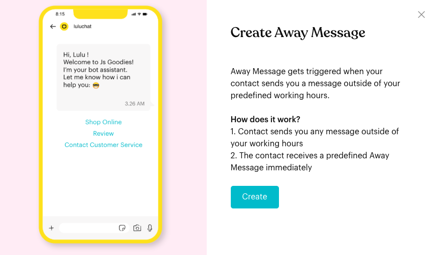
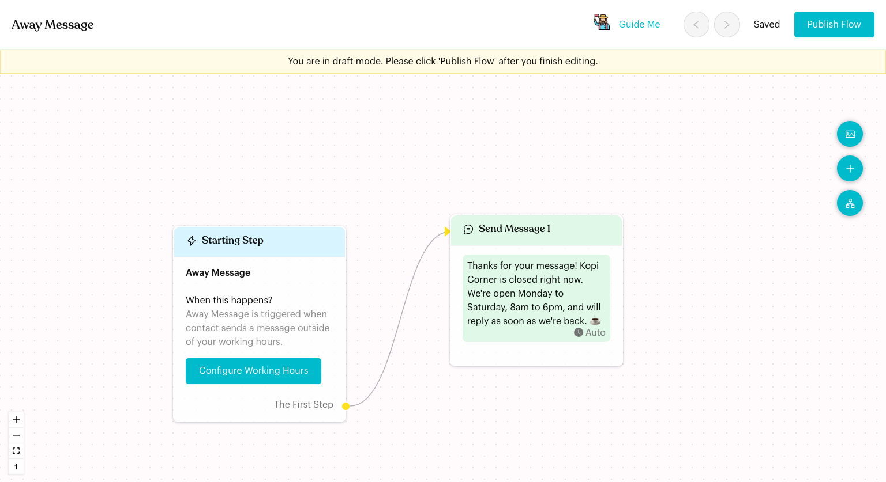
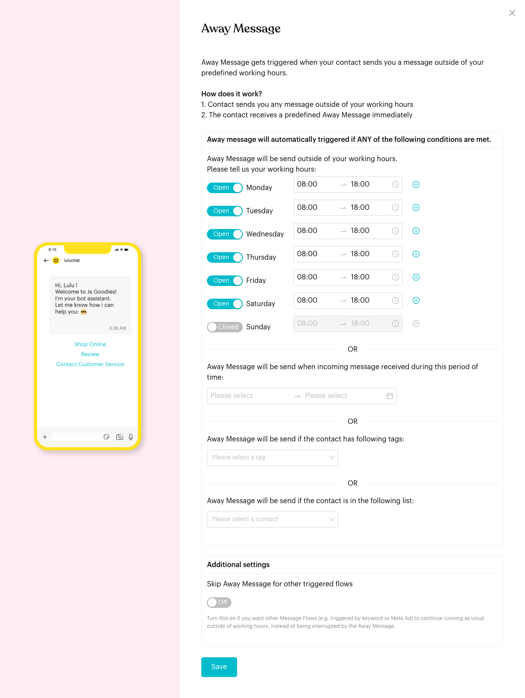

# Away Flow

## What is Away Flow?

The **Away Message** is the flow that replies when a contact messages you while you're away, for example outside your opening hours. It lets the contact know you got their message and when you'll reply.

In the app: "Away Message gets triggered when your contact sends you a message outside of your predefined working hours."

## When does it trigger?

The Away Message is sent if **any** of these conditions is met:

* The message arrives outside your working hours.
* The message arrives during a period you set (for example, a public holiday).
* The contact has one of the tags you choose.
* The contact is in the list of contacts you choose.

It only runs if the Away Message is published and its card is switched **On**.

## How to set it up (Step by Step)



#### Click Configure on the Away Message card

Go to **Automations** > **Message Flows**. Under **Basic Message Flow**, click **Configure** on the **Away Message** card. Then click **Create**.

<figure><figcaption>
Create Away Message
</figcaption></figure>



#### Edit the message

The flow opens in draft mode. The **Starting Step** says **Away Message**, and it's connected to **Send Message 1** with a ready-made text: "Thank you for your message. We're unavailable right now, but will respond as soon as possible."

Click **Send Message 1** to change the text. You can add more steps if you like.

<figure><figcaption>
Away Message flow
</figcaption></figure>



#### Set your working hours and conditions

On the **Starting Step**, click **Configure Working Hours**. In the **Away Message** window:

* **Working hours**: For each day, switch **Open** or **Closed** and set the opening time range. Click **⊕** to add another time range on the same day (for example a lunch break). If the end time is earlier than the start time, it's treated as running past midnight.
* **OR** a period: Under "Away Message will be send when incoming message received during this period of time", pick a start and end date and time.
* **OR** tags: Under "Away Message will be send if the contact has following tags", choose tags.
* **OR** contacts: Under "Away Message will be send if the contact is in the following list", choose contacts.
* **Additional settings** > **Skip Away Message for other triggered flows**: Turn this on if you want other message flows (for example, triggered by a keyword or Meta ad) to keep running as usual outside working hours, instead of being interrupted by the Away Message.

Click **Save**. You see "Working hours has been saved. To apply the changes to the production environment, please remember to click "Publish Flow"."

<figure><figcaption>
Working hours and conditions
</figcaption></figure>



#### Publish

Click **Publish Flow**. Check that the **Away Message** card is switched **On**.



## What happens after it triggers?

The contact receives the steps in your Away Message flow. Unless you turned on **Skip Away Message for other triggered flows**, the Away Message replies instead of your other flows while you're away.

## Important behavior to know

* **Any condition is enough**: The working hours, period, tags and contacts are "OR" conditions. If any one matches, the Away Message is sent.
* **Working hours must be set before publishing**: If you publish without saving working hours, you see "Please configure your working hours".
* **Publish after changing hours**: Saving the working hours only updates the draft. Click **Publish Flow** to apply them.
* **View only in the published view**: In the published view, the button says **View Working Hours** and the window says "You are currently in preview mode. Please go to Edit Flow to modify the settings."
* **No triggers or Flow Settings**: The Away Message has no triggers on its **Starting Step** and no **Flow Settings** button.

## Common issues & solutions

* **"Please configure your working hours"**: Click **Configure Working Hours**, set your hours, click **Save**, then publish again.
* **The Away Message is sent during opening hours**: Check that today is switched **Open** with the right times. Also check the period, tags and contacts conditions; any of them can trigger it.
* **Keyword flows stop working after hours**: Turn on **Skip Away Message for other triggered flows** and publish.
* **Changes to hours don't apply**: You saved them but didn't publish. Click **Publish Flow**.

## Best practice 💡

* Say when you'll be back, for example "We're open Monday to Saturday, 8am to 6pm."
* Use the period option for public holidays such as Hari Raya or Chinese New Year.
* Offer a self-service option, such as "Reply MENU to see our menu", so contacts can still get answers.

## Related Documentation

* [Fallback & Consent Flows](../core-features/index-1/message-flows/fallback-and-consent-flows/README.md)
* [Default Flow](default-flow.md)
* [Message Flow Editor](message-flows-editor.md)
