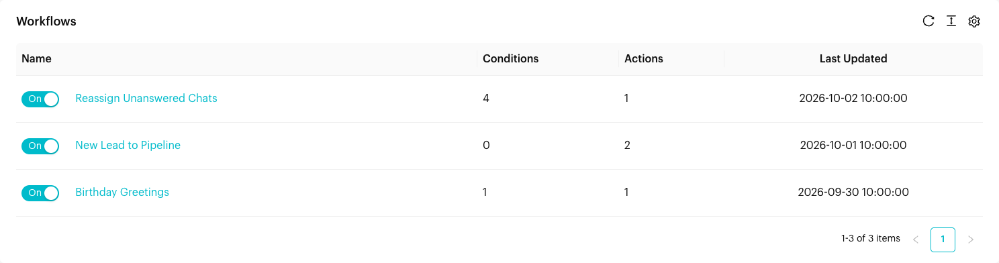
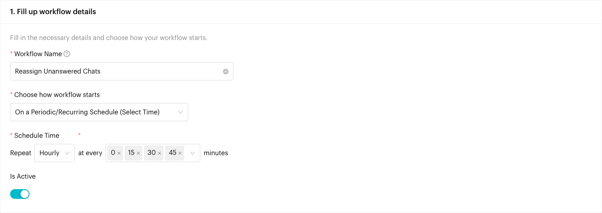
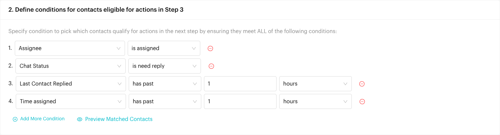
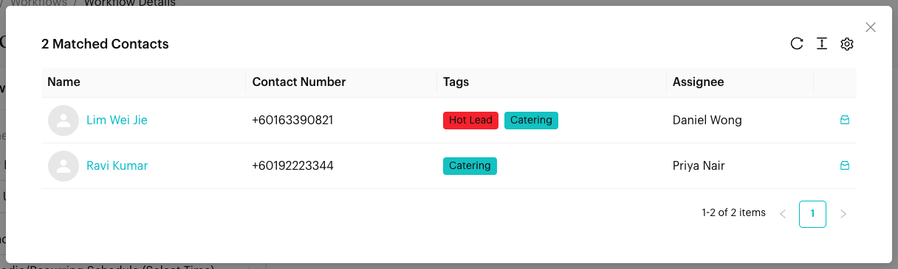
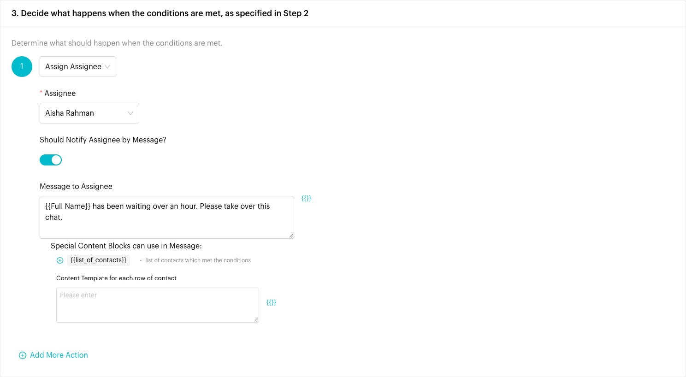
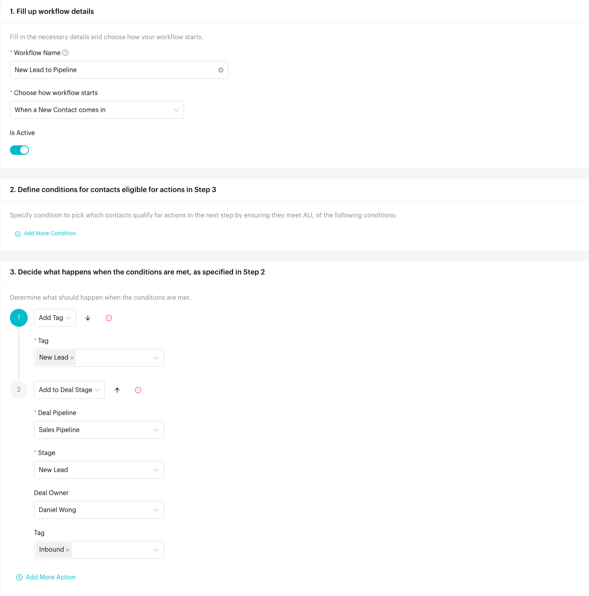
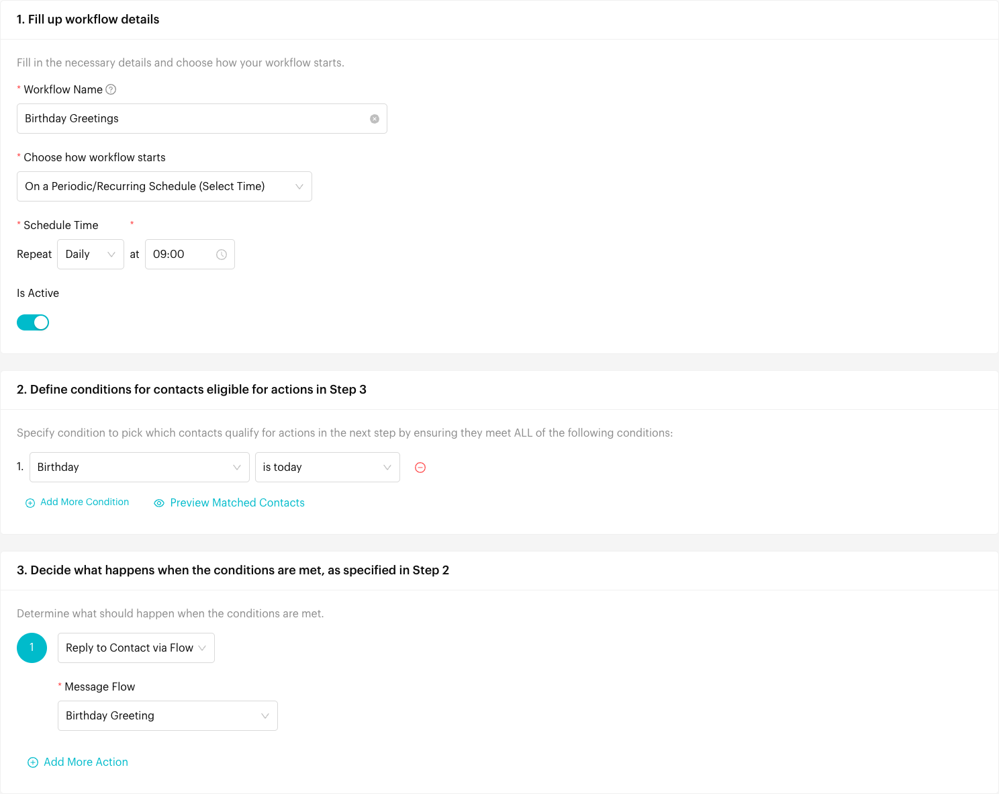

# Common Scenarios

## What is this page?

This page shows how to set up automations for requests we hear most often, step by step. Each scenario tells you which tool to use (a **Workflow** or a **Message Flow**), exactly what to choose in each field, and what to watch out for.

If you are not sure which tool you need, start here:

| You want to… | Use | Why |
| --- | --- | --- |
| Hold a conversation with the customer (ask questions, send menus, wait for replies) | [Message Flow](message-flows.md) | A flow sends messages step by step and reacts to what the customer sends. |
| React to something a customer does, such as sending a keyword or messaging from an ad | [Message Flow](message-flows.md) | The flow's [Trigger](steps/trigger.md) starts it. |
| Tag, assign, route or move contacts that meet certain conditions, with no conversation | [Workflow](workflows.md) | A workflow checks conditions and runs actions. |
| Do something on a schedule, such as every hour or every morning | [Workflow](workflows.md) | Only workflows can run on a schedule. |
| Send a message to contacts picked by a condition, such as a birthday | Both | A workflow picks the contacts and sends them a Message Flow. |


Workflows run on the channel you are on, and need to be **On** in the list. Message Flows need to be **published** and **On**. If something doesn't run, check these first.


<figure><figcaption>
The three workflows built on this page
</figcaption></figure>

***

## Scenario 1: Reassign a chat when the assignee hasn't replied in 1 hour

**Goal:** A chat is assigned to a team member, but they haven't replied to the customer for an hour. Pass the chat to someone else (for example a manager, or the next person in a queue) so the customer isn't left waiting.

**Tool:** A **Workflow** on a **periodic schedule**. Workflows have no "wait 1 hour" step, so instead the workflow runs every hour and looks for chats that have been waiting too long.



#### Create the workflow

Go to **Automations** > **Workflows** and click **Create Workflow**.

* **Workflow Name**: "Reassign Unanswered Chats"
* **Choose how workflow starts**: **On a Periodic/Recurring Schedule (Select Time)**
* **Repeat**: **Hourly**, **at every** 0, 15, 30 and 45 **minutes**

Running four times an hour means a chat is picked up within 15 minutes of passing the 1-hour mark. Choose just **0** if once an hour is enough.

<figure><figcaption>
An hourly schedule that runs every 15 minutes
</figcaption></figure>



#### Add the conditions

Click **Add More Condition** and add these four. A contact must meet all of them.

| # | Field | Operator | Value |
| --- | --- | --- | --- |
| 1 | **Contact** > **Assignee** | **is assigned** | |
| 2 | **Chat** > **Chat Status** | **is need reply** | |
| 3 | **Contact** > **Last Contact Replied** | **has past** | 1 **hours** |
| 4 | **Conversation** > **Time assigned** | **has past** | 1 **hours** |

What each one does:

1. Only chats that have an assignee. Unassigned chats are handled by your normal routing.
2. The customer sent the last message and nobody has replied yet.
3. That message is at least an hour old.
4. The assignee has had the chat for at least an hour. This matters after the workflow reassigns a chat: **Time assigned** resets to the moment of reassignment, so the new assignee gets a full hour before the workflow looks at the chat again.

<figure><figcaption>
The four conditions, all of which must be met
</figcaption></figure>

Click **Preview Matched Contacts** to see which chats would be reassigned right now.

<figure><figcaption>
Chats that have been waiting over an hour right now
</figcaption></figure>



#### Add the action

Click **Add More Action** and pick one of these:

* **Assign Assignee**: Choose the person who takes over, for example a supervisor. Turn on **Should Notify Assignee by Message?** and write a **Message to Assignee** such as "{{Full Name}} has been waiting over an hour. Please take over this chat."
* **Assign Multiple Assignee by Queue (Round Robin)**: Choose several team members. Each unanswered chat goes to the next person in turn. Use this if you don't want everything landing on one person.

<figure><figcaption>
Hand the chat to a supervisor and notify them
</figcaption></figure>

Click **Submit** and make sure the workflow is **On**.



**Things to know**

* **Working hours**: As written, the workflow also runs at night and on weekends. To limit it, add **Event Time** > **Occurrence Time** **in between time** 09:00 and 18:00, and **Occurrence Date** **is on** Monday to Friday.
* **Only chats the assignee never answered**: If you only want to catch assignees who never replied at all since the chat was given to them, replace condition 3 with **Conversation** > **Response time after assignment** **is unknown**. Luluchat clears this value every time a chat is assigned and fills it when the assignee replies.
* **Escalating again**: If the new assignee also goes quiet for an hour, the workflow runs again for the same chat. With **Round Robin**, the chat moves on to the next person. With **Assign Assignee**, it stays with the same person and they get the notification again.
* **Keep the original assignee in the loop**: Add a second action, **Add Collaborators**, and pick the people who should still see the chat. There is no way to add "the previous assignee" automatically, so this works best when you know who that is, for example in a small team.

***

## Scenario 2: Tag new leads and add them to the Lead stage

**Goal:** Every new contact who messages you is tagged "New Lead" and gets a deal in the **New Lead** stage of your sales pipeline, so the sales team sees them on the [Deals Board](../deals/board.md) straight away.

**Tool:** A **Workflow** that starts **When a New Contact comes in**. This fires once for each contact, the first time they message your channel, so each lead gets exactly one deal.


You need the **Deals** module, a pipeline, and a stage in it named for example **New Lead**. See [Deals](../deals/index.md). Create the "New Lead" tag first in [Tags](../settings/data/tags.md), or type it in the action and it is created for you.




#### Create the workflow

Go to **Automations** > **Workflows** and click **Create Workflow**.

* **Workflow Name**: "New Lead to Pipeline"
* **Choose how workflow starts**: **When a New Contact comes in**

Leave the conditions empty so it runs for every new contact.



#### Add the actions

Click **Add More Action** twice:

1. **Add Tag**: Choose **New Lead**.
2. **Add to Deal Stage**:
   * **Deal Pipeline**: your sales pipeline, for example **Sales Pipeline**
   * **Stage**: **New Lead**
   * **Deal Owner** (optional): the person who follows up new leads, for example Daniel Wong. Leave empty to assign owners later on the board.
   * **Tag** (optional): a deal tag such as **Inbound**

<figure><figcaption>
The New Lead to Pipeline workflow
</figcaption></figure>

Click **Submit** and make sure the workflow is **On**.



#### Test it

Message your channel from a phone number that has never contacted it before. The contact appears with the **New Lead** tag, and a deal for them appears in the **New Lead** stage.



**Variations**

* **Only leads from a certain source**: If a "lead" means someone who messaged from a specific Meta ad, sent a keyword like "quote", or clicked a WhatsApp link, use a **Message Flow** instead. Add the matching [trigger](steps/trigger.md) to the Starting Step, then an **Actions** step with [Add Tag](logics/actions/add-tag.md) and [Add to Deal Stage](logics/actions/add-deal-stage.md). You can then continue the flow with a welcome message or a [Form](content-nodes/form.md) to collect their details.
* **Only new contacts from certain numbers**: Add a condition **Contact** > **Phone Number** **starts with** +60 (or your country code) to skip overseas numbers.
* **Move the lead later**: When a lead replies to your quote or books a call, use **Update Deal Stage** (in a workflow or a flow) to move the same deal to the next stage instead of creating another one.

**Things to know**

* **Add to Deal Stage creates a new deal every time it runs.** That is fine with **When a New Contact comes in**, which fires once per contact. Avoid it in workflows that start on every incoming message, or a contact ends up with a deal per message.
* **Existing contacts are not affected.** The workflow only runs for contacts created after you switch it on. To tag and add deals for contacts you already have, use [Bulk Updates & Actions](../contacts/bulk-actions.md).

***

## Scenario 3: Send a birthday message based on an Anniversal Date attribute

**Goal:** Each contact has a birthday saved in a custom attribute. Send them a birthday greeting (or a voucher) automatically, without anyone checking dates by hand.

**Tool:** A custom attribute of type **Anniversal Date**, a **Message Flow** with the greeting, and a daily **Workflow** that finds today's birthdays and sends them the flow.



#### Create the attribute and fill it in

Go to **Settings** > **Data Management** > **Custom Attributes** and click **Create Custom Attribute**.

* **Name**: "Birthday"
* **Data Type**: **Anniversal Date**

An Anniversal Date is a day and month that repeats every year, which is exactly what a birthday is. Fill it in on each contact's profile, through [Import & Export](../contacts/import-export.md), or with a [Form](content-nodes/form.md) that saves the answer to the attribute.



#### Build the greeting flow

Go to **Automations** > **Message Flows** and create a flow called "Birthday Greeting". Add a [Message](content-nodes/message.md) such as:

> Happy birthday, {{Full Name}}! 🎂 Show this message at Kopi Corner this month for a free slice of cake.

Add any extra steps you like, such as an [Add Tag](logics/actions/add-tag.md) action with the tag **Birthday Voucher Sent**. Leave the Starting Step without a trigger: the workflow starts this flow. Click **Publish Flow**.


On a **WhatsApp Business API (WABA)** channel, most contacts won't have messaged you in the last 24 hours on their birthday, so a normal message can't be delivered. Use a [Message Template](content-nodes/message-template.md) as the first step of the flow instead.




#### Create the daily workflow

Go to **Automations** > **Workflows** and click **Create Workflow**.

* **Workflow Name**: "Birthday Greetings"
* **Choose how workflow starts**: **On a Periodic/Recurring Schedule (Select Time)**
* **Repeat**: **Daily**, **at** 09:00

Add one condition:

| Field | Operator |
| --- | --- |
| **Custom Attributes** > **Birthday** | **is today** |

Luluchat compares only the day and month of an Anniversal Date, so a birthday saved as 14 March 1990 matches on 14 March every year.

Add one action: **Reply to Contact via Flow**, and choose **Birthday Greeting**.

<figure><figcaption>
The Birthday Greetings workflow
</figcaption></figure>

Click **Submit** and make sure the workflow is **On**.



#### Test it

Set your own contact's **Birthday** to today, then click **Preview Matched Contacts** in the workflow. You should see yourself in the list. The message arrives at the next 09:00 run.



**Variations**

* **The whole birthday month**: To greet everyone with a birthday this month on the 1st (for example to send a month-long voucher), set **Repeat** to **Monthly**, **on** the 1st, and change the condition to **Birthday** **in upcoming** 30 **days**. Each contact then gets the message once, at the start of their birthday month.
* **A few days early**: Keep the daily schedule and use **Birthday** **in upcoming** 3 **days** so the greeting lands before the day. Because the workflow runs daily, add a second condition **Tag** **does not contain** **Birthday Voucher Sent**, and have the flow add that tag. Otherwise the contact receives the message three days in a row. Remove the tag again after the birthday with a **Remove Tag** workflow, or simply before the next year.
* **Other anniversaries**: The same setup works for a "Member Since" or "Wedding Anniversary" attribute. Only the attribute name and the message change.
* **Only opted-in contacts**: If the greeting is promotional, keep your [Opt-In / Opt-Out](opt-in-flow.md) flows in place. Contacts who opted out don't receive automated messages.

**Things to know**

* **It needs a value**: Contacts with an empty **Birthday** never match. Use **Preview Matched Contacts** to check the attribute is filled in for the contacts you expect.
* **Time zone**: "Today" and the 09:00 run time follow your team's time zone.
* **Once per run**: A daily workflow sends the flow once on the day. If you also run the monthly variation, a contact can receive both messages, so pick one.

***

## Related Documentation

* [Workflows](workflows.md)
* [Message Flows](message-flows.md)
* [Trigger](steps/trigger.md)
* [Actions](logics/actions.md)
* [Custom Attributes](../settings/data/custom-attributes.md)
* [Deals](../deals/index.md)
* [Tags](../settings/data/tags.md)
