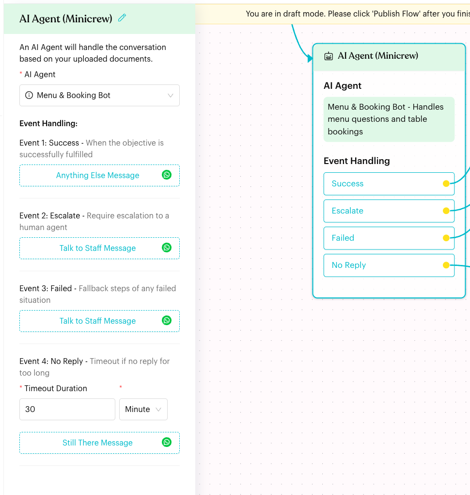
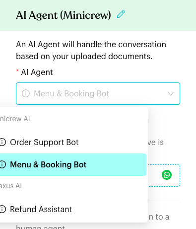
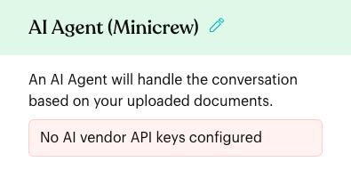

# AI Agent

## What is the AI Agent node?

The **AI Agent** node hands the conversation to an AI agent you created in **Minicrew AI** or **Praxus AI**. In the app: "An AI Agent will handle the conversation based on your uploaded documents." The agent chats with the contact, and the flow continues through one of four events: **Success**, **Escalate**, **Failed** or **No Reply**.

<figure><figcaption>
An AI Agent node with all four events linked
</figcaption></figure>

## When to use it?

* **Open questions**: Let customers ask about the menu, prices or opening hours in their own words.
* **Bookings and orders**: Let the agent guide the customer and then hand back to the flow.
* **Before your team steps in**: Let the agent answer first, and escalate to staff when needed.

## How to set it up (Step by Step)



#### Connect your AI provider

Connect **Minicrew AI** (or **Praxus AI**) in **Settings > Account > [Integration](../../settings/account/integration.md)**, and create your agent in that provider.



#### Add the node

In draft mode (click **Edit Flow**), click **+** (**Add Node**) and choose **Minicrew AI Agent** under **Content**. A node called **AI Agent (Minicrew)** is added. Click it to open the settings.

To send contacts here from a reply button, open the reply in a [Message](message.md) node and choose **Select Existing Step**, then pick this node.



#### Choose the agent

In **AI Agent**, choose your agent. Agents are grouped by provider (**Minicrew AI** and **Praxus AI**). Hover over the **i** icon to see an agent's description.

<figure><figcaption>
Choosing an AI agent
</figcaption></figure>



#### Set up Event Handling

Under **Event Handling**, click the button under each event and choose the next step (**Choose Next Step**):

| Event | When it happens |
| --- | --- |
| **Success** | When the objective is successfully fulfilled |
| **Escalate** | Require escalation to a human agent |
| **Failed** | Fallback steps of any failed situation |
| **No Reply** | Timeout if no reply for too long |

For **No Reply**, set the **Timeout Duration** and choose **Minute**, **Hour** or **Day**. The default is 30 minutes.



#### Publish

Check that every event is linked (unlinked events show in red on the node), then click **Publish Flow**.



## What happens after it triggers?

* The selected agent takes over the conversation with the contact.
* When the agent finishes, the flow continues from the matching event: **Success**, **Escalate** or **Failed**.
* If the contact doesn't reply within the **Timeout Duration**, the flow continues from **No Reply**.
* The node has no **Next Step**. Only the four events lead onwards.

## Important behavior to know

* **Minicrew AI is required to add the node**: Without a Minicrew AI connection, **Minicrew AI Agent** is greyed out with "Integration with Minicrew is required".
* **Match the provider**: Nodes added from the menu are Minicrew AI steps. Choose an agent from the **Minicrew AI** group, otherwise the node can't show the agent's name.
* **Agents come from your provider**: The list is loaded from Minicrew AI and Praxus AI each time you open the node. Create or edit agents in the provider, not in Luluchat.

## Common issues & solutions

* **"No AI vendor API keys configured"**: No AI provider is connected. Connect Minicrew AI or Praxus AI in **Settings > Account > Integration**.

* **"Please create an AI Agent in Praxus AI or Minicrew AI"**: You are connected, but have no agents yet. Create one in your provider.
* **"Please choose AI Agent"** (shown in red on the node): No agent is selected. Click the node and choose one.
* **"Please enter Timeout Duration"**: Enter a number (1 or more) for **No Reply**.
* **Customers get stuck with the AI**: Make sure **Escalate**, **Failed** and **No Reply** all lead to a step, such as a message that tells them a staff member will reply.

<figure><figcaption>
The AI Agent panel when no AI provider is connected
</figcaption></figure>

## Best practice 💡

* Link **Escalate** and **Failed** to a step that brings in your team, for example a message plus an **Add Assignee** action.
* Use **No Reply** to send a gentle reminder like "Are you still there? Reply *menu* whenever you are ready."
* Use normal Message nodes with reply buttons for simple yes/no choices, and the AI Agent for open questions.

## Related Documentation

* [Integration](../../settings/account/integration.md)
* [AI Settings](../../settings/tools/ai.md)
* [Message](message.md)
* [Actions](../logics/actions.md)
