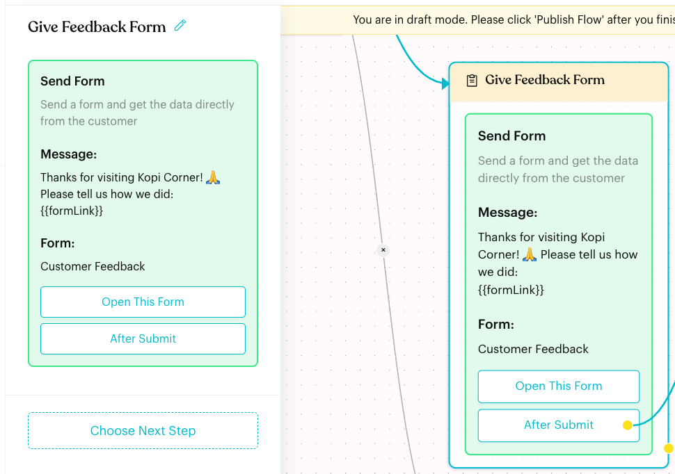
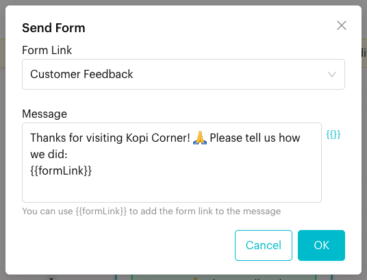

# Form

## What is the Form node?

The **Form** node sends the contact a message with a link to one of your [Luluchat Forms](../../forms/index.md). In the app it is called **Send Form**: "Send a form and get the data directly from the customer." When the contact submits the form, the flow can continue through the **After Submit** exit.

<figure><figcaption>
A Form node that sends the Customer Feedback form
</figcaption></figure>

## When to use it?

* **Feedback**: Send a short survey after a visit or order.
* **Sign-ups and enquiries**: Collect details for a membership or a catering enquiry.
* **Support**: Ask the customer to upload a receipt or photo.

## How to set it up (Step by Step)



#### Create the form

Build and publish your form in [Forms](../../forms/build.md) first. To save answers to the contact's profile, link questions to **Custom Attributes** in the form.



#### Add the node

In draft mode (click **Edit Flow**), click **+** (**Add Node**) and choose **Form** under **Content**. Click the new node, then click the **Send Form** card in the panel.



#### Choose the form and write the message

In the **Send Form** window:

* **Form Link**: Choose the form. Inactive forms are marked **(INACTIVE)**.
* **Message**: The text sent with the link. It starts as "Please fill up the following form: {{formLink}}". Keep `{{formLink}}` where the link should appear ("You can use {{formLink}} to add the form link to the message"). Click **{{}}** to insert `{{formLink}}`, contact details or custom attributes.

<figure><figcaption>
Choosing the form and message
</figcaption></figure>

Click **OK**.



#### Link After Submit

Drag from the **After Submit** handle on the node to the step that should run once the contact submits the form, such as a thank-you message.

The node also has a normal **Next Step** (**Choose Next Step** in the panel). If the next steps should only run after the form is submitted, use **After Submit**.



#### Publish

Click **Open This Form** to check the form in a new tab, then click **Publish Flow**.



## What happens after it triggers?

* Luluchat sends your message with `{{formLink}}` replaced by the contact's form link.
* When the contact submits the form, the flow continues from **After Submit**.
* Answers are stored as form responses, and questions linked to custom attributes update the contact's profile.

## Important behavior to know

* **No OTP for flow contacts**: People who open the form from a Message Flow are already identified, so they skip OTP verification even if the form requires it. See [Form Settings](../../forms/settings.md).
* **Paid feature**: If your plan doesn't include Forms, **Form** is greyed out in the **Add Node** menu with "This is Paid Feature".
* **Inactive forms**: If the selected form is inactive, the node turns red. Activate the form or pick another.

## Common issues & solutions

* **"Please select a form"**: Choose a form in **Form Link** before clicking **OK**.
* **"Please enter a message"**: The message can't be empty.
* **The customer got the message but no link**: The message is missing `{{formLink}}`. Add it back.
* **The node is red ("Click to select a form")**: No form is chosen yet, the message is empty, or the form is inactive.
* **Nothing happens after the customer submits**: Link **After Submit** to a step.

## Best practice 💡

* Tell the customer why you are asking and how long it takes, for example "It takes less than a minute".
* Always link **After Submit** to a short thank-you message.
* Link form questions to custom attributes so you can personalise later messages, such as `{{favourite_outlet}}`.

## Related Documentation

* [Forms](../../forms/index.md)
* [Build a Form](../../forms/build.md)
* [Form Settings](../../forms/settings.md)
* [Form Responses](../../forms/responses.md)
* [Custom Attributes](../../settings/data/custom-attributes.md)
