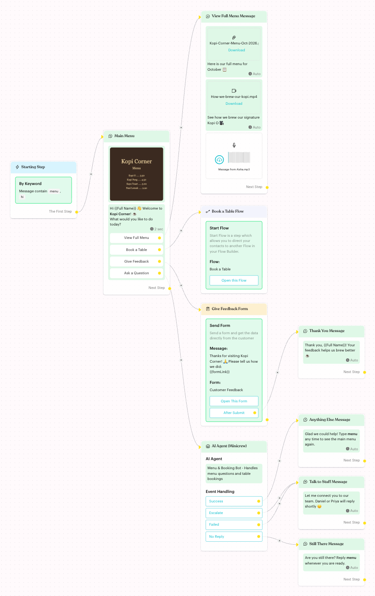
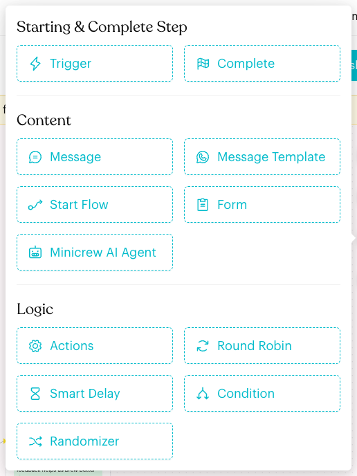

# Content Nodes

## What are Content Nodes?

Content nodes are the steps in a Message Flow that talk to your customer. They send messages, official WhatsApp templates and form links, pass the customer to another flow, or hand the chat to an AI agent.

<figure><figcaption>
A sample flow that uses every content node
</figcaption></figure>

## When to use them?

| Node | Use it to |
| --- | --- |
| [**Message**](message.md) | Send text, images, files, videos and audio, with reply buttons. |
| [**Message Template**](message-template.md) | Send a Meta-approved template (WhatsApp Business API channels only). |
| [**Start Flow**](start-flow.md) | Move the customer into another Message Flow. |
| [**Form**](form.md) | Send a link to one of your Luluchat Forms and continue when it is submitted. |
| [**AI Agent**](ai-agent.md) | Let a Minicrew AI or Praxus AI agent handle the conversation. |

## How to add a content node (Step by Step)



#### Open the flow in draft mode

Open a flow in **Automations > Message Flows** and click **Edit Flow**. You can only add or change nodes in draft mode.



#### Open the Add Node menu

Click the **+** (**Add Node**) button on the right of the canvas. The **Content** group lists the content nodes you can add.

<figure><figcaption>
Content group in the Add Node menu
</figcaption></figure>

You can also drag a line from a step's output handle and drop it on an empty part of the canvas. A short menu opens so you can add and link a new step in one go.



#### Set up the node

Click the new node on the canvas. Its settings open in the panel on the left. Each node's page explains the settings.



#### Connect and publish

Link the node to the next step, then click **Publish Flow**. Changes are not live until you publish.



## What happens after it triggers?

When a contact reaches a content node, Luluchat sends the content (or starts the flow, form or AI agent) and then follows the node's links: **Next Step**, a reply button, **After Submit**, or an AI Agent event.

## Important behavior to know

* **Message Template** only appears in the menu when the current channel is a WhatsApp Business API channel.
* **Form** is a paid feature. Without it, the button is greyed out with the note "This is Paid Feature".
* **Minicrew AI Agent** is greyed out with the note "Integration with Minicrew is required" until you connect Minicrew AI in [Integration](../../settings/account/integration.md).
* **Start Flow** and **AI Agent** have no **Next Step**. The contact continues in the other flow, or through the AI Agent's event exits.

## Common issues & solutions

* **I can't see Message Template**: Switch to a WhatsApp Business API channel. The node isn't available for other channels.
* **Form or Minicrew AI Agent is greyed out**: Check the note under the button. Upgrade your plan for Forms, or connect Minicrew AI in **Settings > Account > Integration**.
* **I can't add or click nodes**: You are viewing the published flow. Click **Edit Flow** first.

## Best practice 💡

* Keep each Message node short and focused. Use reply buttons to split the journey.
* Reuse common journeys (bookings, support, feedback) as separate flows and link them with **Start Flow**.
* Always give AI Agent steps a clear **Escalate** path to your team.

## Related Documentation

* [Message Flow Editor](../message-flows-editor.md)
* [Message Flows](../message-flows.md)
* [Logic Nodes](../logics/index.md)
* [Typing Indicator](../typing-indicator.md)
