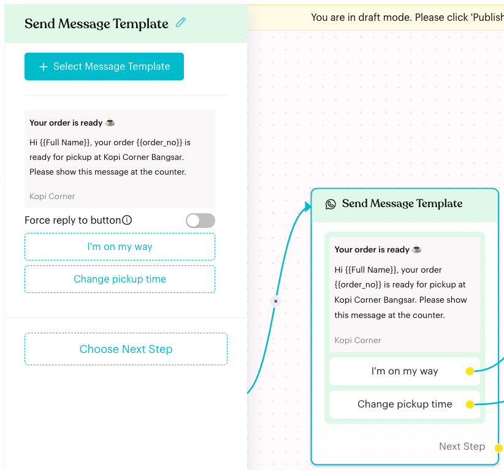
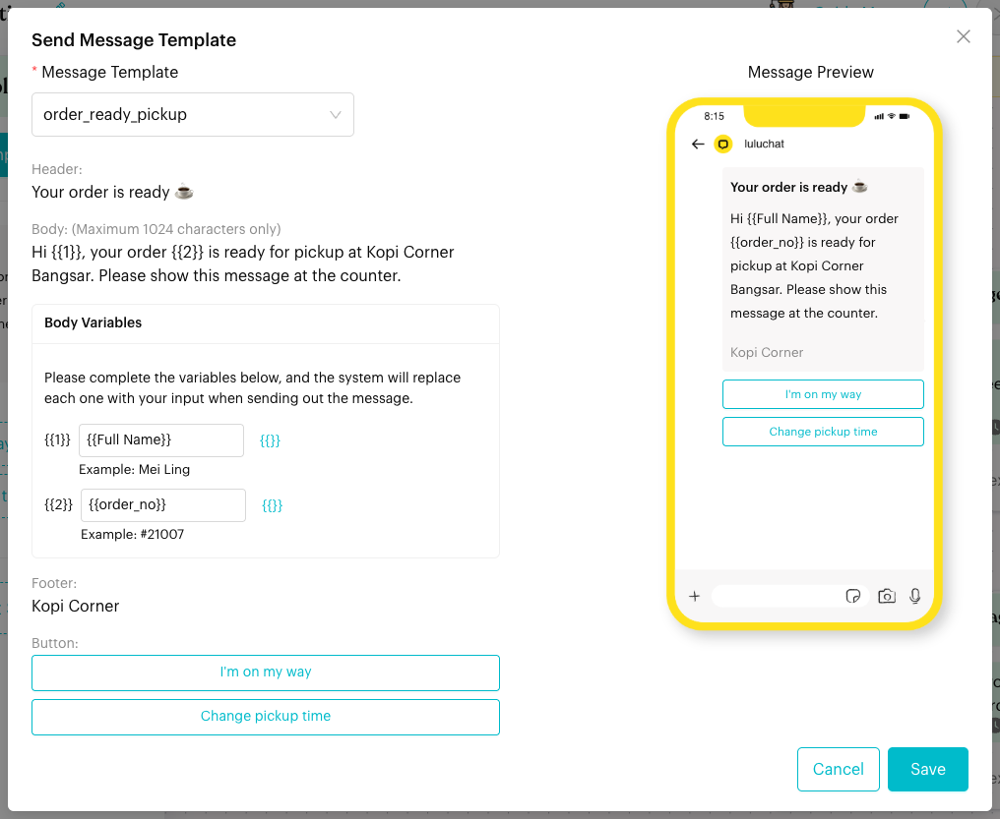

# Message Template

## What is the Message Template node?

The **Message Template** node (shown as **Send Message Template** on the canvas) sends one of your Meta-approved WhatsApp message templates. You fill in the template's variables, and you can link each of its quick reply buttons to the next step in your flow.

It is only available on **WhatsApp Business API** channels.

<figure><figcaption>
A Message Template node with two linked quick replies
</figcaption></figure>

## When to use it?

* **Outside the 24-hour window**: Meta only allows normal messages within 24 hours of the contact's last reply. Use a template to reach the contact after that.
* **Notifications**: Order ready, booking reminders or delivery updates.
* **Flows started by a broadcast, webhook or app event**, where the contact may not have messaged you recently.

## How to set it up (Step by Step)



#### Create and get the template approved

Create the template in [Message Templates](../../message-templates.md) and wait for Meta to approve it.



#### Add the node

Open your flow on a WhatsApp Business API channel and click **Edit Flow**. Click **+** (**Add Node**) and choose **Message Template** under **Content**. Click the new node to open its settings.



#### Select the template

Click **+ Select Message Template**. In the **Send Message Template** window:

1. Pick the template in **Message Template**. Templates that are not approved show their status first, for example **[PENDING]**.
2. Under **Header Variables**, **Body Variables** and **Button Variables** (if the template has them), fill in a value for each variable such as `{{1}}`. Click **{{}}** to insert a placeholder like `{{Full Name}}` or a custom attribute. The grey **Example** shows the sample value from the template.
3. If the header is an image, video or document, upload the media.
4. Check the **Message Preview** on the right, then click **Save**.

<figure><figcaption>
Filling in the template variables
</figcaption></figure>



#### Link the buttons

The template's buttons appear under the preview in the panel. Click a quick reply button and choose what happens when the contact taps it (for example **Send a Message** or **Select Existing Step**), just like replies in a [Message](message.md) node. Turn on **Force reply to button** if the contact must tap a button to continue.

Website (URL) buttons open the link set in the template. To change the address, edit the template ("Please edit Website Address in Message Template").



#### Choose the next step and publish

Use **Choose Next Step** (or the **Next Step** handle) for the path after the template is sent, then click **Publish Flow**.



## What happens after it triggers?

* Luluchat sends the template with your variables filled in for that contact.
* When the contact taps a quick reply button, the flow follows that button's link.
* Otherwise the flow continues to the **Next Step**, if one is set.
* In a published flow, each button shows its **CTR** on the node.

## Important behavior to know

* **WhatsApp Business API only**: The node is hidden in the **Add Node** menu on other channel types.
* **Buttons come from the template**: You can't add or delete buttons in the node. Change the template to change its buttons.
* **Changing the template**: If you pick a different template, its buttons start unlinked, so link them again.
* **Variables are per contact**: Placeholders such as `{{Full Name}}` are replaced with each contact's own details when sent.

## Common issues & solutions

* **I can't find Message Template in the Add Node menu**: The current channel isn't a WhatsApp Business API channel.
* **The template isn't in the list**: Check it exists in [Message Templates](../../message-templates.md) for this channel. Approval can take some time.
* **"Please select a Message Template."**: Choose a template before clicking **Save**.
* **"Please fill up all the body’s variables."** / **"Please fill up all the header’s variables."**: Every variable needs a value.
* **"Please upload a media for header."**: The template has an image, video or document header. Upload one.
* **The node says "Select Message Template"**: No template is chosen yet. Click the node and select one.

## Best practice 💡

* Map variables to contact details or custom attributes so each customer gets the right name and order number.
* Use quick reply buttons ("I'm on my way", "Change pickup time") to keep the conversation going inside the flow.
* After the contact replies, the 24-hour window is open again, so you can follow up with normal [Message](message.md) nodes.

## Related Documentation

* [Message Templates](../../message-templates.md)
* [Message](message.md)
* [Broadcasts](../../broadcasts.md)
* [Content Nodes](index.md)
