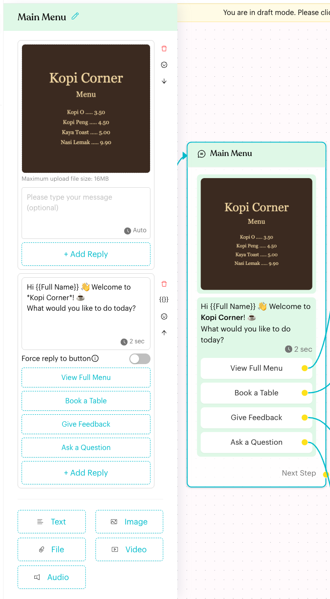
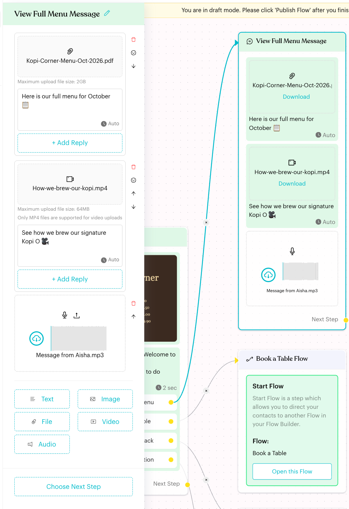
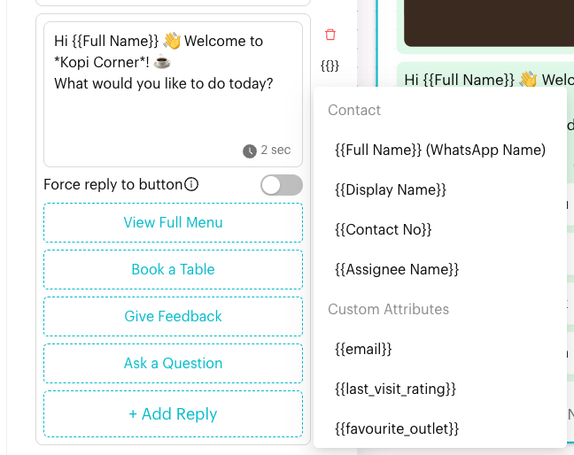
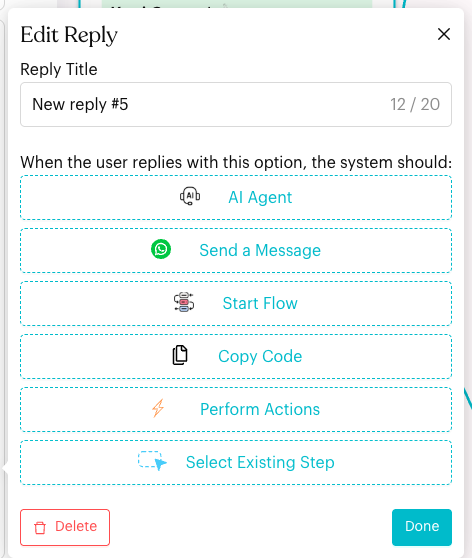
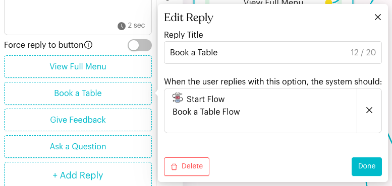

# Message

## What is the Message node?

The **Message** node (shown as **Send Message** on the canvas) sends one or more content blocks to the contact: **Text**, **Image**, **File**, **Video** and **Audio**. Text, image, file and video blocks can also have reply buttons that lead the contact down different paths.

<figure><figcaption>
A Message node with an image, a text block and four replies
</figcaption></figure>

## When to use it?

* **Welcome and menus**: Greet the contact and offer choices with reply buttons, such as "View Full Menu" or "Book a Table".
* **Share media**: Send a menu PDF, a product photo, a short video or a voice note.
* **Answer common questions**: Reply with opening hours, prices or directions.

## How to set it up (Step by Step)



#### Add the node

In draft mode (click **Edit Flow**), click **+** (**Add Node**) and choose **Message** under **Content**. A new node called **Send Message** appears with an empty text block. Click the node to open its settings panel.

To rename the node, click the pencil icon next to its title in the panel.



#### Add content blocks

At the bottom of the panel, click a block type to add it:

| Block | What you can add |
| --- | --- |
| **Text** | A message of any length. Use WhatsApp formatting such as `*bold*` and `_italic_`. |
| **Image** | One image (maximum 16MB) with an optional caption. |
| **File** | One document, such as a PDF, with an optional caption. Maximum 2GB, or 100MB on WhatsApp Business API channels. |
| **Video** | One MP4 video with an optional caption. Maximum 64MB, or 16MB on WhatsApp Business API channels. |
| **Audio** | Record a voice message with the microphone (**Upload Voice Message**) or upload an audio file (**Upload Audio File**). |

Blocks are sent in order from top to bottom. Use the icons on the right of each block to **Delete**, **Move Up** or **Move Down**.

<figure><figcaption>
File, video and audio blocks in one message
</figcaption></figure>



#### Personalise the text

Next to a text block, click **{{}}** (**Content Parameters**) to insert a placeholder at the cursor. You can use:

* **Contact**: `{{Full Name}}` (the contact's WhatsApp name), `{{Display Name}}`, `{{Contact No}}` and `{{Assignee Name}}`.
* **Custom Attributes**: every custom attribute in your workspace, such as `{{favourite_outlet}}`.
* **Shopify App** fields (customer and order details), when the Shopify app is connected.

Click the smiley icon (**Emoticons**) to add emoji.

<figure><figcaption>
Content Parameters
</figcaption></figure>



#### Set the typing indicator (optional)

Each text, image, file and video block shows a clock icon in its bottom-right corner. Use it to show "typing…" before the block is sent, either **Auto based on text length (System Default)** or for a fixed number of seconds. The indicator must be turned on for your team first. See [Typing Indicator](../typing-indicator.md).



#### Add reply buttons

Under a text, image, file or video block, click **+ Add Reply**. A new reply (for example "New reply #5") is added and the **Edit Reply** box opens:

* **Reply Title**: The button label, up to 20 characters.
* **When the user replies with this option, the system should:** Choose what happens when the contact taps it:
  * **Send a Message**: Adds a new Message node, linked to this reply.
  * **Start Flow**: Adds a new Start Flow node, linked to this reply.
  * **Perform Actions**: Adds a new Actions node, linked to this reply.
  * **Select Existing Step**: Links the reply to a node that is already on the canvas. Use this to send the contact to a Form or AI Agent node.

Click **Done** to close the box, or **Delete** to remove the reply.

<figure><figcaption>
Choosing what a new reply does
</figcaption></figure>

Once a reply is linked, the **Edit Reply** box shows where it goes. Click the **×** to unlink it and choose again.

<figure><figcaption>
A reply linked to a Start Flow node
</figcaption></figure>



#### Choose the next step and publish

If the message has no replies, click **Choose Next Step** at the bottom of the panel (or drag from the **Next Step** handle on the node) to continue the flow. Then click **Publish Flow**.



## What happens after it triggers?

* Luluchat sends each block in order, showing the typing indicator first if it is set.
* If the message has replies, the contact sees them as buttons. Tapping one follows that reply's link.
* If the message has no replies, the flow continues to the **Next Step**.
* In a published flow, each reply on the node shows its **CTR** (click-through rate). Hover over it to see **Total Clicked** and **User Clicked**.

## Important behavior to know

* **Replies or Next Step**: When you add a reply to a message whose **Next Step** is already linked (to anything other than a Smart Delay), Luluchat removes the Next Step link and shows "Step Linkage Removed".
* **Reply limits**: Up to 3 replies per block on WhatsApp Business API channels, and up to 50 on other channels.
* **Which flows have replies**: **+ Add Reply** appears in normal Message Flows, flow templates and the Default Message flow. In the Default Message flow, a reply can only **Start Flow**.
* **Force reply to button**: When a block has replies, you can turn this on. If the contact types something instead of tapping a reply, Luluchat sends the fallback message from [Message Flow settings](../../settings/tools/message-flows.md), up to 3 times. The node then shows "Force reply to button is enabled".
* **Captions on WhatsApp Business API**: An image, file or video block that has replies must also have text. Otherwise the node shows **Add a text** in red.
* **24-hour window (WhatsApp Business API)**: Meta only lets you send normal messages within 24 hours of the contact's last reply. Outside that window, use a [Message Template](message-template.md) instead.
* **Blocked image types**: BMP and HEIC images (even when renamed to .jpg) can't be viewed by recipients and are rejected. Convert them to JPEG or PNG first.
* **Messenger channels**: On Facebook Messenger channels, the panel also offers **Messenger Templates** (**Generic** and **Button**).
* **Long text**: On the canvas, very long text is cut short with a **Read More** link. The full text is still sent.

## Common issues & solutions

* **"File must be smaller than 16MB!"** (or another size): The file is over the limit for that block. Compress it or send a link instead.
* **"… is actually a HEIC file and can't be viewed by recipients. Please convert it to JPEG or PNG before sending."**: Convert the image and upload it again.
* **"Step Linkage Removed"**: You added a reply, so the Next Step link was removed. Link each reply instead, or remove the replies and set **Choose Next Step** again.
* **A reply shows in red on the canvas**: The reply isn't linked to anything. Open it and choose an action.
* **"Duplicate button ID detected"**: A reply shares its ID with a reply in another step (left over from an older copy bug). Click **Fix ID**.
* **"Unsupported Content"**: The block type isn't supported here. Delete it ("Please remove this.").
* **Placeholders are sent as plain text**: Check the spelling and braces, for example `{{Full Name}}`. Insert them with **{{}}** to avoid typos.

## Best practice 💡

* Put the image or file first and the question with replies last, so the buttons appear at the bottom of the chat.
* Keep reply titles short and clear, like "Book a Table" or "Talk to Staff".
* Use `{{Full Name}}` in greetings to make messages feel personal.
* Turn on **Force reply to button** for menus where a typed answer would get lost.

## Related Documentation

* [Typing Indicator](../typing-indicator.md)
* [Message Template](message-template.md)
* [Start Flow](start-flow.md)
* [Message Flow settings](../../settings/tools/message-flows.md)
* [Custom Attributes](../../settings/data/custom-attributes.md)
* [Message Flow Editor](../message-flows-editor.md)
