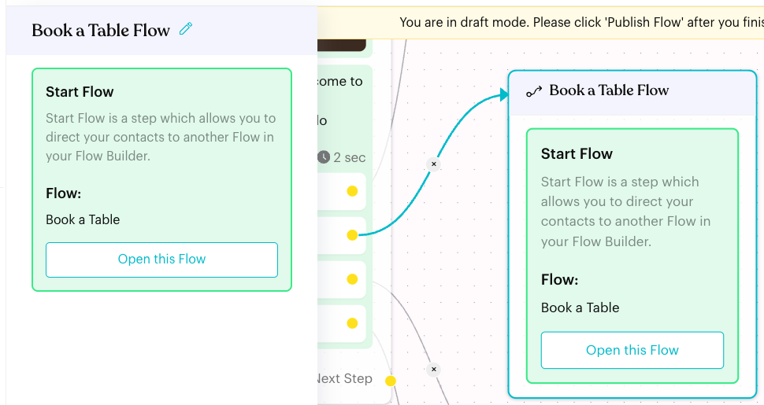
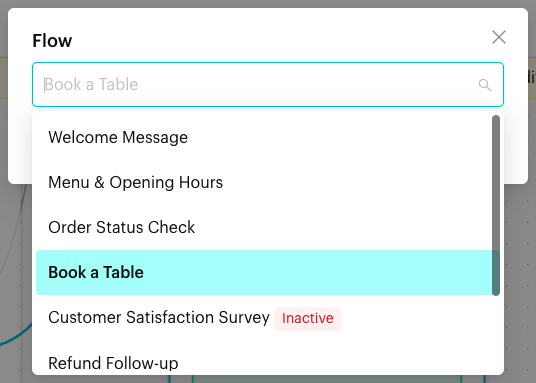

# Start Flow

## What is the Start Flow node?

The **Start Flow** node moves the contact into another Message Flow. In the app it is described as "a step which allows you to direct your contacts to another Flow in your Flow Builder." It lets you build small, reusable flows and link them together.

<figure><figcaption>
A Start Flow node that opens the Book a Table flow
</figcaption></figure>

## When to use it?

* **Menus**: A "Main Menu" flow where each reply starts its own flow, such as "Book a Table".
* **Reusable journeys**: Build "Talk to Staff" or "Collect Address" once and start it from many flows.
* **Long journeys**: Split a long flow into smaller flows that are easier to manage.

## How to set it up (Step by Step)



#### Add the node

In draft mode (click **Edit Flow**), click **+** (**Add Node**) and choose **Start Flow** under **Content**.

You can also create one straight from a reply button: open the reply in a [Message](message.md) node and choose **Start Flow**. The new node is named after the reply, for example "Book a Table Flow", and is already linked.



#### Choose the flow

Click the node, then click the **Start Flow** card in the panel. In the **Flow** window, pick a flow from **Select a message flow**. You can type to search by name. Inactive flows are marked **Inactive**, and flows allowed in group chats are marked **Group**.

<figure><figcaption>
Choosing the flow to start
</figcaption></figure>

Click **OK** to save.



#### Check and publish

The node now shows **Flow:** and the flow's name. Click **Open this Flow** to open that flow in a new tab and check it. Then click **Publish Flow**.



## What happens after it triggers?

The contact is sent into the selected flow and continues there. The Start Flow node has no **Next Step**, so nothing after it runs in the current flow.

## Important behavior to know

* **One way**: The contact does not come back to the original flow. To return, add another Start Flow node in the second flow.
* **Inactive or deleted flows**: If the selected flow is inactive, the node shows **(Inactive)** and turns red. If it was deleted, it shows **(DELETED)**. Pick another flow or turn the target flow back on.
* **Default Message replies**: In the Default Message flow, **Start Flow** is the only action a reply button can have.

## Common issues & solutions

* **The node is red**: No flow is selected ("Click to select a flow"), or the selected flow is inactive or deleted.
* **The contact didn't get the second flow**: Check that the target flow is active and published.
* **Contacts keep bouncing between flows**: Two flows start each other. Remove one of the Start Flow links so the journey can end.

## Best practice 💡

* Name sub-flows clearly, such as "Book a Table" or "Talk to Staff", so they are easy to find in the list.
* Use one shared sub-flow instead of copying the same steps into many flows.
* Click **Open this Flow** after linking to make sure you picked the right one.

## Related Documentation

* [Message](message.md)
* [Message Flows](../message-flows.md)
* [Default Flow](../default-flow.md)
* [Complete Step](../steps/complete.md)
