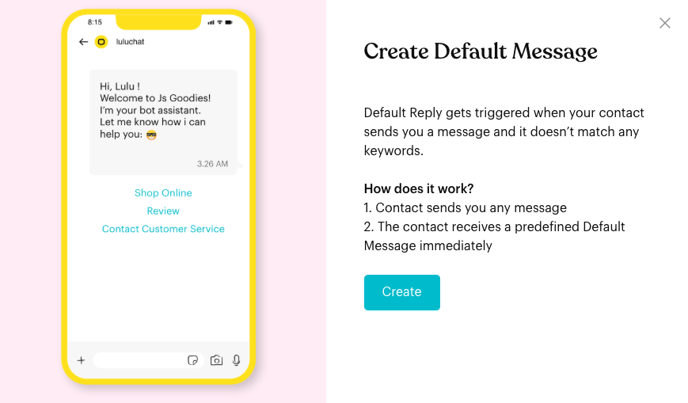
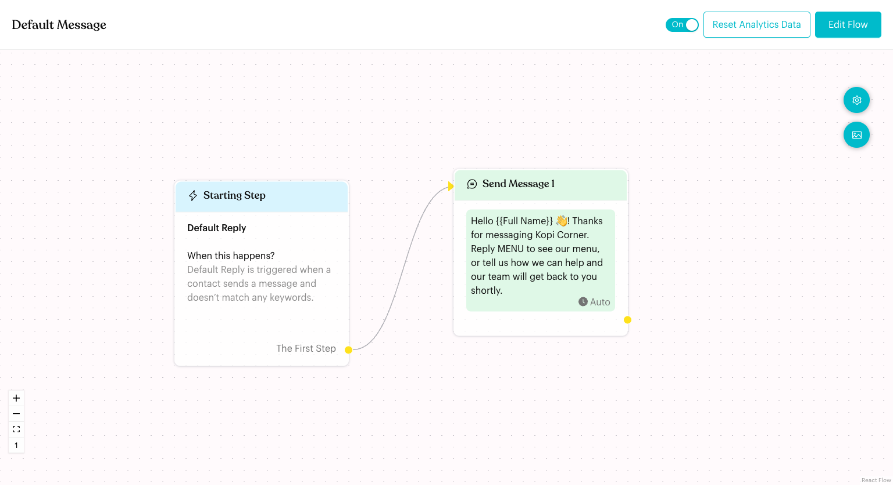
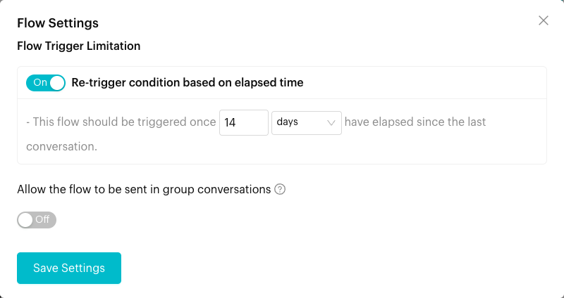

# Default Flow

## What is Default Flow?

The **Default Message** is the flow that replies when a contact sends a message that doesn't match any of your keywords. It makes sure every contact gets a reply, even if they don't know your keywords.

In the app: "Default Reply gets triggered when your contact sends you a message and it doesn't match any keywords."

## When does it trigger?

* When a contact sends any message that doesn't match a keyword in your flows.
* Only if the Default Message is published and its card is switched **On**.
* If **Re-trigger condition based on elapsed time** is on in **Flow Settings**, only when enough time has passed since the contact's last conversation (14 days by default).

## How to set it up (Step by Step)



#### Click Configure on the Default Message card

Go to **Automations** > **Message Flows**. Under **Basic Message Flow**, click **Configure** on the **Default Message** card. Then click **Create**.

<figure><figcaption>
Create Default Message
</figcaption></figure>



#### Edit the message

The flow opens in draft mode. The **Starting Step** says **Default Reply**, and it's connected to **Send Message 1** with a ready-made greeting: "Hello {{Full Name}} 👋! Good to see you. Please tell us how we can help you and we'll get in touch shortly."

Click **Send Message 1** and change the text. You can add buttons and more steps, just like any other flow.

On a WhatsApp Cloud (WABA) channel, the first step is **Send Message Template 1** instead; choose an approved template for it.

<figure><figcaption>
Default Message flow
</figcaption></figure>



#### Set how often it can repeat

Click the gear button (**Flow Settings**). Under **Re-trigger condition based on elapsed time**, set how much time must pass since the contact's last conversation before the Default Message can be sent again: "This flow should be triggered once _14_ _days_ have elapsed since the last conversation." You can use **minutes**, **hours** or **days**. Click **Save Settings**.

<figure><figcaption>
Re-trigger setting for the Default Message
</figcaption></figure>



#### Publish

Click **Publish Flow**. Check that the **Default Message** card is switched **On**.



## What happens after it triggers?

The contact receives the steps in your Default Message flow, for example a greeting with buttons to your menu or to a team member.

## Important behavior to know

* **Keywords come first**: If a message matches a keyword trigger in one of your flows, that flow runs instead of the Default Message.
* **Re-trigger limit**: With the default setting, the Default Message is only sent again once 14 days have passed since the contact's last conversation. Turn the switch **Off** in **Flow Settings** to remove the limit.
* **No triggers on the Starting Step**: You can't add a keyword or other trigger to the Default Message.
* **Copy to another channel**: Click **⋮** on the **Default Message** card and choose **Copy Flow to another channel**. If the other channel already has a Default Message, it is replaced.
* **No delete**: The Default Message can't be deleted. Switch it **Off** to stop it.

## Common issues & solutions

* **The Default Message didn't reply**: Check that the card is **On** and that you published the flow. Also check the re-trigger limit: the contact may have had a conversation with you recently.
* **It replies when it shouldn't**: The message didn't match any keyword. Add the words your contacts use as keywords in the right flow.
* **"In Message Node "Send Message 1", the Content Block "Text" is missing some text."**: Add text to the message before publishing.

## Best practice 💡

* Keep it short and give clear choices, for example buttons for "Menu", "Opening Hours" and "Talk to Staff".
* Mention the keywords contacts can send, such as "Reply MENU to see our menu".
* Keep the re-trigger period long enough so regular customers aren't greeted every time they message.

## Related Documentation

* [Fallback & Consent Flows](../core-features/index-1/message-flows/fallback-and-consent-flows/README.md)
* [Away Flow](away-flow.md)
* [Message Flow Editor](message-flows-editor.md)
* [Trigger](steps/trigger.md)
