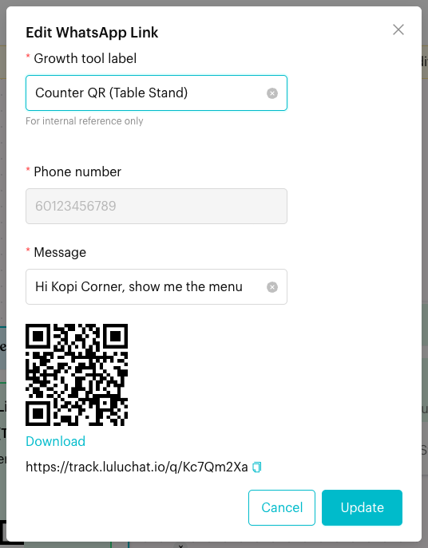
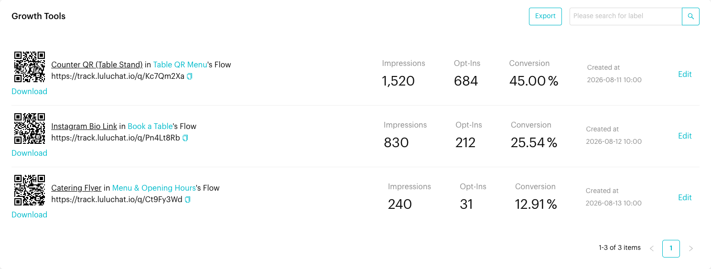
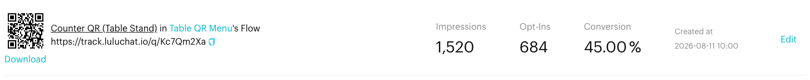

# Growth Tools

## What is Growth Tools?

A **Growth Tool** is a trackable WhatsApp link with its own QR code. When someone clicks the link or scans the QR code, WhatsApp opens a chat with your business with a message already typed in. When they send that message, Luluchat starts the Message Flow the Growth Tool belongs to.

You create a Growth Tool by adding a **WhatsApp Link** trigger to a Message Flow's **Starting Step**. The **Growth Tools** page then lists all of them with their link, QR code and results:

* **Impressions**: How many times the link was opened (clicked or scanned).
* **Opt-Ins**: How many times a contact sent the pre-filled message.
* **Conversion**: Opt-Ins divided by Impressions, as a percentage.

## When does it trigger?

* Someone opens the Growth Tool link or scans its QR code. This counts as an **Impression**, and WhatsApp opens with your number and the pre-filled message.
* They send the message **without changing it**. This counts as an **Opt-In**, and the linked Message Flow starts.
* The linked Message Flow must be active.

## How to set it up (Step by Step)



#### Add a WhatsApp Link trigger to a flow

Go to **Automations** > **Message Flows** and open the flow you want people to receive. Click **Edit Flow**, click the **Starting Step**, then click **WhatsApp Link** under **When this happens**. The **Create WhatsApp Link** window opens.



#### Fill in the link details

* **Growth tool label** (required): A name for your own reference, for example "Counter QR (Table Stand)". Customers don't see it.
* **Phone number**: Your channel's number. It is filled in for you and can't be changed.
* **Message** (required): The message that is typed in for the customer when WhatsApp opens, for example "Hi Kopi Corner, show me the menu".

Click **Create**. You see "WhatsApp link created successfully." and the window now shows the QR code, a **Download** link and the Growth Tool link.

<figure><figcaption>
The WhatsApp Link window after the Growth Tool is created
</figcaption></figure>



#### Publish the flow

Close the window and click **Publish Flow**. Make sure the flow is active, otherwise the link won't work.



#### Share the link or QR code

Go to **Automations** > **Growth Tools**. Each row shows:

* The QR code, with **Download** below it to save the QR code as a PNG image.
* "_Label_ in _Flow_'s Flow". Click the flow name to open the flow.
* The link, with a copy icon to copy it.
* **Impressions**, **Opt-Ins**, **Conversion** and **Created at**.
* **Edit**: Opens the flow in draft mode with the **Starting Step** open.

Put the link on your website, Instagram bio or emails, and print the QR code on menus, posters or table stands.

<figure><figcaption>
The Growth Tools page
</figcaption></figure>



#### Test it

Scan the QR code with your phone (or open the link), send the pre-filled message, and check that the right flow replies. The **Impressions** and **Opt-Ins** counts go up.



## What happens after it triggers?

* The contact receives the linked Message Flow, starting from the step connected to the Starting Step.
* **Opt-Ins** goes up by one, and **Conversion** is updated.
* The conversation appears in your Inbox as usual.

<figure><figcaption>
Impressions, Opt-Ins and Conversion for one Growth Tool
</figcaption></figure>

## Important behavior to know

* **The message must be sent unchanged**: The flow only starts, and Opt-Ins only goes up, when the customer's message is exactly the Growth Tool's **Message** (letter case doesn't matter). If they edit it first, it is treated like any other message, so it may match a [keyword](keywords.md) instead.
* **The flow must be active**: If the linked flow is inactive, the link does not open WhatsApp. People see a "not found" page instead.
* **The Growth Tool is created straight away**: Clicking **Create** saves the Growth Tool and its link immediately, even before you publish the flow. To change the label or message later, click the WhatsApp Link box in the Starting Step, edit it and click **Update**.
* **The link and QR code stay the same**: Editing the label or message doesn't change the link, so printed QR codes keep working.
* **Order of triggers**: A [Meta Ad](meta-ads.md) trigger is checked before Growth Tools, and Growth Tools are checked before keywords.
* **Flow conditions and away hours still apply**: If the flow has conditions the contact doesn't meet, it doesn't start, even though the Opt-In is counted.
* **Export**: Click **Export** at the top of the list to download your Growth Tools and their results as an Excel file.

## Common issues & solutions

* **"Please enter your Growth tool label"** or **"Please enter your message"**: Fill in the required field before clicking **Create**.
* **The link shows a "not found" page**: The linked flow is inactive or was deleted. Activate the flow, or create a new WhatsApp Link in an active flow.
* **Impressions go up but Opt-Ins don't**: People open WhatsApp but don't send the message, or they change it before sending. Keep the message short and inviting so people send it as it is.
* **The wrong flow replies**: Check that the message isn't edited, and that no [Meta Ad](meta-ads.md) trigger is linked to the ad the customer came from.
* **Edit is greyed out**: The Growth Tool isn't linked to a flow any more.

## Best practice 💡

* Create a separate Growth Tool for each place you share it (website, Instagram, flyer, table stand), so you can compare their results.
* Use a clear label such as "Counter QR (Table Stand)" so your team knows where each link is used.
* Write a pre-filled message that makes sense to the customer, such as "Hi Kopi Corner, show me the menu".
* Check **Conversion** regularly and try a different message or placement for links that convert poorly.

## Related Documentation

* [Trigger (Starting Step)](steps/trigger.md#2-whatsapp-link-trigger)
* [Message Flows](message-flows.md)
* [Message Flow Editor](message-flows-editor.md)
* [Keywords](keywords.md)
* [Meta Ads](meta-ads.md)
