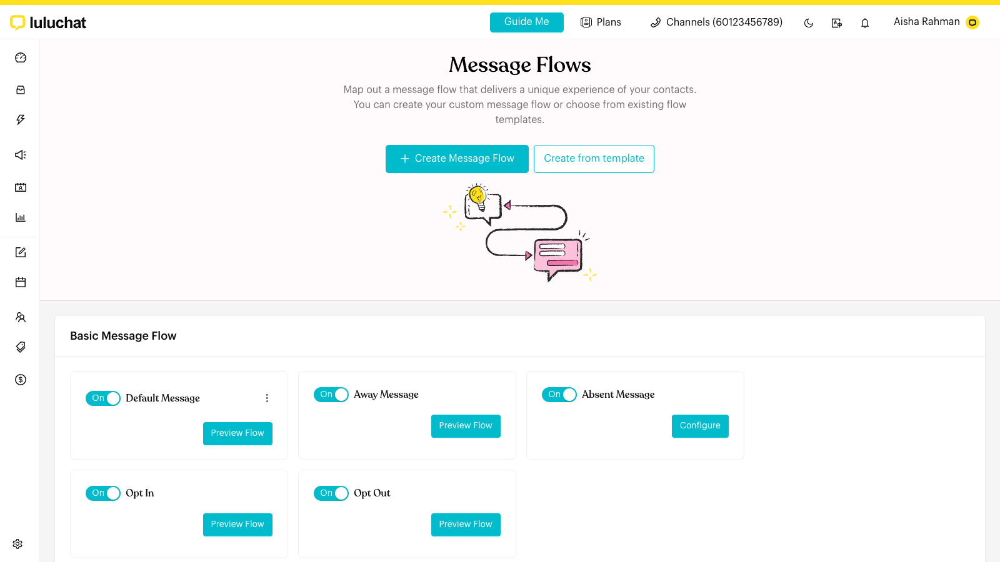

# Automations

## What is Automations?

**Automations** is the group in the left menu where you set up everything that replies to and routes your contacts automatically. It has these pages:

* **Message Flows**: Build automated conversations step by step in a visual editor. This is also where you set up the fallback and consent flows (Default, Away, Absent, Opt In and Opt Out).
* **Keywords**: See the keyword triggers used across your message flows.
* **Meta Ads**: See the Meta ad and post triggers used across your message flows, and how often each one was triggered.
* **Growth Tools**: See your entry points (such as WhatsApp links) and how well they perform.
* **Workflows**: Run actions on contacts that meet your conditions, on a schedule or when something happens (for example, a new contact comes in or a tag changes).
* **Web Widget**: Generate a WhatsApp chat button for your website.

When you click **Automations**, Luluchat opens **Message Flows**.


Not sure whether you need a Message Flow or a Workflow, or how to set up a specific case? See [Common Scenarios](common-scenarios.md) for step-by-step recipes such as reassigning unanswered chats, adding new leads to a deal pipeline and sending birthday messages.


<figure><figcaption>
Automations opens on the Message Flows page
</figcaption></figure>

## When to use it?

* **Answer common questions**: Reply with your menu, prices or opening hours when a contact sends a keyword such as "menu".
* **Greet new contacts**: Send a welcome message to everyone who messages you, even if they don't use a keyword (Default Message).
* **Cover after-hours messages**: Let contacts know you're closed and when you'll reply (Away Message).
* **Capture leads from ads and links**: Start a flow when someone messages you from a Meta ad or a WhatsApp link.
* **Manage marketing consent**: Let contacts subscribe or unsubscribe with a keyword (Opt In and Opt Out).
* **Run scheduled follow-ups**: Use a workflow to act on contacts that meet your conditions.

## How to set it up (Step by Step)



#### Open Automations

In the left menu, click **Automations**, then choose the page you need: **Message Flows**, **Keywords**, **Meta Ads**, **Growth Tools**, **Workflows** or **Web Widget**.



#### Create a message flow

On **Message Flows**, click **Create Message Flow** (or **Create from template**). Name the flow and click **Create**. The flow editor opens in draft mode.

See [Message Flows](message-flows.md).



#### Add a trigger and steps

In the editor, click the **Starting Step** to add a trigger, such as a **Keyword**, **WhatsApp Link** or **Meta Ad**. Then add messages and other steps and connect them.

See [Message Flow Editor](message-flows-editor.md) and [Trigger](steps/trigger.md).



#### Publish and turn it on

Click **Publish Flow**. Make sure the flow's switch is **On**. Then test it from another phone by sending the keyword.



## Sections in Automations

* [Common Scenarios](common-scenarios.md)
* [Message Flows](message-flows.md)
  * [Message Flow Editor](message-flows-editor.md)
  * [Typing Indicator](typing-indicator.md)
  * [Starting & Complete Steps](steps/index.md)
    * [Trigger](steps/trigger.md)
    * [Complete](steps/complete.md)
  * [Content Nodes](content-nodes/index.md)
    * [Message](content-nodes/message.md)
    * [Message Template](content-nodes/message-template.md)
    * [Start Flow](content-nodes/start-flow.md)
    * [Form](content-nodes/form.md)
    * [AI Agent](content-nodes/ai-agent.md)
  * [Logics](logics/index.md)
    * [Actions](logics/actions.md)
    * [Round Robin](logics/round-robin.md)
    * [Smart Delay](logics/smart-delay.md)
    * [Condition](logics/condition.md)
    * [Randomizer](logics/randomizer.md)
  * [Fallback & Consent Flows](../core-features/index-1/message-flows/fallback-and-consent-flows/README.md)
    * [Default Flow](default-flow.md)
    * [Away Flow](away-flow.md)
    * [Absent Flow](absent-flow.md)
    * [Opt-In Flow](opt-in-flow.md)
    * [Opt-Out Flow](opt-out-flow.md)
* [Keywords](keywords.md)
* [Meta Ads](meta-ads.md)
* [Growth Tools](growth-tools.md)
* [Workflows](workflows.md)
* [Web Widget](web-widget.md)

## What happens after it triggers?

* A message flow sends its steps to the contact in the order you connected them: messages, actions (such as adding a tag or assigning a team member), delays and so on.
* A workflow runs its actions on every contact that meets its conditions.
* The Web Widget opens a WhatsApp chat with your number from your website.

## Important behavior to know

* **You only see the pages your plan includes**: Each page under **Automations** appears only if your plan and role give you access to it.
* **Message flows must be published and On**: Changes you make in the editor are saved as a draft. They only go live after you click **Publish Flow**. A flow that is switched **Off** never runs.
* **Your channel must be connected**: If your channel isn't connected, the **Message Flows** page shows "Channel not connected — Your message flow will not be triggered until you connect your channel."
* **Each channel has its own automations**: Flows belong to the channel you're on. Use **Copy Flow to another channel** to reuse a flow on another channel.

## Common issues & solutions

* **A flow didn't reply**: Check that the flow is **On**, that you clicked **Publish Flow** after your last edit, and that the contact's message matches the trigger.
* **"Channel not connected" warning**: Reconnect your channel. Flows don't run until it is connected.
* **A page is missing from the Automations menu**: Your plan or role doesn't include it. Ask your account owner.

## Best practice 💡

* Set up the **Default Message** and **Away Message** first, so every contact gets a reply.
* Give flows clear names, such as "Menu & Opening Hours" or "Catering Enquiry", so they're easy to find in pickers.
* Use folders to group flows by purpose (for example, "Promotions" and "Customer Support").
* Test every new flow from a second phone before you announce it.

## Related Documentation

* [Message Flows](message-flows.md)
* [Message Flow Editor](message-flows-editor.md)
* [Fallback & Consent Flows](../core-features/index-1/message-flows/fallback-and-consent-flows/README.md)
* [Keywords](keywords.md)
* [Meta Ads](meta-ads.md)
* [Workflows](workflows.md)
