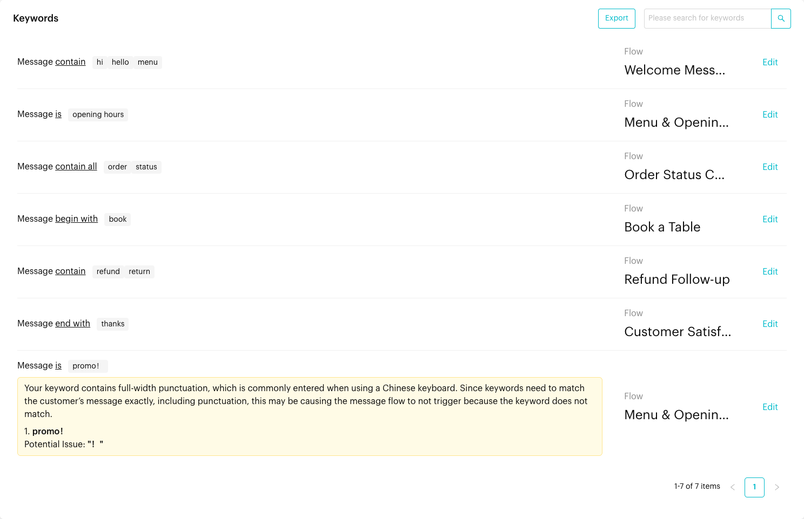
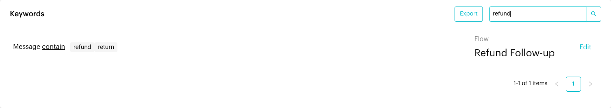
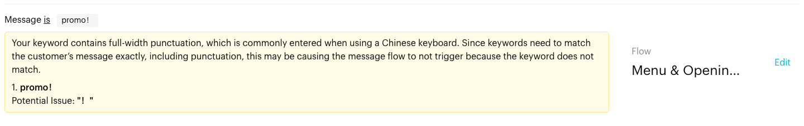

# Keywords

## What is the Keywords page?

The **Keywords** page lists every keyword trigger set up in your Message Flows, in one place. For each keyword trigger you can see the match condition, the keywords, and the Message Flow it starts.

You don't create keywords on this page. Keywords are added in a Message Flow's **Starting Step** (see [Trigger (Starting Step)](steps/trigger.md#1-keyword-trigger)). This page is for reviewing them, finding them quickly and jumping to the flow to change them.

## When to use it?

* **Review all keywords**: See every keyword trigger on the current channel without opening each flow.
* **Find overlaps**: Spot two flows that react to the same word, for example "menu" in two different flows.
* **Fix a keyword quickly**: Click **Edit** to open the flow with its Starting Step ready to change.
* **Keep a record**: Export the list to a spreadsheet.

## How to use it (Step by Step)



#### Open the Keywords page

Go to **Automations** > **Keywords** from the left menu.

Each row shows one keyword trigger:

* **Message _condition_**: How the customer's message is matched, for example **Message contain**. The conditions are **is**, **contain**, **contain all**, **begin with** and **end with**.
* **Keywords**: The words or phrases, shown as tags.
* **Flow**: The Message Flow this keyword starts. Click the flow name to open the flow.
* **Edit**: Opens the flow in draft mode with the **Starting Step** open, so you can change the keyword.

<figure><figcaption>
The Keywords page lists every keyword trigger and its flow
</figcaption></figure>



#### Search for a keyword

Type a word in the **Please search for keywords** box at the top right and press **Enter** (or click the search icon). The list shows only keyword triggers whose keywords match what you typed. The search looks at the keyword text, not the flow name.

To see the full list again, clear the box and press **Enter**.

<figure><figcaption>
Searching for "refund"
</figcaption></figure>



#### Change a keyword

Click **Edit** on the row. The Message Flow opens in draft mode with the **Starting Step** panel open. Click the keyword trigger to change the condition or keywords, then click **Publish Flow** to make the change live.

See [Trigger (Starting Step)](steps/trigger.md#1-keyword-trigger) for how to set up a keyword trigger.



#### Export the list (optional)

Click **Export** to download an Excel file of your keyword triggers and their flows.



## What happens after you use it?

* **Search** narrows the list to matching keywords.
* **Edit** takes you to the flow editor. Your change only takes effect after you publish the flow.
* **Export** downloads a spreadsheet you can keep as a backup or share with your team.

## Important behavior to know

* **Read-only list**: You can't add, change or delete keywords on this page. Do it in the flow's Starting Step.
* **All flows are listed**: The list includes keyword triggers from active and inactive flows. A keyword in an inactive flow does not start that flow.
* **Not case-sensitive**: "MENU", "Menu" and "menu" are treated the same when a customer's message is matched.
* **Punctuation counts**: Apart from letter case, keywords must match the customer's message exactly, including punctuation.
* **Punctuation warning**: If a keyword contains full-width punctuation (often typed on a Chinese keyboard, such as `！` or `？`), a yellow warning appears under it on this page and in the flow editor. A similar warning appears if a keyword contains an invisible "zero-width space", which can be copied in from chat apps.
* **One flow per message**: A message starts at most one flow. If keywords from several flows match the same message, only one of them starts, and you can't choose which. Avoid using the same keyword in more than one flow.
* **Other triggers come first**: If a message comes from a Meta ad or post that is linked to a flow ([Meta Ads](meta-ads.md)), or exactly matches a [Growth Tool](growth-tools.md) message, that flow starts and keywords are not checked.
* **Re-triggering**: How often the same contact can trigger a flow again is set in the flow's **Flow Trigger Limitation** settings. See [Flow Settings](message-flows-editor.md#flow-settings).

<figure><figcaption>
Warning for a keyword with full-width punctuation
</figcaption></figure>

## Common issues & solutions

* **"Your keyword contains full-width punctuation, which is commonly entered when using a Chinese keyboard…"**: Click **Edit**, retype the keyword with normal (half-width) punctuation, or remove the punctuation, then publish the flow.
* **"Your keyword contains an invisible character (zero-width space)…"**: Click **Edit**, delete the keyword and type it again by hand instead of pasting it.
* **I can't find a keyword**: Search for a single word instead of a whole phrase. Also check that you are on the right channel, because the list shows the current channel only.
* **The keyword doesn't start the flow**: Check that the flow is active and published, that the message matches the condition (for **is**, the whole message must be the keyword), and that no other flow uses the same keyword.
* **I want to add a keyword**: Go to **Automations** > **Message Flows**, open the flow and add a **Keyword** trigger in its **Starting Step**.

## Best practice 💡

* Review this page regularly and remove keywords from flows you no longer use.
* Give each flow its own keywords so customers always get the reply you expect.
* Use **is** for exact phrases, and **contain** for single words that may appear anywhere in a message.
* Export the list before making big changes, so you have a record of your setup.

## Related Documentation

* [Trigger (Starting Step)](steps/trigger.md#1-keyword-trigger)
* [Message Flows](message-flows.md)
* [Message Flow Editor](message-flows-editor.md)
* [Meta Ads](meta-ads.md)
* [Growth Tools](growth-tools.md)
