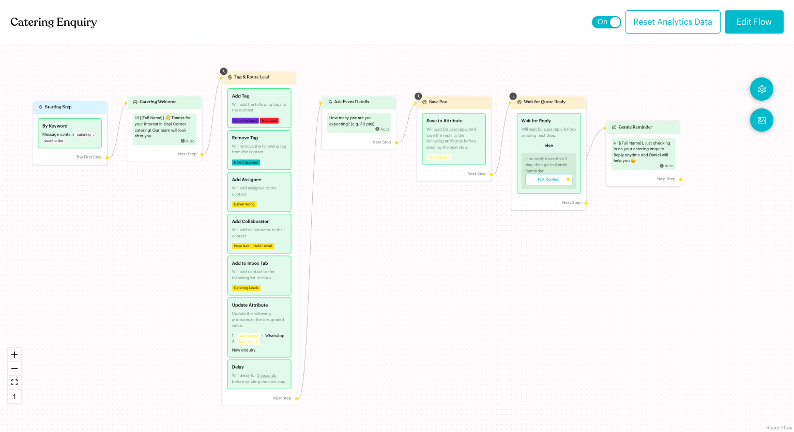
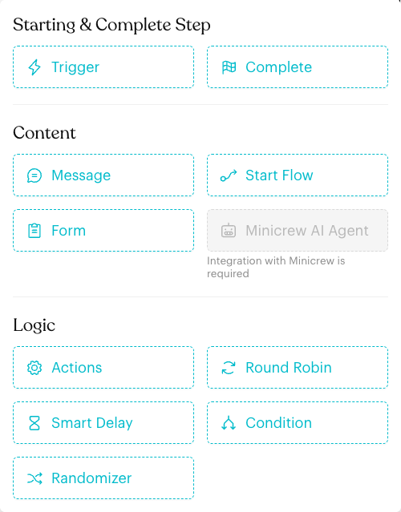
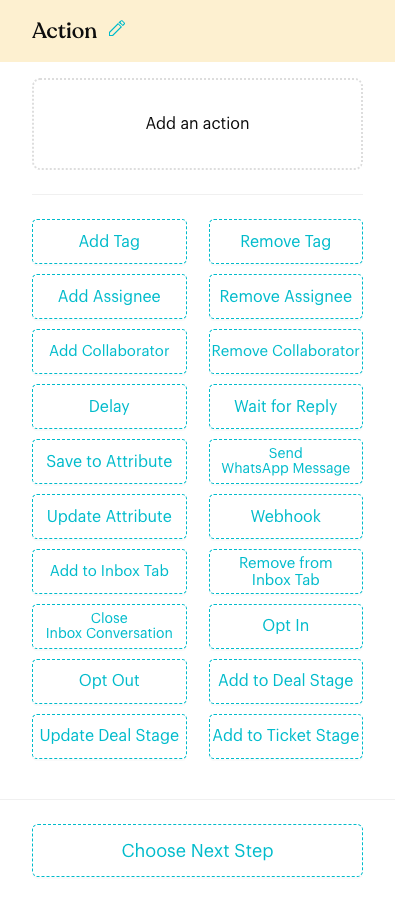
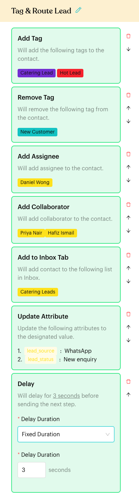
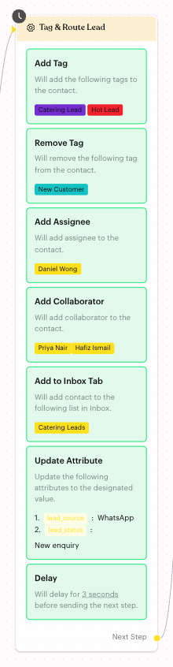
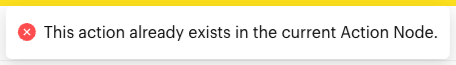

# Logic: Actions

## What is the Actions step?

The **Actions** step does work in the background while a contact moves through a Message Flow. It does not send a chat message itself (except **Send WhatsApp Message**, which messages other numbers). Use it to tag contacts, assign them to your team, move them into Inbox lists, save data, pause the flow, and connect to other systems.

One Actions step can hold several actions. Each action appears as a block (a "content block") inside the step.

<figure><figcaption>
A flow with three Actions steps
</figcaption></figure>

## When to use it?

* **Tag and segment**: Add a "Catering Lead" tag when someone asks about catering, and remove "New Customer".
* **Route to your team**: Assign the contact to Daniel Wong and add Priya Nair as a collaborator.
* **Organise the Inbox**: Put the contact in a custom list such as "Catering Leads".
* **Store data**: Save the customer's reply to a custom attribute, or set attributes to fixed values.
* **Control timing**: Pause for a few seconds, or wait for the customer to reply before moving on.
* **Connect other tools**: Call a webhook, create a deal or a ticket.

## How to set it up (Step by Step)



#### Open the flow in edit mode

Go to **Automations** > **Message Flows**, open a flow and click **Edit Flow**. You will see the banner "You are in draft mode. Please click 'Publish Flow' after you finish editing."



#### Add an Actions step

Click the **+** (**Add Node**) button on the right of the canvas (or **+ Add New Step** when choosing a next step). Under **Logic**, click **Actions**. A new step called **Action** is added to the canvas.

<figure><figcaption>
Actions is under Logic
</figcaption></figure>



#### Choose the actions

Click the step to open its settings panel on the left. Until you add something, it shows **Add an action**. Click a button below it to add that action.

<figure><figcaption>
A new, empty Actions step
</figcaption></figure>

Click the step title (pencil icon) to give it a clear name, such as "Tag & Route Lead".



#### Configure each action

Click an action block to set it up. For example, the **Add Tag** block opens a window where you pick the tags. **Delay** and **Wait for Reply** are set up directly in the block. See the page for each action below.

Use the icons to the right of each block to **Delete** it (you'll be asked "Are you sure you want to delete this content?"), or to move it up or down.

<figure><figcaption>
An Actions step with seven actions
</figcaption></figure>



#### Connect the next step

Click **Choose Next Step** at the bottom of the panel, or drag from the **Next Step** dot on the step to another step.



#### Publish the flow

Click **Publish Flow**. Changes only take effect after you publish.



## Available actions

These are the buttons in the Actions step, in the order the app shows them.

| Action | What it does | Page |
| --- | --- | --- |
| **Add Tag** | Adds one or more tags to the contact. | [Add Tag](actions/add-tag.md) |
| **Remove Tag** | Removes one or more tags from the contact. | [Remove Tag](actions/remove-tag.md) |
| **Add Assignee** | Assigns the contact to a team member. | [Add Assignee](actions/add-assignee.md) |
| **Remove Assignee** | Removes the assignee from the contact. See [below](#remove-assignee). | — |
| **Add Collaborator** | Adds team members as collaborators. | [Add Collaborator](actions/add-collaborator.md) |
| **Remove Collaborator** | Removes collaborators from the contact. See [below](#remove-collaborator). | — |
| **Delay** | Pauses for a few seconds before the next step. | [Delay](actions/delay.md) |
| **Wait for Reply** | Waits for the contact to reply, with a **Not Replied** branch. | [Wait for Reply](actions/wait-reply.md) |
| **Save to Attribute** | Waits for the contact's reply and saves it to custom attributes. | [Save to Attribute](actions/save-attribute.md) |
| **Send WhatsApp Message** | Sends a message to one or more phone numbers (for example, to notify your staff). Only shown on WhatsApp (non-WABA) channels. | [Send WhatsApp Message](actions/send-whatsapp-message.md) |
| **Update Attribute** | Sets custom attributes to fixed values. | [Update Attribute](actions/update-attribute.md) |
| **Webhook** | Sends data to your own system's URL. | [Webhook](actions/webhook.md) |
| **Add to Inbox Tab** | Adds the contact to a custom list in the Inbox. | [Assign Inbox Tab](actions/assign-inbox-tab.md) |
| **Remove from Inbox Tab** | Removes the contact from a custom list in the Inbox. See [below](#remove-from-inbox-tab). | — |
| **Close Inbox Conversation** | Closes the conversation in the Inbox. | [Close Inbox Conversation](actions/close-conversation.md) |
| **Opt In** | Opts the contact in to promotional messages. | [Opt In](actions/opt-in.md) |
| **Opt Out** | Opts the contact out of promotional messages. | [Opt Out](actions/opt-out.md) |
| **Add to Deal Stage** | Creates a deal for the contact in a pipeline stage. Only shown if your plan includes Deals. | [Add to Deal Stage](actions/add-deal-stage.md) |
| **Update Deal Stage** | Moves the contact's deal to another stage. Only shown if your plan includes Deals. | [Add to Deal Stage](actions/add-deal-stage.md) |
| **Add to Ticket Stage** | Creates a ticket for the contact. Only shown if your plan includes Tickets. | [Add to Ticket Stage](actions/add-ticket-stage.md) |

<figure><figcaption>
The step on the canvas lists every action
</figcaption></figure>


**Send Conversions API Event** is temporarily unavailable: its button is hidden in the Actions step for now. Existing flows that already use it still show the block. See [Send Conversions API Event](actions/send-conversions-api-event.md).


### Remove Assignee

Removes the assignee from the contact. Click the block and choose **All assignees**, or one team member, in the **Assignee** window ("Select All assignees or one assignee to remove"). Click **OK**. The block shows "Will remove assignee from the contact."

### Remove Collaborator

Removes collaborators from the contact. Click the block and choose **All collaborators**, or one or more team members, in the **Collaborators** window ("Select All collaborators and/or specific users to remove"). Click **OK**. The block shows "Will remove collaborator from the contact."

### Remove from Inbox Tab

Removes the contact from one custom list in the Inbox. Click the block, pick the list in the **Remove from Inbox Tab** window ("Select a tab") and click **OK**. Only your custom lists are offered, not built-in lists such as **All** or **Unread**. See [Custom Lists](../../inbox/custom-lists.md).

## What happens after it triggers?

When a contact reaches the Actions step, the actions in it are carried out and the flow continues through **Next Step**. Changes such as tags, assignees, lists and attributes show on the contact in the Inbox.

Two actions make the step wait:

* **Delay** waits a few seconds before the next step.
* **Wait for Reply** and **Save to Attribute** wait for the contact to reply.

## Important behavior to know

* **Each action once per step**: You can add each action only once in the same step. Trying again shows "This action already exists in the current Action Node." **Remove Assignee**, **Remove Collaborator** and **Send WhatsApp Message** can be added more than once. To add the same action twice, use a second Actions step.
* **Wait for Reply vs Save to Attribute**: Don't put both in the same step. If a step already has **Wait for Reply**, adding **Save to Attribute** shows "Wait for Reply and Save to Attribute cannot coexist in the same node."
* **Clock icon**: A clock icon on the top-left corner of the step means it waits. Hover over it to see **Delay** or **Wait for user reply**.
* **Order**: Blocks are listed in the order you add them. Use the up and down arrows to reorder them.
* **Blocks in red** are not set up yet, for example "Please select a tag" or "Please select an assignee." Click the block to finish it.
* **Missing team members**: If an assigned team member was removed from your team, the block shows a red "Team User Not found (ID)" tag. Hover over it to see "This assignee no longer exists. Please select another one." Pick another team member.
* **Draft vs published**: Edits are saved as a draft. Contacts only get the new actions after you click **Publish Flow**.

## Common issues & solutions

* **"This action already exists in the current Action Node."**: That action is already in this step. Edit the existing block, or add a second Actions step.

<figure><figcaption>
Adding the same action twice
</figcaption></figure>

* **"Wait for Reply and Save to Attribute cannot coexist in the same node."**: Put **Save to Attribute** in its own Actions step.
* **"Node "Action" has no content."** when publishing: The step is empty. Add at least one action, or delete the step.
* **"In Action Node "…", the Content Block "Add Tag" is missing a tag."**: An **Add Tag** or **Remove Tag** block has no tag selected.
* **"In Action Node "…", the Content Block "Add Assignee" is missing an assignee."**: Pick a team member in **Add Assignee**.
* **"In Action Node "…", the Content Block "Add Collaborator" is missing a collaborator."**: Pick at least one collaborator.
* **"In Action Node "…", the Content Block "Add to Inbox Tab" is missing an inbox tab."** (or **"Remove from Inbox Tab"**): Pick a list.
* **"In Action Node "…", the Content Block "Save to Attribute" is missing an attribute."**: Pick at least one attribute.
* **I can't find Add to Deal Stage, Update Deal Stage or Add to Ticket Stage**: These only show if your plan includes Deals or Tickets.
* **I can't find Send WhatsApp Message**: It only shows on WhatsApp (non-WABA) channels.

## Best practice 💡

* Name steps by what they do, such as "Tag & Route Lead", so the canvas is easy to read.
* Group related actions in one step: tag, assign and add to a list together.
* Put **Wait for Reply** or **Save to Attribute** in their own step, right after the message that asks the question.
* Use tags for segments and reports, and custom lists for daily Inbox work.

## Related Documentation

* [Message Flow Editor](../message-flows-editor.md)
* [Smart Delay](smart-delay.md)
* [Condition](condition.md)
* [Custom Lists](../../inbox/custom-lists.md)
* [Tags](../../settings/data/tags.md)
* [Custom Attributes](../../settings/data/custom-attributes.md)
* [Webhook Action Developer Guide](../../developer-guide/webhook-action.md)
