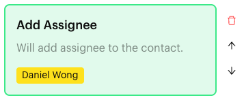
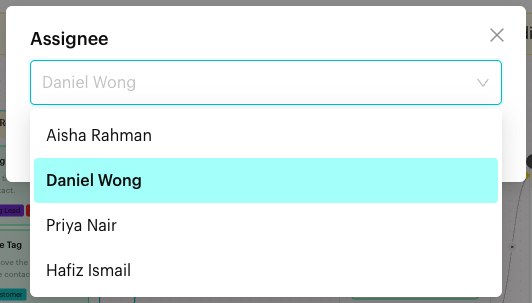

# Add Assignee

## What is Add Assignee?

**Add Assignee** is an action in the [Actions step](../actions.md) of a Message Flow. When a contact reaches the step, the contact is assigned to the team member you chose. The block reads "Will add assignee to the contact."

<figure><figcaption>
Add Assignee block
</figcaption></figure>

## When to use it?

* **Route by topic**: Assign catering enquiries to Daniel Wong, who handles events.
* **Hand off from the bot**: Assign the contact to a person when the flow can't answer.
* **Make ownership clear**: Every lead from a campaign gets an owner straight away.

## How to set it up (Step by Step)



#### Open the Actions step

Go to **Automations** > **Message Flows**, open the flow and click **Edit Flow**. Click an Actions step, or add one (**+** > **Logic** > **Actions**).



#### Add the action

In the step's panel, click **Add Assignee**. An empty block appears in red with "Please select an assignee."



#### Choose the team member

Click the block. In the **Assignee** window, open the list ("Select an Assignee") and pick one team member. Click **OK**.

<figure><figcaption>
Pick one team member
</figcaption></figure>



#### Publish

Connect the step to the next step and click **Publish Flow**.



## What happens after it triggers?

The contact is assigned to the selected team member, and the flow moves on. The assignee shows on the chat in the Inbox, and the chat appears when filtering by that assignee.

## Important behavior to know

* You pick **one** team member per **Add Assignee** block.
* You can add one **Add Assignee** block per Actions step.
* Team members whose account was deleted are listed with an **Account Deleted** tag and can't be picked.
* If the chosen team member is later removed from your team, the block turns red and shows "Team User Not found (ID)". Hover over it to see "This assignee no longer exists. Please select another one."
* To take the assignee off a contact, use **Remove Assignee**. See [Actions](../actions.md#remove-assignee).

## Common issues & solutions

* **"In Action Node "…", the Content Block "Add Assignee" is missing an assignee."** when publishing: Click the block and pick a team member.
* **"Team User Not found (ID)"** on the block: That person is no longer on your team. Click the block and pick someone else.
* **A team member is missing from the list**: Make sure they have joined your team.

## Best practice 💡

* Assign by role: send catering leads to the events person, refunds to the person who handles payments.
* To share leads evenly across several people, use a [Round Robin](../round-robin.md) step where each round leads to an Actions step that assigns a different person.
* Add teammates who only need to follow along as collaborators instead. See [Add Collaborator](add-collaborator.md).

## Related Documentation

* [Actions](../actions.md)
* [Add Collaborator](add-collaborator.md)
* [Round Robin](../round-robin.md)
* [Filters](../../../inbox/filters.md)
