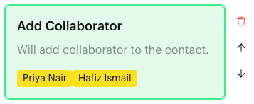
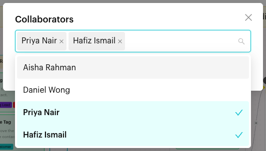

# Add Collaborator

## What is Add Collaborator?

**Add Collaborator** is an action in the [Actions step](../actions.md) of a Message Flow. When a contact reaches the step, the team members you chose are added to the contact as collaborators. The block reads "Will add collaborator to the contact."

Collaborators are extra team members who follow the chat. They don't replace the assignee.

<figure><figcaption>
Add Collaborator block
</figcaption></figure>

## When to use it?

* **Bring in specialists**: Add Priya Nair (kitchen) and Hafiz Ismail (delivery) to catering chats while Daniel Wong stays the assignee.
* **Keep a manager in the loop**: Add the owner to high-value enquiries.

## How to set it up (Step by Step)



#### Open the Actions step

Go to **Automations** > **Message Flows**, open the flow and click **Edit Flow**. Click an Actions step, or add one (**+** > **Logic** > **Actions**).



#### Add the action

In the step's panel, click **Add Collaborator**. An empty block appears in red with "Please select a collaborator."



#### Choose the team members

Click the block. In the **Collaborators** window, open the list ("Select a collaborator") and pick one or more team members. Click **OK**.

<figure><figcaption>
Pick one or more collaborators
</figcaption></figure>



#### Publish

Connect the step to the next step and click **Publish Flow**.



## What happens after it triggers?

The selected team members are added as collaborators on the contact, and the flow moves on. They show on the contact in the Inbox, and the chat appears when filtering by those collaborators.

## Important behavior to know

* Collaborators are added on top of the assignee. The assignee doesn't change.
* You can add one **Add Collaborator** block per Actions step, but it can hold many people.
* Team members whose account was deleted are listed with an **Account Deleted** tag and can't be picked.
* If a chosen team member is later removed from your team, the block turns red and shows "Team User Not found (ID)" with the tooltip "This collaborator no longer exists. Please select another one."
* To take collaborators off, use **Remove Collaborator**. See [Actions](../actions.md#remove-collaborator).

## Common issues & solutions

* **"In Action Node "…", the Content Block "Add Collaborator" is missing a collaborator."** when publishing: Click the block and pick at least one team member.
* **"Team User Not found (ID)"** on the block: Remove that person from the block and pick someone else.
* **A team member is missing from the list**: Make sure they have joined your team.

## Best practice 💡

* Use **Add Assignee** for the one person who owns the chat, and **Add Collaborator** for helpers.
* Keep the collaborator list short so people only follow chats they need.

## Related Documentation

* [Actions](../actions.md)
* [Add Assignee](add-assignee.md)
* [Filters](../../../inbox/filters.md)
