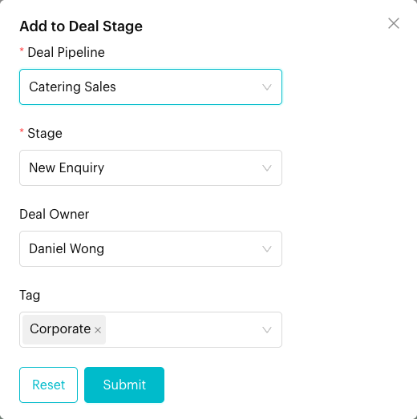
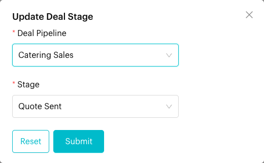
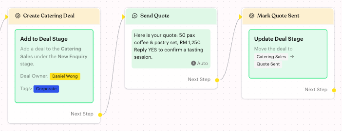

# Add to Deal Stage

## What is Add to Deal Stage?

**Add to Deal Stage** is an action that creates a new deal for the contact in the deal pipeline and stage you choose. You can also set a **Deal Owner** and deal tags.

Its partner action, **Update Deal Stage**, moves the contact's existing deal to another stage. Both are covered on this page.

Both actions only appear if your plan includes **Deals** and you have access to it.

## When to use it?

* **New leads**: Create a deal in *New Enquiry* when a customer asks for a catering quote.
* **Sales progress**: Move the deal to *Quote Sent* after the flow sends the quote.
* **Hand-off to sales**: Give the deal to the right owner, such as Daniel for catering, so it shows on their board straight away.

## How to set it up (Step by Step)



#### Add the action

Go to **Automations** > **Message Flows**, open the flow and click **Edit Flow**. Click an **Action** step (or add one), then click **Add to Deal Stage** to create a deal, or **Update Deal Stage** to move one.

A new card shows "Please select a deal pipeline." (or "Please select a deal pipeline and stage.") with a red border until you set it up.



#### Create a deal: choose the pipeline, stage, owner and tags

Click the **Add to Deal Stage** card and fill in:

* **Deal Pipeline**: The pipeline for the new deal, e.g. *Catering Sales*.
* **Stage**: The stage the deal starts in, e.g. *New Enquiry*. The list shows the stages of the pipeline you picked.
* **Deal Owner** (optional): The team member who owns the deal.
* **Tag** (optional): One or more deal tags, e.g. *Corporate*.

Click **Submit**.

<figure><figcaption>
Add to Deal Stage settings
</figcaption></figure>



#### Move a deal: choose the pipeline and stage

Click the **Update Deal Stage** card and choose the **Deal Pipeline** and the **Stage** to move the deal to, e.g. *Catering Sales* → *Quote Sent*. Click **Submit**.

<figure><figcaption>
Update Deal Stage settings
</figcaption></figure>



#### Check the cards and publish

The cards now summarise what they do, for example "Add a deal to the **Catering Sales** under the **New Enquiry** stage." and "Move the deal to Catering Sales → Quote Sent". Click **Publish Flow**.

<figure><figcaption>
Create a deal, send the quote, then move the deal
</figcaption></figure>



## What happens after it triggers?

**Add to Deal Stage**

* A new deal is created and linked to the contact, in the pipeline and stage you chose.
* The deal gets **Medium** priority, plus the **Deal Owner** and tags you set.
* The deal appears on the [Deals Board](../../../deals/board.md) and on the contact's profile in the Inbox.
* The flow continues to the next step.

**Update Deal Stage**

* Luluchat finds the contact's deal and moves it to the stage you chose.
* If the contact has no deal, nothing changes.
* The flow continues to the next step either way.

## Important behavior to know

* **Add creates a new deal every time**: If the same contact reaches this action twice, they get two deals. Use **Update Deal Stage** to move an existing deal instead.
* **Update moves one deal only**: If the contact has several deals, only one of them is moved, and it may not be the one in the pipeline you picked. It works best when each contact has one open deal.
* **Pick the pipeline first**: Changing **Deal Pipeline** clears **Stage**. Choose the stage again.
* **One of each per Action step**: You can't add the same action twice in one Action step. The app shows "This action already exists in the current Action Node."

## Common issues & solutions

* **The buttons are missing**: Your plan doesn't include Deals, or you don't have access to it.
* **The card stays red**: Open it and choose both **Deal Pipeline** and **Stage**, then click **Submit**.
* **The pipeline or stage isn't in the list**: Create it in [Deals](../../../deals/index.md) first, then reopen the action.
* **Duplicate deals**: Place **Add to Deal Stage** where each contact only passes once, and use **Update Deal Stage** for later steps.
* **Update Deal Stage did nothing**: The contact had no deal. Add an **Add to Deal Stage** action earlier in the flow.

## Best practice 💡

* Create the deal at the first sign of interest, then move it with **Update Deal Stage** as the flow progresses.
* Set a **Deal Owner** so the lead lands on someone's board right away.
* Use deal tags such as *Corporate* or *Wedding* so you can filter and report on deal types.

## Related Documentation

* [Deals](../../../deals/index.md)
* [Deals Board](../../../deals/board.md)
* [Trigger (Deal Stage)](../../steps/trigger.md)
* [Add to Ticket Stage](add-ticket-stage.md)
* [Logic: Actions](../actions.md)
