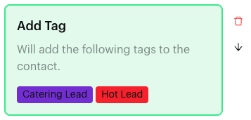
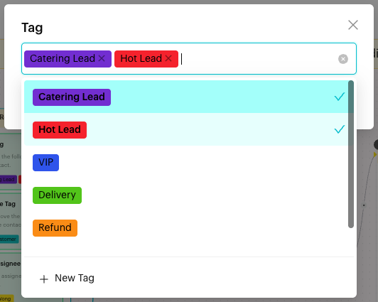

# Add Tag

## What is Add Tag?

**Add Tag** is an action in the [Actions step](../actions.md) of a Message Flow. When a contact reaches the step, the tags you chose are added to the contact. The block reads "Will add the following tags to the contact."

<figure><figcaption>
Add Tag block
</figcaption></figure>

## When to use it?

* **Segment contacts**: Tag contacts who ask about catering as "Catering Lead".
* **Mark interest**: Tag contacts who tap "Order now" as "Hot Lead".
* **Track journeys**: Tag contacts by the path they took through a flow, for reports and filters.

## How to set it up (Step by Step)



#### Open the Actions step

Go to **Automations** > **Message Flows**, open the flow and click **Edit Flow**. Click an Actions step, or add one (**+** > **Logic** > **Actions**).



#### Add the action

In the step's panel, click **Add Tag**. An empty **Add Tag** block appears in red with "Please select a tag".



#### Choose the tags

Click the block. In the **Tag** window, open the list ("Please select a tag") and pick one or more tags. Type to search. Click **OK**.

To create a tag here, click **New Tag** at the bottom of the list, choose a **Tag Color**, type the **Tag Name** and click **Add Tag**.

<figure><figcaption>
Choose tags in the Tag window
</figcaption></figure>



#### Publish

Connect the step to the next step and click **Publish Flow**.



## What happens after it triggers?

The selected tags are added to the contact, and the flow moves on. You can see the tags on the contact in the Inbox and use them in Inbox filters and in **Condition** steps.

## Important behavior to know

* You can add one **Add Tag** block per Actions step, but it can hold many tags.
* Tags you create in the **Tag** window are added to your team's tag list straight away.

## Common issues & solutions

* **"In Action Node "…", the Content Block "Add Tag" is missing a tag."** when publishing: Click the block and choose at least one tag.
* **"This action already exists in the current Action Node."**: The step already has **Add Tag**. Click the existing block and add more tags to it.
* **I can't find a tag**: Type part of the name to search, or create it with **New Tag**. See [Tags](../../../settings/data/tags.md).

## Best practice 💡

* Use short, consistent tag names, such as "Catering Lead" and "VIP".
* Pair **Add Tag** with **Remove Tag** to move contacts from one stage to the next, for example add "Customer" and remove "New Customer".
* Only add tags you will use for routing, filters or reports.

## Related Documentation

* [Actions](../actions.md)
* [Remove Tag](remove-tag.md)
* [Condition](../condition.md)
* [Tags](../../../settings/data/tags.md)
* [Filters](../../../inbox/filters.md)
