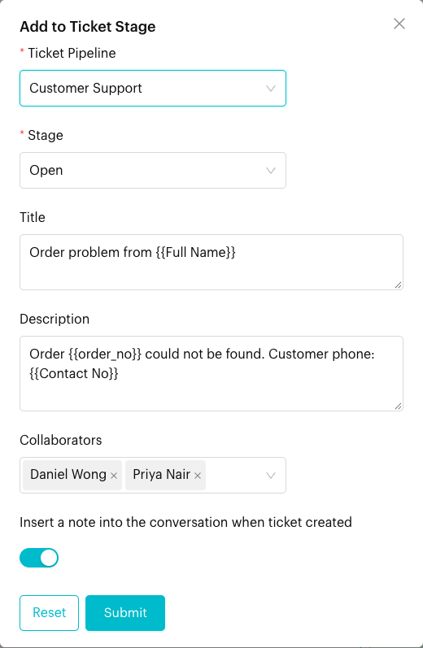
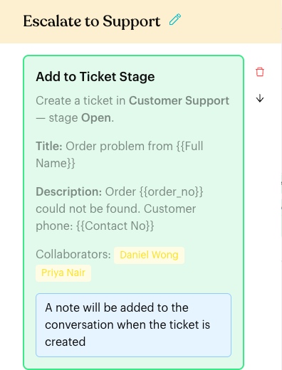

# Add to Ticket Stage

## What is Add to Ticket Stage?

**Add to Ticket Stage** is an action that creates a new ticket for the contact in the ticket pipeline and stage you choose. Use it to turn customer requests into tickets automatically, for example when a customer reports a problem with an order.

This action only appears if your plan includes **Tickets** and you have access to it.

## When to use it?

* **Problem reports**: A customer picks "Report a problem" in a menu, and a ticket is created in *Open*.
* **Failed lookups**: An order lookup [Webhook](webhook.md) fails, so the flow creates a ticket for the team to check by hand.
* **Refund or complaint requests**: Log every request on the Tickets board so nothing is missed.

## How to set it up (Step by Step)



#### Add the action

Go to **Automations** > **Message Flows**, open the flow and click **Edit Flow**. Click an **Action** step (or add one), then click **Add to Ticket Stage**.

The new card says "Please configure ticket pipeline, stage, and fields." and has a red border until you choose a stage.



#### Fill in the ticket details

Click the card and fill in:

| Field | What to enter |
| --- | --- |
| **Ticket Pipeline** | The pipeline for the ticket, e.g. *Customer Support*. |
| **Stage** | The stage the new ticket starts in, e.g. *Open*. The list shows the stages of the pipeline you picked. |
| **Title** | The ticket summary. You can type placeholders, e.g. `Order problem from {{Full Name}}`. |
| **Description** | More details, e.g. `Order {{order_no}} could not be found. Customer phone: {{Contact No}}`. |
| **Collaborators** | Team members to add to the ticket (optional). |
| **Insert a note into the conversation when ticket created** | Turn on to add an internal note to the chat with the ticket number and a link. |

Click **Submit**.

<figure><figcaption>
Add to Ticket Stage settings
</figcaption></figure>



#### Check the card and publish

The card now shows "Create a ticket in **Customer Support** — stage **Open**.", the title, description and collaborators. If you turned on the note, it also says "A note will be added to the conversation when the ticket is created". Click **Publish Flow**.

<figure><figcaption>
The saved action card
</figcaption></figure>



## What happens after it triggers?

* A new ticket is created and linked to the contact, in the pipeline and stage you chose, with **Medium** priority.
* Placeholders in **Title** and **Description** are replaced with the contact's details.
* The collaborators you chose are added to the ticket.
* If **Insert a note** is on, an internal note from the automation is added to the chat, e.g. `🎫 Ticket created: [SUP-12] https://…`. The customer doesn't see it. Your team can click the link to open the ticket.
* The flow continues to the next step.

## Important behavior to know

* **A new ticket every time**: If the same contact reaches this action twice, they get two tickets. It doesn't move an existing ticket.
* **Pick the pipeline first**: Changing **Ticket Pipeline** clears **Stage**. Choose the stage again.
* **The note needs a ticket**: The note is only added if the ticket was created.
* **One per Action step**: You can't add this action twice in one Action step. The app shows "This action already exists in the current Action Node."

## Common issues & solutions

* **The button is missing**: Your plan doesn't include Tickets, or you don't have access to it.
* **No ticket was created**: Check that the flow is published and the contact actually took the path with this action. Make sure a **Stage** is selected (the card isn't red).
* **Duplicate tickets**: Place the action where each contact only passes once, for example after a menu choice instead of at the start of the flow.
* **The pipeline or stage isn't in the list**: Create it on the Tickets [Board](../../../tickets/board.md), then reopen the action.
* **Placeholders show up as text**: Check the spelling. It must match exactly, such as `{{Full Name}}`, `{{Contact No}}`, or a custom attribute name in double curly brackets, such as `{{order_no}}`.

## Best practice 💡

* Use a clear **Title** with placeholders, such as `Order problem from {{Full Name}}`, so tickets are easy to recognise on the board.
* Turn on **Insert a note** so agents in the Inbox can open the ticket straight from the chat.
* Add collaborators so the right people see the ticket right away.
* Pair it with [Send WhatsApp Message](send-whatsapp-message.md) to alert the manager on duty.

## Related Documentation

* [Tickets](../../../tickets/index.md)
* [Tickets Board](../../../tickets/board.md)
* [Internal Note](../../../inbox/internal-note.md)
* [Add to Deal Stage](add-deal-stage.md)
* [Logic: Actions](../actions.md)
