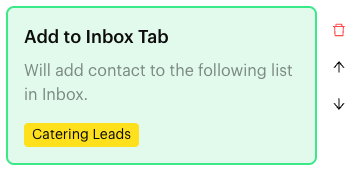
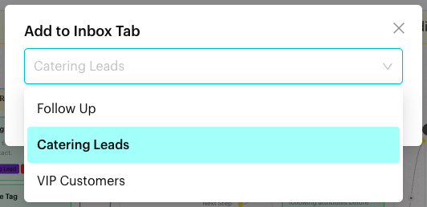

# Add to Inbox Tab

## What is Add to Inbox Tab?

**Add to Inbox Tab** is an action in the [Actions step](../actions.md) of a Message Flow. When a contact reaches the step, the contact is added to the Inbox list (tab) you chose. The block reads "Will add contact to the following list in Inbox."

The lists you can pick are your [Custom Lists](../../../inbox/custom-lists.md), such as "Follow Up" or "Catering Leads".

<figure><figcaption>
Add to Inbox Tab block
</figcaption></figure>

## When to use it?

* **Triage**: Put every catering enquiry in a "Catering Leads" list so the events team works from one place.
* **Follow-ups**: Add contacts who asked for a quote to "Follow Up".
* **VIP handling**: Add top customers to "VIP Customers".

## How to set it up (Step by Step)



#### Create the list first

If the list doesn't exist yet, create it in the Inbox. See [Custom Lists](../../../inbox/custom-lists.md).



#### Open the Actions step

Go to **Automations** > **Message Flows**, open the flow and click **Edit Flow**. Click an Actions step, or add one (**+** > **Logic** > **Actions**).



#### Add the action

In the step's panel, click **Add to Inbox Tab**. An empty block appears in red with "Please select a tab."



#### Choose the list

Click the block. In the **Add to Inbox Tab** window, open the list ("Select a tab") and pick one list. Click **OK**.

<figure><figcaption>
Only custom lists are offered
</figcaption></figure>



#### Publish

Connect the step to the next step and click **Publish Flow**.



## What happens after it triggers?

The contact is added to the selected list, and the flow moves on. Your team sees the chat when they open that list in the Inbox.

## Important behavior to know

* Each block adds the contact to **one** list.
* Only custom lists are offered. Built-in lists such as **All**, **Unread** or **Closed** can't be picked.
* You can add one **Add to Inbox Tab** block per Actions step. To add a contact to two lists, use a second Actions step.
* Adding to a list doesn't change the contact's tags or assignee. Combine with **Add Tag** or **Add Assignee** if needed.
* To take a contact out of a list, use **Remove from Inbox Tab**. See [Actions](../actions.md#remove-from-inbox-tab).

## Common issues & solutions

* **"In Action Node "…", the Content Block "Add to Inbox Tab" is missing an inbox tab."** when publishing: Click the block and pick a list.
* **The list I want isn't offered**: It may be a built-in list, or it hasn't been created yet. See [Custom Lists](../../../inbox/custom-lists.md).
* **"This action already exists in the current Action Node."**: The step already has **Add to Inbox Tab**. Use another Actions step for a second list.

## Best practice 💡

* Use lists for the team's daily work queues and tags for long-term segments.
* Pair with **Remove from Inbox Tab** in a later flow to clear the list when the work is done.

## Related Documentation

* [Actions](../actions.md)
* [Custom Lists](../../../inbox/custom-lists.md)
* [Add Tag](add-tag.md)
* [Add Assignee](add-assignee.md)
