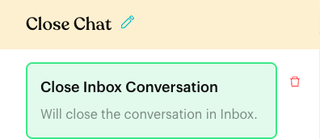

# Close Inbox Conversation

## What is Close Inbox Conversation?

**Close Inbox Conversation** is an action that closes the contact's chat in the Inbox, the same way your team does with the **Close** button. The chat moves from the **All** list to the **Closed** list. All messages are kept.

It has no settings. You add it to an **Action** step, and every contact who reaches that step has their conversation closed.

## When to use it?

* **Self-service answers**: Close the chat after the flow has answered the question, such as an order status check or opening hours.
* **Finished surveys**: Close the chat after the customer completes a feedback flow.
* **Opt-out paths**: Close the chat after you confirm an unsubscribe request.
* **Keep the All list clean**: Stop automated chats from piling up in the Inbox when nobody on the team needs to reply.

## How to set it up (Step by Step)



#### Open the flow in edit mode

Go to **Automations** > **Message Flows**, open the flow, and click **Edit Flow**.



#### Add the action

Click the **Action** step at the end of the path you want to close (or add a new Action step there). In the panel, click **Close Inbox Conversation**.

The action card appears in the step: **Close Inbox Conversation** — "Will close the conversation in Inbox." There is nothing else to fill in.

<figure><figcaption>
Close Inbox Conversation in an Action step
</figcaption></figure>



#### Publish the flow

Click **Publish Flow**. The action only runs in the published version of the flow.



## What happens after it triggers?

* A few seconds after the step runs, the conversation is added to the **Closed** list and leaves the **All** list. Other lists the chat belongs to (such as custom lists) are not changed.
* The assignee is removed when the chat closes, unless **Keep assignee after conversation closes** is turned on in [Inbox settings](../../../settings/tools/inbox.md).
* The chat history is kept. Nothing is deleted.
* The flow carries on to the next step, if there is one.
* If the customer sends a new message later, the conversation opens again and returns to the **All** list.

## Important behavior to know

* **Small delay**: The close happens about 5 seconds after the step runs, not at the exact same moment.
* **Steps after it still run**: Closing the chat does not stop the flow. Put this action at the end of the path so the chat isn't closed while the flow is still talking to the customer.
* **A new customer reply reopens it**: If your next step asks a question and the customer answers, the chat opens again. This is expected.
* **One per Action step**: You can't add the same action twice in one Action step. The app shows "This action already exists in the current Action Node."

## Common issues & solutions

* **The chat is still in the All list**: Check that the flow is published and that the contact actually reached the path with this action. Wait a few seconds, then refresh the Inbox.
* **The chat came back after it closed**: The customer sent another message, so the conversation reopened. This is expected.
* **The assignee disappeared**: Closing removes the assignee by default. Turn on **Keep assignee after conversation closes** in [Inbox settings](../../../settings/tools/inbox.md) to keep it.
* **A chat closed too early**: Move the action to the very end of the path, after the last message and any **Wait for Reply** step.

## Best practice 💡

* Send a short closing message first, such as "Thanks for chatting with Kopi Corner! Reply anytime if you need us ☕", then close.
* Only close chats on paths where the customer's question is fully answered. Leave chats open when a staff member needs to follow up.
* Check the **Closed** list now and then to make sure the flow isn't closing chats that still need a reply.

## Related Documentation

* [Close Conversation (Inbox)](../../../inbox/close-conversation.md)
* [Custom Lists](../../../inbox/custom-lists.md)
* [Inbox settings](../../../settings/tools/inbox.md)
* [Logic: Actions](../actions.md)
