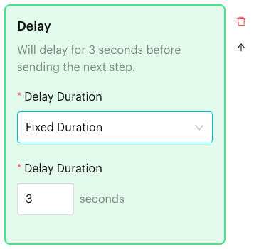
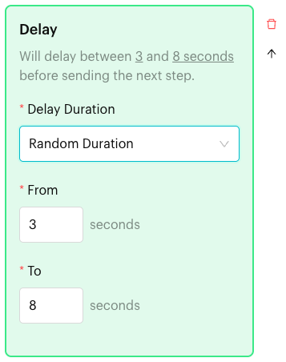

# Delay

## What is Delay?

**Delay** is an action in the [Actions step](../actions.md) of a Message Flow. It pauses the flow for a few **seconds** before the next step. Use it to make a conversation feel natural, for example a short pause between two messages.

You can set a **Fixed Duration** (always the same number of seconds) or a **Random Duration** (a random time between two values).

<figure><figcaption>
Fixed delay of 3 seconds
</figcaption></figure>

## When to use it?

* **Natural pacing**: Wait 3 seconds after "Thanks for your interest in Kopi Corner catering!" before asking the next question.
* **Give time to read**: Pause after sending a menu image before the next message.
* **Look less robotic**: Use a random delay of 3 to 8 seconds so replies don't always arrive at the same speed.

## How to set it up (Step by Step)



#### Open the Actions step

Go to **Automations** > **Message Flows**, open the flow and click **Edit Flow**. Click an Actions step, or add one (**+** > **Logic** > **Actions**).



#### Add the action

In the step's panel, click **Delay**. A **Delay** block appears with a **Fixed Duration** of 3 seconds.



#### Set the duration

Delay is set up directly in the block. Under **Delay Duration**, choose:

* **Fixed Duration**: Enter the number of **seconds** (1 to 25).
* **Random Duration**: Enter **From** (1 to 24 seconds) and **To** (2 to 25 seconds). When you switch to Random Duration, **To** starts at 5.

The summary at the top updates, for example "Will delay between 3 and 8 seconds before sending the next step." Your changes are saved as you type.

<figure><figcaption>
Random delay between 3 and 8 seconds
</figcaption></figure>



#### Publish

Connect the step to the next step and click **Publish Flow**.



## What happens after it triggers?

The flow waits for the set number of seconds, then moves to the next step. On the canvas, the step shows a clock icon; hover over it to see **Delay**.

## Important behavior to know

* Delay only works in **seconds**, up to 25. For longer waits (minutes, hours or days), use [Smart Delay](../smart-delay.md).
* Delay doesn't check for replies. To wait for the customer to answer, use [Wait for Reply](wait-reply.md).
* You can add one **Delay** block per Actions step.

## Common issues & solutions

* **"Please enter Delay Duration"**: The seconds box is empty. Enter a number.
* **I need to wait longer than 25 seconds**: Use [Smart Delay](../smart-delay.md) instead.
* **"This action already exists in the current Action Node."**: The step already has a **Delay**. Change its duration instead.

## Best practice 💡

* Keep delays short (2 to 5 seconds) so customers aren't left waiting.
* Use **Random Duration** for chatty flows so the timing feels more human.
* Put **Delay** in its own Actions step between two message steps when you want a pause between them.

## Related Documentation

* [Actions](../actions.md)
* [Wait for Reply](wait-reply.md)
* [Smart Delay](../smart-delay.md)
* [Typing Indicator](../../typing-indicator.md)
