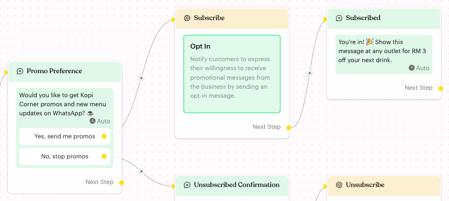

# Opt In

## What is Opt In?

**Opt In** is an action that sets the contact's **Opt-In Status** to **Opted In**. Use it when a customer says they want to receive promotions and updates from you.

Opted-in contacts can receive your broadcasts and automated flow messages. The action has no settings.

## When to use it?

* **Promo sign-up**: A customer taps "Yes, send me promos" on a button in your flow.
* **Re-subscribe**: A customer who opted out earlier sends a keyword such as "PROMO" to subscribe again.
* **Campaign entry**: A customer joins a giveaway or loyalty programme through a flow and agrees to receive updates.

## How to set it up (Step by Step)



#### Ask for consent first

Build the question into your flow, for example a **Message** step with a "Yes, send me promos" button. Only contacts who agree should reach the Opt In action.



#### Add the action

Click **Edit Flow**, then click the **Action** step on the "yes" path (or add a new Action step there). In the panel, click **Opt In**.

The card reads **Opt In** — "Notify customers to express their willingness to receive promotional messages from the business by sending an opt-in message." There is nothing else to fill in.

<figure><figcaption>
Opt In on the "yes" path of a promo sign-up flow
</figcaption></figure>



#### Confirm with a message

Connect the Action step to a **Message** step that confirms the sign-up, such as "You're in! 🎉". The Opt In action does not send any message by itself.



#### Publish the flow

Click **Publish Flow**.



## What happens after it triggers?

* The contact's **Opt-In Status** changes to **Opted In**. You can see it on the contact's profile in the Inbox.
* The contact can receive broadcasts and automated flow messages again.
* The flow continues to the next step.

## Important behavior to know

* **No message is sent**: Despite the card text, the action only changes the status. Add your own confirmation message.
* **Works for any contact**: The contact doesn't need to have opted out before. If they are already opted in, nothing changes.
* **Opt In Status filter**: You can find opted-in or opted-out contacts with the **Opt In Status** condition in Inbox [Filters](../../../inbox/filters.md).
* **Manual change is still possible**: Your team can switch the status on the contact's profile at any time. See [Profile](../../../inbox/contact-info/profile.md).

## Common issues & solutions

* **Status didn't change**: Check that the flow is published and the contact took the path that has the Opt In action.
* **Contact still doesn't get broadcasts**: Check the broadcast's other audience rules (tags, lists, channel). Opt In only removes the opt-out block.
* **Customer got no confirmation**: Add a **Message** step after the action.

## Best practice 💡

* Always ask first and opt in only contacts who clearly said yes.
* Tell customers how to stop, for example "Reply STOP anytime to unsubscribe", and build that path with [Opt Out](opt-out.md).
* Add a tag such as "Promo Subscriber" in the same Action step so you can see where the consent came from.

## Related Documentation

* [Opt Out](opt-out.md)
* [Opt-In Flow](../../opt-in-flow.md)
* [Broadcasts](../../../broadcasts.md)
* [Profile (Opt-In Status)](../../../inbox/contact-info/profile.md)
* [Logic: Actions](../actions.md)
