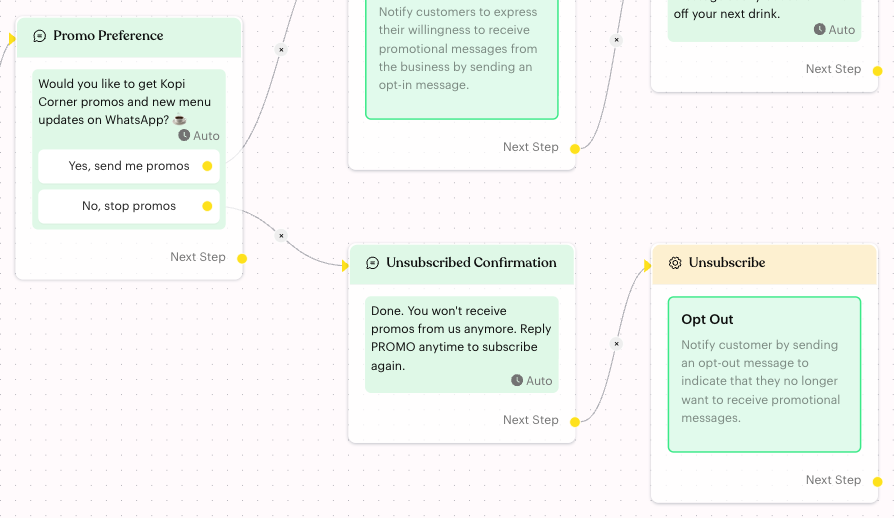

# Opt Out

## What is Opt Out?

**Opt Out** is an action that sets the contact's **Opt-In Status** to **Opted Out**. Use it when a customer asks to stop receiving promotions from you.

Opted-out contacts are left out of broadcasts, and your regular message flows stop sending them messages. The action has no settings.

## When to use it?

* **Unsubscribe requests**: A customer taps "No, stop promos" or sends a keyword such as "STOP".
* **Preference menus**: A customer picks "Stop promos" in a settings or preferences flow.
* **Complaints**: A customer says they don't want marketing messages.

## How to set it up (Step by Step)



#### Send the confirmation message first

On the unsubscribe path, add a **Message** step that confirms the request, for example "Done. You won't receive promos from us anymore. Reply PROMO anytime to subscribe again."

Put this message **before** the Opt Out action. Once the contact is opted out, later messages in the same flow are not sent.



#### Add the action

Click **Edit Flow**, then click the **Action** step after the confirmation message (or add a new one). In the panel, click **Opt Out**.

The card reads **Opt Out** — "Notify customer by sending an opt-out message to indicate that they no longer want to receive promotional messages." There is nothing else to fill in.

<figure><figcaption>
Confirmation message first, then Opt Out
</figcaption></figure>



#### Publish the flow

Click **Publish Flow**.



## What happens after it triggers?

* The contact's **Opt-In Status** changes to **Opted Out**. You can see it on the contact's profile in the Inbox.
* Broadcasts skip the contact.
* Automated messages from your regular message flows are no longer delivered to the contact, including any messages that come after this action in the same flow.
* The flow continues to the next step, but its messages won't reach the contact.

## Important behavior to know

* **No message is sent**: Despite the card text, the action only changes the status. Send your confirmation message before it.
* **Your team can still reply**: Opt Out blocks broadcasts and flow messages. Messages your team types in the Inbox are still sent.
* **Not permanent**: The contact becomes opted in again if they go through an [Opt In](opt-in.md) action, or if your team switches the status on their profile.
* **Find opted-out contacts**: Use the **Opt In Status** condition in Inbox [Filters](../../../inbox/filters.md).

## Common issues & solutions

* **The customer didn't get the confirmation**: The message was placed after the Opt Out action. Move it before the action.
* **Contact still receives promos**: Check that the flow is published and the contact reached the Opt Out step. Check their **Opt-In Status** on the profile.
* **A customer opted out by mistake**: Switch their status back to **Opted In** on their profile, or let them send your opt-in keyword.

## Best practice 💡

* Keep the opt-out path short: one confirmation message, then Opt Out.
* Tell customers how to come back, such as "Reply PROMO anytime to subscribe again".
* Add [Close Inbox Conversation](close-conversation.md) at the end if nobody on the team needs to follow up.

## Related Documentation

* [Opt In](opt-in.md)
* [Opt-Out Flow](../../opt-out-flow.md)
* [Broadcasts](../../../broadcasts.md)
* [Profile (Opt-In Status)](../../../inbox/contact-info/profile.md)
* [Logic: Actions](../actions.md)
