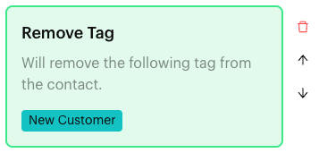
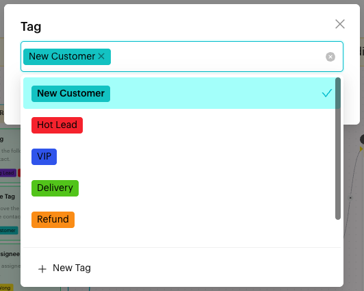

# Remove Tag

## What is Remove Tag?

**Remove Tag** is an action in the [Actions step](../actions.md) of a Message Flow. When a contact reaches the step, the tags you chose are removed from the contact. The block reads "Will remove the following tag from the contact."

<figure><figcaption>
Remove Tag block
</figcaption></figure>

## When to use it?

* **Move contacts along**: Remove "New Customer" once they place their first catering enquiry.
* **Clear temporary tags**: Remove "Refund" after the refund flow is finished.
* **Keep segments accurate**: Remove tags that no longer describe the contact.

## How to set it up (Step by Step)



#### Open the Actions step

Go to **Automations** > **Message Flows**, open the flow and click **Edit Flow**. Click an Actions step, or add one (**+** > **Logic** > **Actions**).



#### Add the action

In the step's panel, click **Remove Tag**. An empty **Remove Tag** block appears in red with "Please select a tag".



#### Choose the tags to remove

Click the block. In the **Tag** window, pick one or more tags ("Please select a tag"). Type to search. Click **OK**.

<figure><figcaption>
Choose the tags to remove
</figcaption></figure>



#### Publish

Connect the step to the next step and click **Publish Flow**.



## What happens after it triggers?

The selected tags are removed from the contact, and the flow moves on. The contact's other tags stay as they are.

## Important behavior to know

* Only the tags you select are removed.
* If the contact doesn't have a selected tag, nothing changes for that tag.
* You can add one **Remove Tag** block per Actions step, but it can hold many tags.
* **Add Tag** and **Remove Tag** can be in the same step.

## Common issues & solutions

* **"In Action Node "…", the Content Block "Add Tag" is missing a tag."** when publishing: The app uses this message for empty **Remove Tag** blocks too. Click the block and choose at least one tag.
* **"This action already exists in the current Action Node."**: The step already has **Remove Tag**. Add the extra tags to the existing block.
* **The tag is still on the contact**: Check that the contact went through this step, and that the flow was published after you added the action.

## Best practice 💡

* Use **Remove Tag** together with **Add Tag** to swap one status for another.
* Remove short-term tags (such as "Awaiting Payment") as soon as they no longer apply, so filters stay accurate.

## Related Documentation

* [Actions](../actions.md)
* [Add Tag](add-tag.md)
* [Tags](../../../settings/data/tags.md)
* [Filters](../../../inbox/filters.md)
