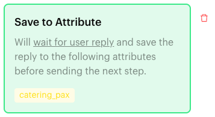
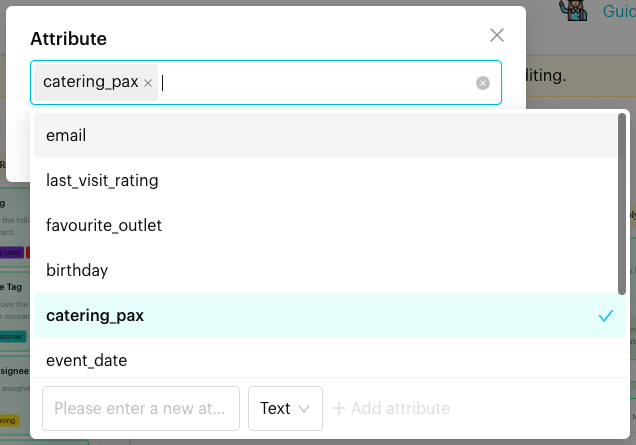

# Save to Attribute

## What is Save to Attribute?

**Save to Attribute** is an action in the [Actions step](../actions.md) of a Message Flow. It waits for the contact to reply, then saves the reply into the custom attributes you chose. The block reads "Will wait for user reply and save the reply to the following attributes before sending the next step."

<figure><figcaption>
Save to Attribute block
</figcaption></figure>

## When to use it?

* **Collect details**: Ask "How many pax are you expecting?" and save the answer to `catering_pax`.
* **Capture contact info**: Ask for an email address and save it to `email`.
* **Personalise later messages**: Save the customer's favourite outlet and use it in later flows.

## How to set it up (Step by Step)



#### Ask the question first

Add a message step that asks the question, for example "How many pax are you expecting? (e.g. 30 pax)".



#### Add an Actions step after the question

Go to **Automations** > **Message Flows**, open the flow and click **Edit Flow**. Add an Actions step right after the question (**+** > **Logic** > **Actions**) and name it, for example "Save Pax".



#### Add the action

In the step's panel, click **Save to Attribute**. An empty block appears in red with "Please select an attribute."



#### Choose the attributes

Click the block. In the **Attribute** window, open the list ("Select an attribute") and pick one or more custom attributes. Click **OK**.

To create an attribute here, type its name in "Please enter a new attribute" at the bottom of the list, choose a data type and click **Add attribute**.

<figure><figcaption>
Pick the attributes to save the reply to
</figcaption></figure>



#### Publish

Connect the step to the next step and click **Publish Flow**.



## What happens after it triggers?

* The flow waits for the contact's reply.
* When the contact replies, the reply is saved to each selected attribute, and the flow moves to **Next Step**.
* The saved value shows in the contact's custom attributes in the Inbox, and you can use it in later messages and in [Condition](../condition.md) steps.

On the canvas, the step shows a clock icon (tooltip **Wait for user reply**).

## Important behavior to know

* Save to Attribute waits for a reply, just like [Wait for Reply](wait-reply.md). The two can't be in the same Actions step.
* It has no **Not Replied** branch. If you need a follow-up for contacts who don't answer, use [Wait for Reply](wait-reply.md) or [Smart Delay](../smart-delay.md) in your design.
* If you pick several attributes, the same reply is saved to all of them.
* You can add one **Save to Attribute** block per Actions step. To ask two questions, use two message steps, each followed by its own Save to Attribute step.

## Common issues & solutions

* **"In Action Node "…", the Content Block "Save to Attribute" is missing an attribute."** when publishing: Click the block and pick at least one attribute.
* **"Wait for Reply and Save to Attribute cannot coexist in the same node."**: Remove **Wait for Reply** from this step, or move **Save to Attribute** to its own step.
* **The attribute isn't in the list**: Create it with **Add attribute** at the bottom of the list, or in [Custom Attributes](../../../settings/data/custom-attributes.md).
* **The saved value looks wrong**: The whole reply is saved. Make your question clear about the format you expect, for example "Please reply with a number, e.g. 30".

## Best practice 💡

* Put Save to Attribute straight after the question it saves.
* Ask one thing per question so the saved value is clean.
* Give examples in the question ("e.g. 30 pax", "e.g. 2026-12-24") to get consistent answers.

## Related Documentation

* [Actions](../actions.md)
* [Update Attribute](update-attribute.md)
* [Wait for Reply](wait-reply.md)
* [Custom Attributes](../../../settings/data/custom-attributes.md)
* [Condition](../condition.md)
