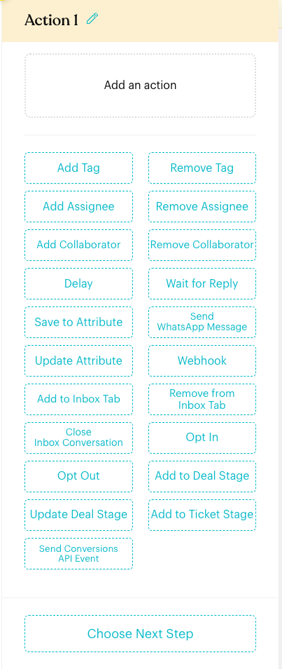

# Send Conversions API Event

## What is Send Conversions API Event?

Sends a conversion event (such as **Lead** or **Purchase**) for the current contact to a Meta dataset through the Meta Conversions API (CAPI). The event shows up in Meta Ads Manager, so you can see which Click-to-WhatsApp, Messenger or Instagram ads turned into leads and sales, and Meta can optimise your campaigns on real results.

## When does it trigger?

* When the flow reaches this `Send Conversions API Event` action while the flow is active.
* Only on **WhatsApp Business (WABA)**, **Messenger** and **Instagram** channels. The action is hidden on WhatsApp Personal channels.

## How to set it up (Step by Step)



**Add the action to an Actions node**

In `Automations` > `Message Flows`, open a flow, select the `Action` step, and click `Send Conversions API Event` (the last button in the list).

<figure><figcaption></figcaption></figure>



**Choose the dataset and event**

Click the new action card to open its settings.

* **Dataset**: the Meta dataset (pixel) that receives the event. If a newly created dataset is missing, click the reload button next to the field.
* **Event**: the Meta standard event to send. Events that need extra data say so in the list, e.g. *Purchase (requires value, currency)*.

<figure><figcaption></figcaption></figure>



**Fill in Customer Information**

Meta uses these details to match the event to a person. **Email or Phone Number is required**; the other fields improve the match rate.

| Field | Default | Tip |
| --- | --- | --- |
| Email | empty | Use a custom attribute holding the email, if you collect one |
| Phone Number | `{{Contact No}}` | Keep the default for WhatsApp contacts |
| Name | `{{Full Name}}` | Keep the default |
| City, State, Zip Code, Country | empty | Fill from custom attributes when available |

Every field accepts placeholders: click **{{}}** inside a field to insert contact details, custom attributes or order values.



**Add Custom Data (optional)**

Custom data describes the conversion itself, such as the order value or product IDs. Click **Add Parameter**, pick a parameter, then enter its value. The value input adapts to the parameter type:

| Parameter type | Examples | How to enter it |
| --- | --- | --- |
| Number | `value`, `num_items`, `predicted_ltv` | Type a number or a placeholder, e.g. `{{order.total}}` |
| Currency | `currency` | 3-letter code, e.g. `MYR`, or `{{order.currency}}` |
| Text | `content_name`, `order_id` | Free text or a placeholder |
| Date | `checkin_date`, `travel_start` | `YYYY-MM-DD` |
| Choice | `content_type`, `delivery_category` | Pick from the dropdown |
| True / False | `status` | Pick True or False |
| List | `content_ids` | Type a value and press Enter for each item |
| Item list | `contents` | Click **Add Item**, then fill id, quantity, item price and delivery category |

Parameters required by the chosen event are added automatically, marked with `*`, and cannot be removed.

<figure><figcaption></figcaption></figure>



**Save and publish**

Click **Save**. The card turns green and shows the event, the dataset and the custom data being sent. Publish the flow to go live.

<figure><figcaption></figcaption></figure>



## Supported events

All Meta standard events are available: Purchase, Lead, CompleteRegistration, Contact, Schedule, AddToCart, AddToWishlist, AddPaymentInfo, InitiateCheckout, Search, StartTrial, Subscribe, SubmitApplication, CustomizeProduct, FindLocation, Donate and ViewContent.

For most businesses, **Lead** (a qualified enquiry) and **Purchase** (a paid order) matter most. Purchase carries a monetary value, which gives Meta a stronger signal about high-value customers.

## What happens after it triggers?

The event is sent to the selected Meta dataset for the current contact and appears in Meta Events Manager and Ads Manager. The flow continues to the next step.


**Important behavior to know**

* **7-day window**: Meta only accepts events within 7 days of the contact's conversation. Place the action in flows that run while the conversation is recent.
* **Datasets**: WhatsApp Business datasets are created by Meta automatically. Messenger and Instagram need a dataset created in Meta Events Manager first.
* **One per Actions node**: Each Actions node holds one Send Conversions API Event. To send more events, add another Actions node.
* **Empty rows are skipped**: Custom Data rows left empty are not sent.


## Example recipes

* **Report a won deal as a Purchase**: [Deal Stage trigger](../../steps/trigger.md) on stage *Won* → Send Conversions API Event with **Purchase**, `value` = the deal amount, `currency` = `MYR`.
* **Report a qualified lead**: Deal Stage trigger on stage *Qualified* → Send Conversions API Event with **Lead**.
* **Report a confirmed appointment**: [Booking Event trigger](../../steps/trigger.md) on *Booking Confirmed* → Send Conversions API Event with **Schedule**.
* **Report a paid Shopify order**: App Event trigger on Shopify *Order Paid* → Send Conversions API Event with **Purchase**, `value` = `{{order.total}}`, `currency` = `{{order.currency}}`, `order_id` = `{{order.id}}`.

## Common issues & solutions

* **Action not in the list**: The channel is WhatsApp Personal. Switch to a WhatsApp Business, Messenger or Instagram channel.
* **Dataset list is empty**: No dataset exists yet (Messenger / Instagram). Create one in Meta Events Manager, then click reload next to Dataset.
* **"Conversion tracking is only available for WhatsApp Business, Messenger and Instagram channels"**: The flow belongs to a WhatsApp Personal channel. Use the action on a supported channel.
* **Events don't appear in Ads Manager**: The conversation is older than 7 days, or both email and phone number are empty. Trigger the flow sooner and keep `{{Contact No}}` in Phone Number.

## Best practice 💡

* Send **Purchase** with an accurate `value` and `currency` whenever you can; it gives Meta the strongest optimisation signal.
* Fill as many Customer Information fields as you have data for, to raise Meta's match rate.
* Pair it with the Deal Stage or Booking Event triggers so conversions are reported the moment they happen in Luluchat.
