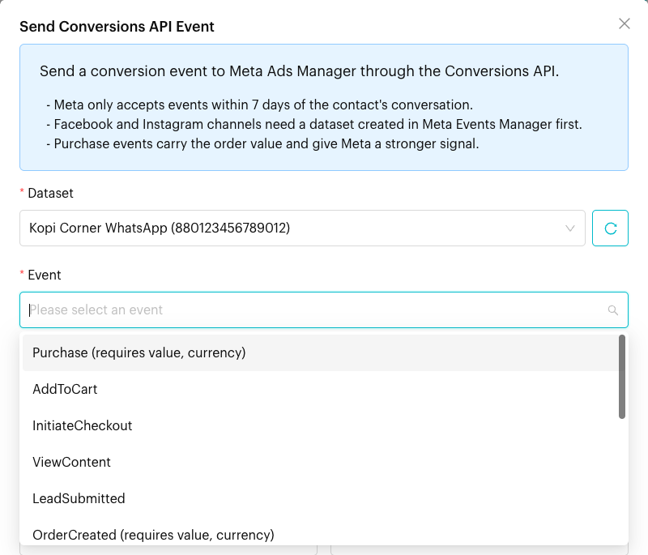
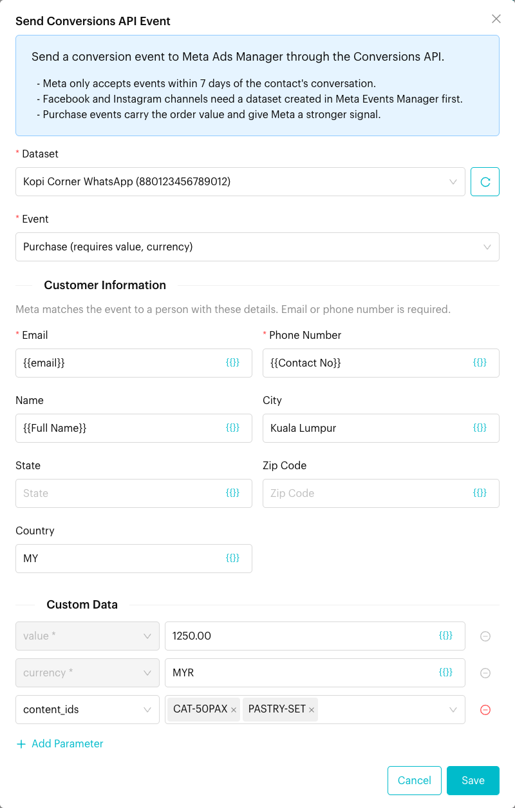
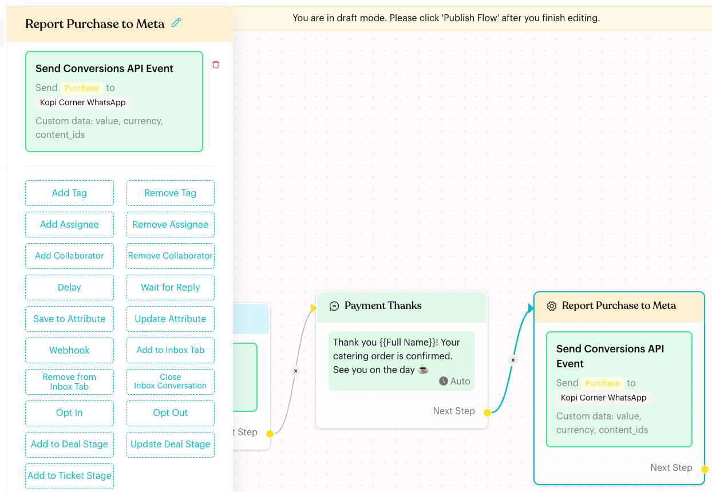

# Send Conversions API Event


**Temporarily unavailable**: The **Send Conversions API Event** button is currently hidden from the Action step, so you can't add this action to a flow right now. Actions that were added earlier still show in your flows and can still be opened and edited.


## What is Send Conversions API Event?

**Send Conversions API Event** is an action that reports a conversion, such as a **Purchase**, for the current contact to Meta through the Meta Conversions API (CAPI). The event is sent to a Meta dataset and shows up in Meta Events Manager and Ads Manager. This helps you see which ads turned into sales, and lets Meta optimise your campaigns on real results.

It works on **WhatsApp Business (WABA)**, **Messenger** and **Instagram** channels.

## When to use it?

* **Paid orders**: Report a **Purchase** with the order value when a customer pays for a catering order.
* **Qualified leads**: Report a **QualifiedLead** when a customer asks for a quote.
* **Order updates**: Report **OrderShipped** or **OrderDelivered** as an order moves along.
* **Reviews**: Report **RatingProvided** or **ReviewProvided** after a feedback flow.

## How to set it up (Step by Step)



#### Open the action

In **Automations** > **Message Flows**, open the flow and click **Edit Flow**. Click the Action step that holds the **Send Conversions API Event** card, then click the card to open its settings.



#### Choose the dataset and event

* **Dataset** (required): The Meta dataset that receives the event, shown as name and ID. If a dataset you just created in Meta is missing, click the reload button (**Reload datasets from Meta**) next to the field.
* **Event** (required): The event to send. Events that need extra data say so in the list, e.g. **Purchase (requires value, currency)**.

<figure><figcaption>
Choose a dataset and an event
</figcaption></figure>



#### Fill in Customer Information

Meta uses these details to match the event to a person. **Email** or **Phone Number** is required. The other fields help Meta find more matches.

| Field | Default | Tip |
| --- | --- | --- |
| **Email** | empty | Use a custom attribute that holds the email, e.g. `{{email}}` |
| **Phone Number** | `{{Contact No}}` | Keep the default for WhatsApp contacts |
| **Name** | `{{Full Name}}` | Keep the default |
| **City**, **State**, **Zip Code**, **Country** | empty | Type a value or use a custom attribute |

Click **{{}}** inside a field to insert contact details or custom attributes.



#### Add Custom Data

Custom data describes the conversion, such as the order value. Click **Add Parameter**, pick a **Parameter**, then enter its value. The value box changes with the parameter:

| Parameter type | Examples | How to enter it |
| --- | --- | --- |
| Number | `value`, `num_items`, `predicted_ltv` | A number, e.g. `1250.00`, or a placeholder |
| Currency | `currency` | A 3-letter code, e.g. `MYR` |
| Text | `content_name`, `order_id` | Free text or a placeholder |
| Choice | `content_type`, `delivery_category` | Pick from the list |
| True / False | `status` | Pick **True** or **False** |
| List | `content_ids` | Type a value and press Enter for each item |
| Item list | `contents` | Click **Add Item**, then fill in each item |

Parameters that the event needs are added for you, marked with `*`, and can't be removed.

<figure><figcaption>
A Purchase event with customer details and custom data
</figcaption></figure>



#### Save and publish

Click **Save**. The card turns green and shows the event, the dataset and the custom data being sent, e.g. "Send **Purchase** to **Kopi Corner WhatsApp**". Click **Publish Flow**.

<figure><figcaption>
The saved action
</figcaption></figure>



## Supported events

Purchase, AddToCart, InitiateCheckout, ViewContent, LeadSubmitted, OrderCreated, OrderShipped, OrderDelivered, OrderCanceled, OrderReturned, CartAbandoned, QualifiedLead, RatingProvided and ReviewProvided.

**Purchase**, **OrderCreated** and **OrderShipped** need `value` and `currency`.

## What happens after it triggers?

* Luluchat sends the event to the selected dataset for the current contact. Placeholders are filled in with the contact's details.
* The event appears in Meta Events Manager and Ads Manager.
* The flow continues to the next step.

## Important behavior to know

* **WhatsApp Business needs an ad click**: On WABA channels, the event is only sent if the contact messaged you from a Click-to-WhatsApp ad in the last 7 days. Otherwise it is skipped.
* **7-day window**: Meta only accepts events within 7 days of the contact's conversation.
* **Datasets**: Facebook and Instagram channels need a dataset created in Meta Events Manager first.
* **Empty rows are skipped**: Custom Data rows left empty are not sent.
* **One per Action step**: You can't add this action twice in the same Action step. Use another Action step to send a second event.
* **Not on WhatsApp channels**: The action is not available on WhatsApp (non-WABA) channels.

## Common issues & solutions

* **I can't find the button**: The action is temporarily hidden. See the note at the top of this page.
* **"Please select a dataset."** or **"Please select an event."**: Choose both before you click **Save**.
* **"Email or phone number is required."**: Fill in **Email** or **Phone Number**. Keep `{{Contact No}}` in **Phone Number** for WhatsApp contacts.
* **"Purchase requires: value, currency"**: Add the missing Custom Data parameters and give them values.
* **The card says "Please provide the customer's email or phone number."**: Open the action and fill in **Email** or **Phone Number**.
* **The dataset list is empty**: Create a dataset in Meta Events Manager, then click the reload button next to **Dataset**.
* **Events don't appear in Ads Manager**: The contact didn't come from a Click-to-WhatsApp ad in the last 7 days (WABA), or the conversation is older than 7 days.

## Best practice 💡

* Send **Purchase** with an accurate `value` and `currency`. It gives Meta the strongest signal.
* Fill in as many Customer Information fields as you have data for, to raise Meta's match rate.
* Place the action in flows that run soon after the customer chats with you, such as right after payment is confirmed.

## Related Documentation

* [Trigger](../../steps/trigger.md)
* [Deals](../../../deals/index.md)
* [Logic: Actions](../actions.md)
