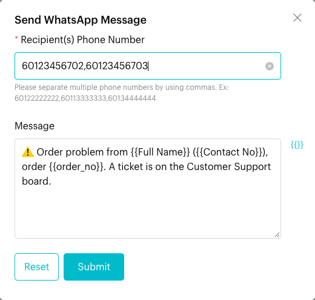
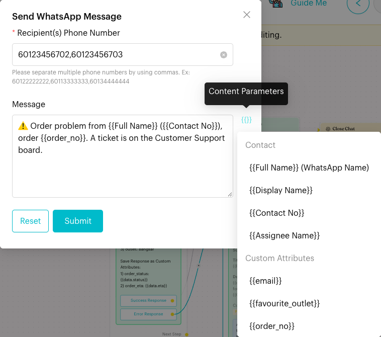
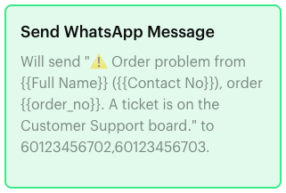

# Send WhatsApp Message

## What is Send WhatsApp Message?

**Send WhatsApp Message** is an action that sends a WhatsApp message to one or more phone numbers you choose, such as your own staff. It does **not** reply to the contact in the flow. To reply to the contact, use a **Message** step instead.

The most common use is an internal alert: when a customer reaches a certain point in a flow, your team gets a WhatsApp message about it.

This action is available on WhatsApp channels. It is hidden on WhatsApp Business API (WABA) channels.

## When to use it?

* **Staff alerts**: Tell the shift manager when a customer reports an order problem.
* **Lead notifications**: Send the sales person a message when someone asks for a catering quote.
* **Booking alerts**: Let the outlet know that a customer booked a table through the flow.

## How to set it up (Step by Step)



#### Add the action

Go to **Automations** > **Message Flows**, open the flow and click **Edit Flow**. Click an **Action** step (or add one), then click **Send WhatsApp Message** in the panel.

A new card appears with the text "Please specify your message and intended recipient, and the system will assist you in sending it." Its red border means it isn't set up yet.



#### Enter the recipients and message

Click the card to open the **Send WhatsApp Message** window:

* **Recipient(s) Phone Number** (required): The number that receives the message, with the country code and no spaces or symbols, e.g. `60123456702`. To send to several people, separate the numbers with commas: `60123456702,60123456703`.
* **Message**: The text to send.

<figure><figcaption>
Send WhatsApp Message settings
</figcaption></figure>



#### Add customer details with placeholders

Click **{{}}** (**Content Parameters**) next to **Message** to insert details of the contact who is going through the flow:

* **Contact**: `{{Full Name}}`, `{{Display Name}}`, `{{Contact No}}`, `{{Assignee Name}}`
* **Custom Attributes**: any custom attribute, e.g. `{{order_no}}`
* **Order Information** and shipping details, when the Shopify integration is active

<figure><figcaption>
Insert contact details into the message
</figcaption></figure>



#### Save and publish

Click **Submit**. The card now shows the message and the numbers it goes to. Click **Publish Flow** to make it live.

<figure><figcaption>
The saved action card
</figcaption></figure>



## What happens after it triggers?

* The message is sent from your connected WhatsApp number to each phone number in the list.
* Placeholders are filled in with the details of the contact in the flow. For example, `{{Full Name}}` becomes the customer's name, not the recipient's.
* The contact in the flow does not see this message.
* The flow continues to the next step.

## Important behavior to know

* **Message must not be empty**: Only the phone number is required in the window. If **Message** is left blank, nothing is sent.
* **Message quota**: If your plan's message limit has been reached, the message is not sent.
* **One per Action step**: Unlike most actions, you can add more than one **Send WhatsApp Message** to the same Action step, for example to send different texts to different people.
* **Not on WABA channels**: The button doesn't appear on WhatsApp Business API channels. Older flows on those channels may still show a template version of this action with a **Select Message Template** button. It can't be added to new flows.

## Common issues & solutions

* **"Please input phone number."**: Enter at least one recipient number.
* **Nobody received the message**: Check that the flow is published, the channel is connected, the **Message** box isn't empty, and the numbers include the country code (e.g. `60…`).
* **Placeholders show the wrong person**: Placeholders always use the details of the contact in the flow. Write the message for your staff, e.g. "New order problem from {{Full Name}}".
* **I can't find the button**: Your channel is a WhatsApp Business API channel. The action is not available there.

## Best practice 💡

* Use it for short internal alerts, not for messages to customers.
* Include `{{Full Name}}` and `{{Contact No}}` so staff can find the chat quickly.
* Send alerts to a small, fixed group, such as the manager on duty, so they are not ignored.

## Related Documentation

* [Message](../../content-nodes/message.md)
* [Add to Ticket Stage](add-ticket-stage.md)
* [Logic: Actions](../actions.md)
