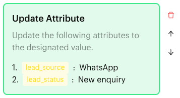
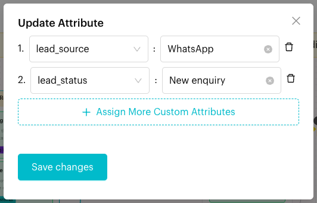

# Update Attribute

## What is Update Attribute?

**Update Attribute** is an action in the [Actions step](../actions.md) of a Message Flow. When a contact reaches the step, the custom attributes you chose are set to the values you typed. The block reads "Update the following attributes to the designated value."

Unlike [Save to Attribute](save-attribute.md), it doesn't wait for a reply. You decide the value when you build the flow.

<figure><figcaption>
Update Attribute block
</figcaption></figure>

## When to use it?

* **Record the source**: Set `lead_source` to "WhatsApp" for everyone who enters a catering flow.
* **Track status**: Set `lead_status` to "New enquiry" at the start of a flow and "Quote sent" later.
* **Flag a choice**: Set `favourite_outlet` to "Bangsar" when the customer taps the Bangsar button.

## How to set it up (Step by Step)



#### Open the Actions step

Go to **Automations** > **Message Flows**, open the flow and click **Edit Flow**. Click an Actions step, or add one (**+** > **Logic** > **Actions**).



#### Add the action

In the step's panel, click **Update Attribute**. An empty block appears in red with "Please select an attribute."



#### Set attributes and values

Click the block. In the **Update Attribute** window, click **Assign More Custom Attributes** to add a row. In each row, pick an attribute on the left and type the value on the right ("Enter Value"). Add as many rows as you need. Click the bin icon to remove a row.

Click **Save changes**.

<figure><figcaption>
Set each attribute to a value
</figcaption></figure>



#### Publish

Connect the step to the next step and click **Publish Flow**.



## What happens after it triggers?

The selected attributes on the contact are set to the values you typed, and the flow moves on. If an attribute already had a value, it is replaced. The new values show in the contact's custom attributes in the Inbox.

## Important behavior to know

* Each attribute can only be picked once in the same block. Attributes already used in another row are greyed out.
* Every row needs both an attribute and a value.
* You can add one **Update Attribute** block per Actions step, but it can update many attributes.
* An empty **Update Attribute** block isn't checked when you publish, but it shows in red. Set it up or delete it.

## Common issues & solutions

* **"Please select a custom attribute"**: A row has no attribute. Pick one or remove the row.
* **"Please input a value"**: A row has no value. Type a value or remove the row.
* **The attribute isn't in the list**: Create it at the bottom of the attribute list, or in [Custom Attributes](../../../settings/data/custom-attributes.md).
* **"This action already exists in the current Action Node."**: The step already has **Update Attribute**. Add more rows to the existing block.

## Best practice 💡

* Use **Update Attribute** for fixed values you decide (source, status, plan), and **Save to Attribute** for what the customer types.
* Keep values consistent, for example always "New enquiry", not sometimes "new enquiry", so filters and conditions work.

## Related Documentation

* [Actions](../actions.md)
* [Save to Attribute](save-attribute.md)
* [Custom Attributes](../../../settings/data/custom-attributes.md)
* [Condition](../condition.md)
