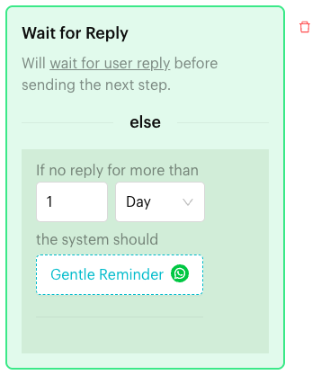
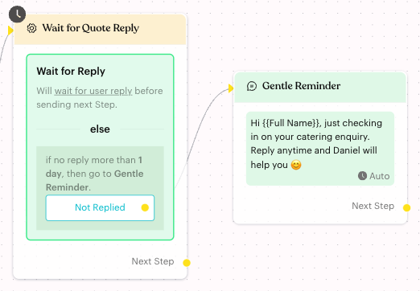

# Wait for Reply

## What is Wait for Reply?

**Wait for Reply** is an action in the [Actions step](../actions.md) of a Message Flow. It holds the flow until the contact replies. The block reads "Will wait for user reply before sending the next step."

It also has an **else** part: "If no reply for more than" a set time, "the system should" go to a step you choose. This is the **Not Replied** branch.

<figure><figcaption>
Wait for Reply block
</figcaption></figure>

## When to use it?

* **Wait for an answer**: After asking "Would you like a catering quote?", wait for the customer before continuing.
* **Follow up on silence**: If the customer doesn't reply within 1 day, send a gentle reminder.

## How to set it up (Step by Step)



#### Open the Actions step

Go to **Automations** > **Message Flows**, open the flow and click **Edit Flow**. Add an Actions step right after the message that asks the question (**+** > **Logic** > **Actions**).



#### Add the action

In the step's panel, click **Wait for Reply**. The block appears with a wait of 1 **Hour**.



#### Set the wait time

Under **else**, after "If no reply for more than", enter a number and choose **Minute**, **Hour** or **Day**. Changes are saved straight away.



#### Choose what happens if there is no reply

Under "the system should", click **Choose Next Step**. In the **Choose Next Step** panel, create a new step (for example **Send a Message** for a "Gentle Reminder") or choose **Select Existing Step**. The button then shows the step's name.

You can also drag from the **Not Replied** dot on the canvas to a step.



#### Choose what happens after a reply

Connect the step's **Next Step** to the step that should run when the contact replies. Then click **Publish Flow**.

<figure><figcaption>
Not Replied branch on the canvas
</figcaption></figure>



## What happens after it triggers?

* The flow waits for the contact's reply.
* If the contact replies in time, the flow continues to **Next Step**.
* If there is no reply for longer than the time you set, the flow goes to the step linked to **Not Replied**.

On the canvas, the step shows a clock icon (tooltip **Wait for user reply**) and the summary "if no reply more than 1 day, then go to Gentle Reminder."

## Important behavior to know

* Wait for Reply and **Save to Attribute** can't be in the same Actions step. Both wait for a reply.
* You can add one **Wait for Reply** block per Actions step.
* The **Not Replied** button on the canvas is red until it is linked to a step.
* Wait for Reply waits for any reply. To act on *what* the customer said, use buttons in your message, or save the reply with [Save to Attribute](save-attribute.md) and check it in a [Condition](../condition.md) step.

## Common issues & solutions

* **Contacts who don't reply never get a follow-up**: Link the **Not Replied** branch (or **Choose Next Step**) to a step.
* **"Please enter Delay Duration"**: The wait time is empty. Enter a number.
* **"Wait for Reply and Save to Attribute cannot coexist in the same node."**: This step already has **Save to Attribute**. Add **Wait for Reply** in its own Actions step.

## Best practice 💡

* Place Wait for Reply right after the question you want answered.
* Pick a wait time that suits the question: minutes for a quick yes/no, a day for a quote.
* Make the **Not Replied** message friendly, for example "Just checking in on your catering enquiry. Reply anytime 😊".
* For more control over time windows, see [Smart Delay](../smart-delay.md).

## Related Documentation

* [Actions](../actions.md)
* [Save to Attribute](save-attribute.md)
* [Delay](delay.md)
* [Smart Delay](../smart-delay.md)
* [Condition](../condition.md)
