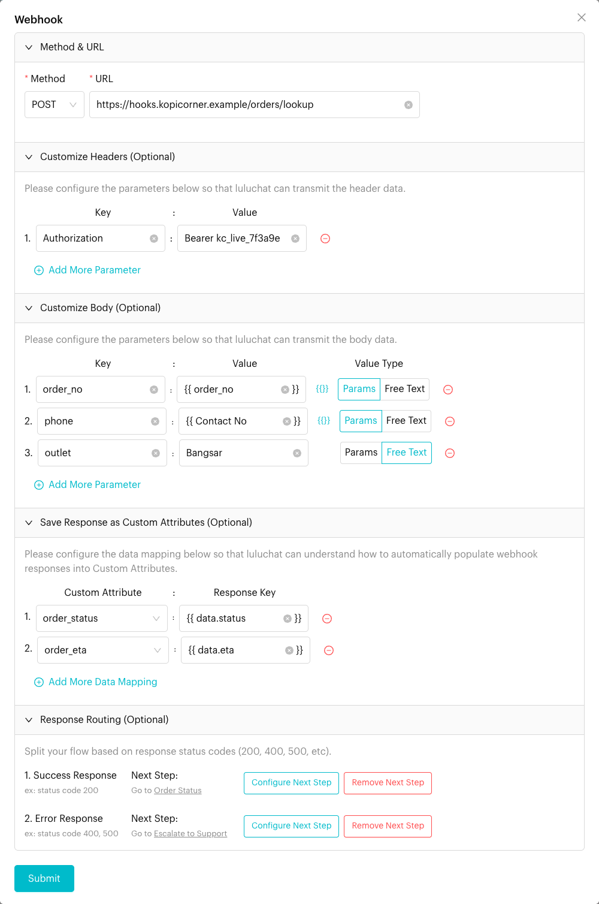
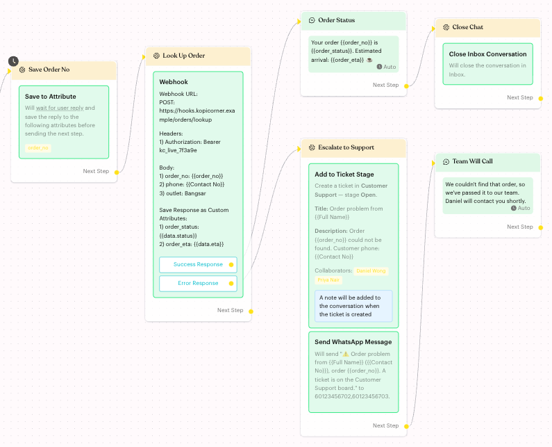

# Webhook

## What is Webhook?

**Webhook** is an action that sends a request from your flow to another system, such as your ordering system, CRM or a Zapier/Make hook. It can:

* Send the contact's details and other values to that system.
* Save values from the reply into the contact's custom attributes.
* Send the contact down a different path depending on whether the request worked (**Success Response**) or failed (**Error Response**).

## When to use it?

* **Order lookups**: Send the customer's order number to your ordering system and reply with the order status.
* **Lead capture**: Push a new catering enquiry into your CRM.
* **Loyalty checks**: Ask your loyalty system for the customer's points balance and save it to a custom attribute.
* **Notifications**: Tell another tool that something happened in the chat.

## How to set it up (Step by Step)



#### Add the action

Go to **Automations** > **Message Flows**, open the flow and click **Edit Flow**. Click an **Action** step (or add one), then click **Webhook** in the panel.

The new card says "Please configure your Webhook URL" and has a red border until you set it up. Click the card to open the **Webhook** window.



#### Set the method and URL

In **Method & URL**:

* **Method** (required): **GET** or **POST**. New webhooks start with **POST**.
* **URL** (required): The full address that receives the request, starting with `http://` or `https://`. You can include placeholders, e.g. `https://hooks.kopicorner.example/orders/{{order_no}}`.



#### Add headers (optional)

Open **Customize Headers (Optional)** and click **Add More Parameter** for each header. Fill in a **Key** and a **Value**, e.g. `Authorization` : `Bearer kc_live_7f3a9e`. Both are required for each row you add.



#### Add body fields (optional)

Open **Customize Body (Optional)** and click **Add More Parameter** for each field you want to send. For each row:

* **Key**: The field name the other system expects, e.g. `order_no`.
* **Value Type**:
  * **Params**: The value is a placeholder. Click **{{}}** to pick one, such as `{{Contact No}}` or a custom attribute.
  * **Free Text**: The value is sent exactly as you type it, e.g. `Bangsar`.

With **POST**, the fields are sent in the request body. With **GET**, they are added to the URL as query parameters.



#### Save the reply to custom attributes (optional)

Open **Save Response as Custom Attributes (Optional)** and click **Add More Data Mapping**. For each row, pick a **Custom Attribute** and type the **Response Key** that holds the value in the reply, e.g. `data.status`.

The other system must reply in JSON with the values inside a `data` object. For example, the reply `{"data": {"status": "Out for delivery", "eta": "3:45pm"}}` lets you save `data.status` and `data.eta`.



#### Route by response (optional)

Open **Response Routing (Optional)**. For **Success Response** and **Error Response**, click **Configure Next Step** and choose the step to go to. Click **Remove Next Step** to unlink it.

<figure><figcaption>
Webhook settings
</figcaption></figure>

Click **Submit** to save.



#### Check the card and publish

The card now lists the method and URL, headers, body fields and saved attributes, with a **Success Response** and an **Error Response** button. You can also link each button by dragging from its dot on the canvas. Click **Publish Flow** when you're done.

<figure><figcaption>
Success and error paths on the canvas
</figcaption></figure>



## What happens after it triggers?

1. Luluchat sends the request to your URL. Every request includes `contact_number` and `name` for the contact, plus the body fields you added.
2. Luluchat waits for the reply.
3. If the reply has a 2xx status code (such as 200), it counts as a **Success Response**. The mapped values are saved to the contact's custom attributes, and the flow follows the **Success Response** path.
4. Any other status code (such as 400 or 500), a timeout, or a connection error counts as an **Error Response**. Nothing is saved, and the flow follows the **Error Response** path.

## Important behavior to know

* **Placeholders in headers and body**: A value is replaced only when the whole value is one placeholder, such as `{{Contact No}}`. A mix like `Bearer {{token}}` is sent as typed. If a placeholder has no value for the contact, an empty value is sent.
* **Placeholders in the URL**: These are always replaced, even in the middle of the URL.
* **Saving the reply**: Only non-empty values that match the custom attribute's data type are saved. See [Data Formatting](../../../developer-guide/data-formatting.md).
* **Timeout**: Luluchat waits up to about 25 seconds for a reply. Slower replies count as an **Error Response**.
* **Unlinked paths**: A **Success Response** or **Error Response** button with no next step is shown in red. If the request lands on that path, the flow stops there.
* **One per Action step**: You can't add two webhooks to the same Action step. The app shows "This action already exists in the current Action Node." Add another Action step instead.

## Common issues & solutions

* **"Please select a method"** or **"Please enter URL"**: Fill in **Method** and **URL**.
* **"Please enter a valid URL, e.g. https://example.com/webhook"**: The URL must start with `http://` or `https://`.
* **"Please enter key"** / **"Please enter value"**: A header row is missing its key or value. Fill it in or remove the row with the red minus icon.
* **The flow always takes the Error Response path**: Check that the URL is reachable, the method matches what the other system expects, the auth header is correct, and the system replies within about 25 seconds with a 2xx status.
* **Custom attributes are not filled in**: Make sure the reply is JSON with the values inside `data`, the **Response Key** matches exactly (e.g. `data.status`), and the value fits the attribute's data type.
* **The other system receives empty fields**: The contact has no value for that placeholder yet. Collect it earlier in the flow, for example with **Save to Attribute**.

## Best practice 💡

* Always link both **Success Response** and **Error Response**. On the error path, tell the customer that a staff member will help, and alert your team.
* Keep secrets such as API keys in headers, not in the URL.
* Test with your own number first and check what the other system receives.
* Ask your developer to reply quickly and in the expected JSON format. They can find the technical details in the [Webhook Action developer guide](../../../developer-guide/webhook-action.md).

## Related Documentation

* [Webhook Action (developer guide)](../../../developer-guide/webhook-action.md): Request and response format
* [Data Formatting](../../../developer-guide/data-formatting.md): Value formats for custom attributes
* [Save to Attribute](save-attribute.md)
* [Custom Attributes](../../../settings/data/custom-attributes.md)
* [Logic: Actions](../actions.md)
