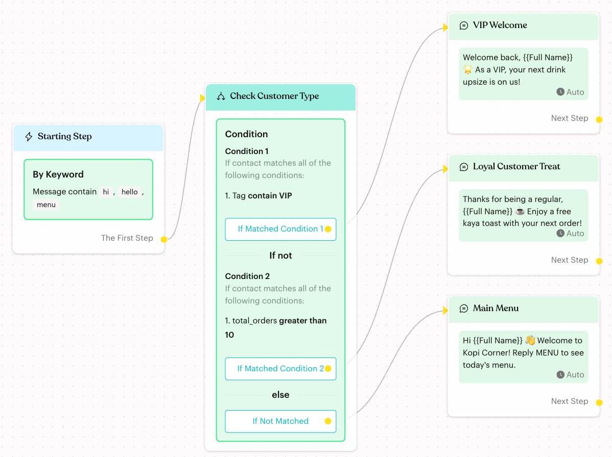
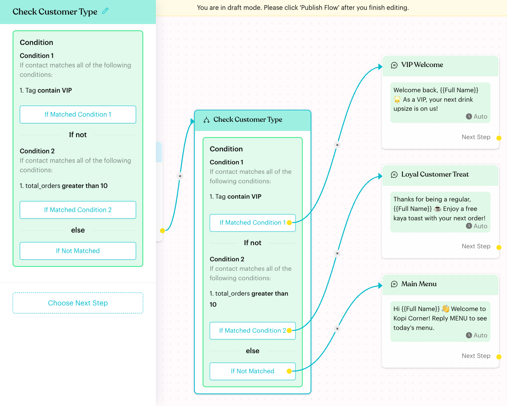
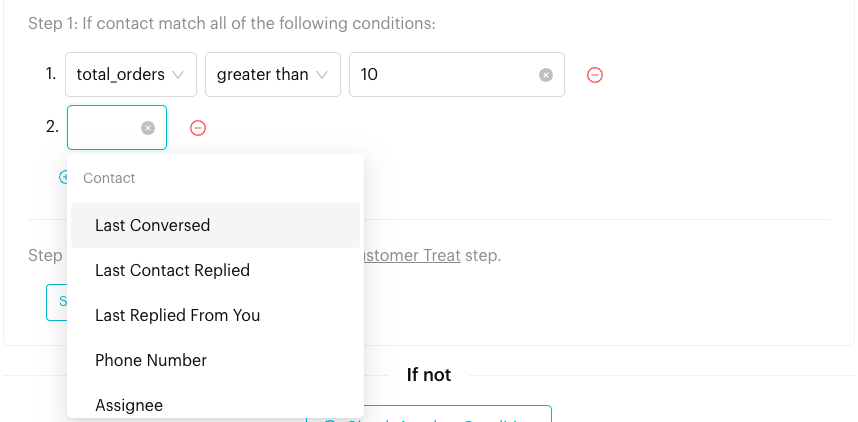
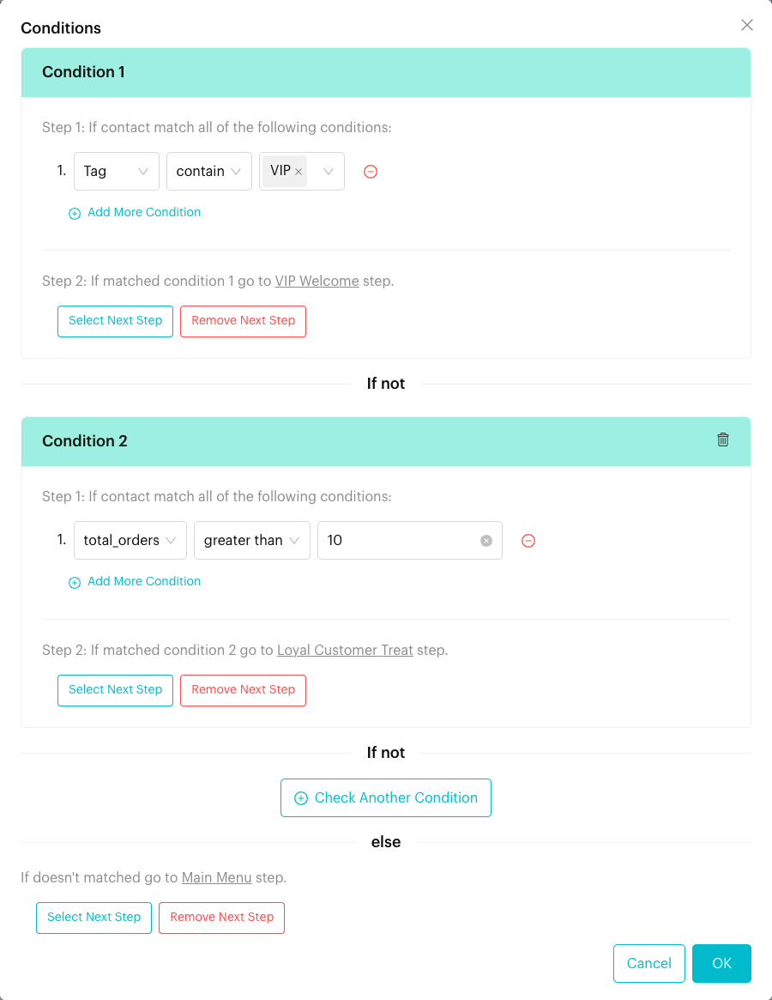

# Condition

## What is the Condition step?

The **Condition** step checks a contact's details and sends them down a different path depending on the result. It works like "if… else if… else":

* **Condition 1**: If the contact matches, follow **If Matched Condition 1**.
* **If not**, check **Condition 2**, then **Condition 3**, and so on.
* **else**: If no condition matches, follow **If Not Matched**.

<figure><figcaption>
A Condition step with two conditions and an else path
</figcaption></figure>

## When does it trigger?

The check runs the moment a contact reaches the Condition step in a published flow. Luluchat uses the contact's details at that moment.

Common uses:

* **VIP treatment**: Greet contacts tagged "VIP" with a special offer.
* **Loyalty rewards**: Check a custom attribute such as `total_orders` and reward regulars.
* **Business hours**: Use **Occurrence Time** or **Occurrence Date** to reply differently at night or on weekends.
* **Routing**: Send unassigned chats to a Round Robin, and assigned chats straight to their owner.

## How to set it up (Step by Step)



#### Add a Condition step

Open your flow, click **Edit Flow**, then click **+** (**Add Node**) **> Logic > Condition**. Link the previous step to it.



#### Open the Conditions window

Click the step to open its settings panel, then click the green **Condition** box. The **Conditions** window opens.

<figure><figcaption>
Click the Condition box in the panel to edit it
</figcaption></figure>



#### Build Condition 1

Under "Step 1: If contact match all of the following conditions:", choose:

1. A field (for example **Tag**). The list is grouped into **Contact**, **Tag**, **Event Time**, **Conversation**, **Chat**, **Deals** and **Custom Attributes**.
2. An operator (for example **contain**).
3. A value (for example **VIP**), if the operator needs one.

Click **Add More Condition** to add another rule to the same condition. A contact must match **all** rules in a condition. Click the red minus icon to remove a rule.

<figure><figcaption>
Choosing a field for a rule
</figcaption></figure>



#### Choose the next step for Condition 1

Under "Step 2: If matched condition 1", click **Select Next Step** and pick a step on the canvas. Click **Remove Next Step** to unlink it.



#### Add more conditions (optional)

Click **Check Another Condition** to add **Condition 2**, which is only checked if Condition 1 does not match. To delete a condition (from Condition 2 onwards), click the bin icon on its header.



#### Set the else path and save

Under **else**, click **Select Next Step** to choose where contacts go when nothing matches ("If doesn't matched"). Click **OK** to save, then **Publish Flow**.

<figure><figcaption>
The Conditions window with two conditions and an else path
</figcaption></figure>

You can also link the outputs on the canvas: drag from the dot next to **If Matched Condition 1**, **If Matched Condition 2** or **If Not Matched** to the next step.



## Fields and operators

| Group | Fields | Operators |
| --- | --- | --- |
| **Contact** | **Last Conversed**, **Last Contact Replied**, **Last Replied From You** | in upcoming, in last, has past, in between, in between time, is before, is before time, is after, is after time, is, is on, is unknown, is known |
| **Contact** | **Phone Number** | is, is not, contain, doest not contain, starts with |
| **Contact** | **Assignee** | is, is assigned, is unassigned |
| **Contact** | **Collaborator** | include, include all, does not include, does not include all, is known, is none |
| **Tag** | **Tag** | contain, does not contain, contain all |
| **Event Time** | **Occurrence Time** (when the contact reaches the step) | same as **Last Conversed** |
| **Event Time** | **Occurrence Date** | is today, in upcoming, in last, has past, in between, is before, is after, is, is on, is unknown, is known |
| **Conversation** | **Last Assignee** | is, is assigned, is unassigned |
| **Conversation** | **Last List** | is, in, is assigned, is unassigned |
| **Conversation** | **Time assigned**, **Time of Responsed after assigned**, **Time of Conversation Opened**, **Time of First Response**, **Time of List Assigned**, **Time of Conversation Closed** | same as **Last Conversed** |
| **Chat** | **Chat Status** | is need reply, is awaiting reply |
| **Deals** | Each deal pipeline (only if your plan has Deals) | is, in (a stage in that pipeline) |
| **Custom Attributes** | Each custom attribute | Text: is, is not, contain, doest not contain, starts with. Number: is equal to, is not equal to, greater than, lesser than. Date or date & time: the date operators above |

Notes:

* **in upcoming**, **in last** and **has past** need a number and a unit (**minutes**, **hours** or **days**).
* **is on** lets you pick days of the week (Monday to Sunday).
* For **Phone Number**, use the full number with country code, for example 60122222222.

## What happens after it triggers?

* Luluchat checks **Condition 1** first. If the contact matches all its rules, they go to **If Matched Condition 1** and no other condition is checked.
* If not, it checks **Condition 2**, and so on, in order.
* If no condition matches, the contact goes to **If Not Matched**.
* This happens instantly and silently. The contact only sees what the next step sends.

## Important behavior to know

* **First match wins**: Conditions are checked from top to bottom, and the first match is used. Put the most specific condition first.
* **All rules must match**: Rules inside one condition are combined with AND. For OR logic, use separate conditions that lead to the same next step.
* **Live data**: The check uses the contact's tags, attributes and chat details at the moment they reach the step. An [Actions](actions.md) step earlier in the same flow (for example **Add Tag**) is already applied.
* **Unlinked outputs**: If the matching output has no next step, the flow ends for that contact.
* **Incomplete conditions**: The node turns red if a condition has no rules or a rule has no operator. It reads "Condition missing, click to configure conditions" when a condition is empty.

## Common issues & solutions

* **Wrong path taken**: Check the order. A broad condition above a specific one catches contacts first. For example, put "Tag contain VIP" above "total_orders greater than 10".
* **Everyone goes to If Not Matched**: Check the values. For tags, make sure you picked the right tag. For text attributes, check the spelling.
* **Empty date attributes**: To catch contacts with no value in a date attribute, use **is unknown**.
* **"Please select a condition"** or **"Please configure response"** when clicking **OK**: Add at least one condition with a next step before saving.
* **A custom attribute or deal pipeline is missing from the list**: The **Custom Attributes** group only lists attributes that exist in your team. The **Deals** group only appears if your plan includes Deals and you have at least one pipeline.

## Best practice 💡

* Name the step after the question it answers, such as "Check Customer Type".
* Always link **If Not Matched**, even to a simple general message, so no contact gets stuck.
* Use **Occurrence Date** with **is on** Saturday and Sunday to send weekend opening hours.
* Combine with [Actions](actions.md): tag contacts first, then use a Condition later in the flow to branch on that tag.

## Related Documentation

* [Automation Logics](index.md)
* [Actions](actions.md)
* [Tags](../../settings/data/tags.md)
* [Custom Attributes](../../settings/data/custom-attributes.md)
* [Round Robin](round-robin.md)
* [Randomizer](randomizer.md)
