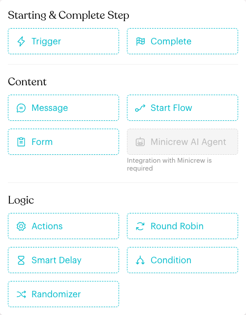

# Automation Logics

## What are Logic steps?

Logic steps control what happens inside a Message Flow without sending a message themselves. They decide **which path** a contact takes, **when** the next step runs, and **what is updated** in the background.

In the Message Flow Editor they are grouped under **Logic** in the **Add Node** menu:

| Step | What it does |
| --- | --- |
| [**Actions**](actions.md) | Runs background tasks such as adding a tag, assigning a team member or saving an attribute. |
| [**Round Robin**](round-robin.md) | Sends each new contact to the next round in turn (Round 1, Round 2, Round 3, then back to Round 1). |
| [**Smart Delay**](smart-delay.md) | Waits for a set time, then continues on a **Replied** or **Not Replied** path. |
| [**Condition**](condition.md) | Checks the contact's data (tags, custom attributes, assignee, time and more) and picks a path. |
| [**Randomizer**](randomizer.md) | Splits contacts randomly between paths by percentage, for example 50% / 50% for an A/B test. |

<figure><figcaption>
The Logic section of the Add Node menu
</figcaption></figure>

## When to use them?

* **Route work fairly**: Use **Round Robin** to share new leads between Daniel, Priya and Hafiz.
* **Follow up on silence**: Use **Smart Delay** to send a gentle reminder only to customers who did not reply.
* **Personalise the journey**: Use **Condition** to greet VIP customers differently from everyone else.
* **Test ideas**: Use **Randomizer** to compare two promotions.
* **Update data quietly**: Use **Actions** to tag, assign or save details while the flow runs.

## How to add a Logic step (Step by Step)



#### Open the flow in draft mode

Go to **Automations > Message Flows**, open a flow and click **Edit Flow**. Logic steps can only be added in draft mode.



#### Add the step

Click the **+** button (**Add Node**) on the right of the canvas and pick a step under **Logic**.

You can also drag a link from any step's dot to an empty spot on the canvas and choose the step from the menu that appears.



#### Set it up and link its paths

Click the new step to open its settings panel on the left. Each Logic step has its own outputs (rounds, **Replied** / **Not Replied**, **If Matched Condition 1**, variants A and B, and so on). Link every output to a next step.



#### Publish

Click **Publish Flow** when you are done. Changes only go live after publishing.



## Important behavior to know

* Logic steps run silently. The contact does not see a message or a "processing" state unless the next step sends one.
* An output with no next step shows a red dot on the canvas. A contact who reaches an unlinked output stops at that point of the flow.
* Logic steps can be combined. For example, a **Condition** can lead to a **Round Robin**, which leads to **Actions** that assign a team member.

## Best practice 💡

* Give each Logic step a clear name (click the pencil icon next to its title), such as "Check Customer Type" or "Share Catering Leads". The name appears in other steps' **Choose Next Step** lists.
* After building, follow each path on the canvas from start to finish and make sure no output is left unlinked.

## Related Documentation

* [Message Flow Editor](../message-flows-editor.md)
* [Actions](actions.md)
* [Round Robin](round-robin.md)
* [Smart Delay](smart-delay.md)
* [Condition](condition.md)
* [Randomizer](randomizer.md)
