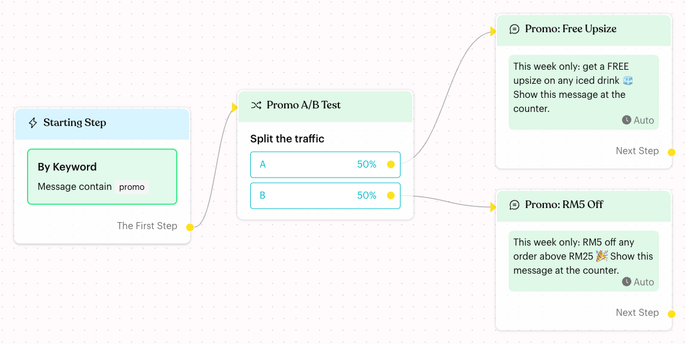
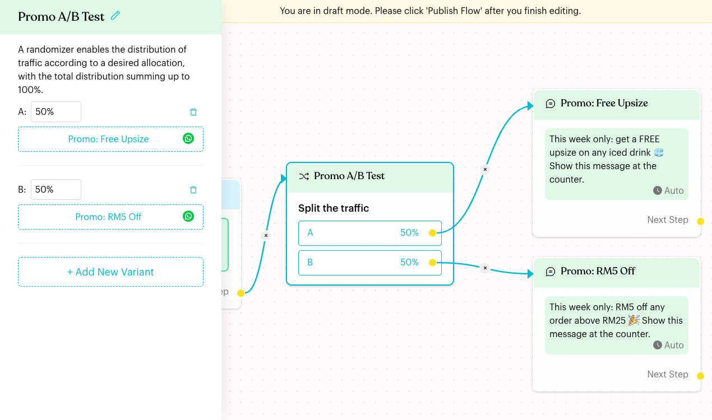
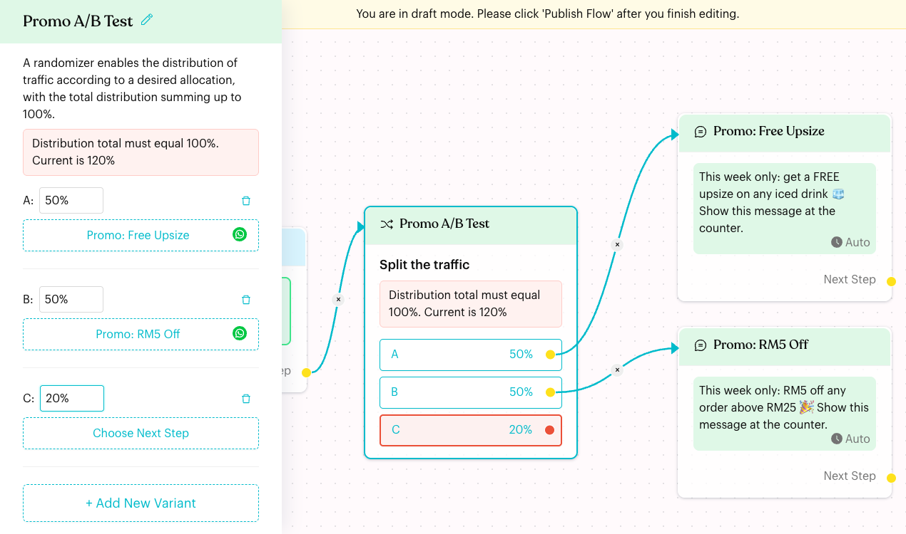

# Randomizer

## What is the Randomizer?

The **Randomizer** splits contacts between paths at random, using percentages you set. For example, 50% of contacts see Promo A and 50% see Promo B. Each path is called a variant and is labelled **A**, **B**, **C** and so on.

<figure><figcaption>
A Randomizer running a 50/50 promo test
</figcaption></figure>

## When does it trigger?

Every time a contact reaches the Randomizer in a published flow, Luluchat picks one variant for them at random, based on the percentages.

Common uses:

* **A/B testing**: Compare two promotions, such as "Free Upsize" vs "RM5 Off", and see which gets more replies.
* **Message testing**: Try a greeting with emojis against one without.
* **Gradual rollout**: Send 10% of contacts to a new flow and 90% to the current one.

## How to set it up (Step by Step)



#### Add a Randomizer step

Open your flow, click **Edit Flow**, then click **+** (**Add Node**) **> Logic > Randomizer**. A new Randomizer starts with two variants, **A** and **B**, at 50% each.



#### Set the percentages

Click the step to open its settings. Enter a percentage (0 to 100) next to each letter. The total of all variants should be exactly **100%**.

<figure><figcaption>
Randomizer settings with two variants
</figcaption></figure>



#### Add or remove variants

Click **+ Add New Variant** to add another path. New variants start at 0%, so lower the others to make room. To remove a variant, click its bin icon and confirm "Are you sure you want to delete this variant?".

If the total is not 100%, the panel and the node show "Distribution total must equal 100%. Current is …%".

<figure><figcaption>
A new variant C pushes the total to 120% and still needs a next step
</figcaption></figure>



#### Choose the next step for each variant

Under each variant, click **Choose Next Step** and pick what happens, for example **Send a Message**, **Perform Actions** or **Select Existing Step**. You can also drag from a variant's dot on the canvas to a step.



#### Publish the flow

Check that the total is 100% and every variant is linked, then click **Publish Flow**.



## What happens after it triggers?

* The contact is sent to one variant at random. The chance of each variant matches its percentage.
* This happens instantly and silently. The contact never knows they are part of a test.
* Over many contacts, the split gets close to your percentages. With only a few contacts, it can look uneven.

## Important behavior to know

* **Each visit is a new draw**: If the same contact reaches the Randomizer again (for example, they send the keyword again), they may get a different variant.
* **0% variants are never chosen**.
* **Publishing is not blocked by the total**: The red warning does not stop you from publishing. If the total is not 100%, each variant gets its share of the actual total (for example 50/50/20 behaves like about 42% / 42% / 17%). Fix the total so the split is what you expect.
* **Unlinked variants**: If a contact is sent to a variant with no next step, the flow ends for that contact. The variant's row on the node turns red until it is linked.
* **Labels A to F**: Variants are labelled A to F, so use six variants at most.

## Common issues & solutions

* **"Distribution total must equal 100%. Current is 120%"**: Adjust the percentages so they add up to 100.
* **The node shows "Please customise your randomizer"**: All variants were deleted. Click **+ Add New Variant** and set it up again.
* **One variant seems to get more contacts**: With small numbers, random results vary. Wait for more contacts before comparing.

## Best practice 💡

* Start with two variants at 50% each, and change only one thing between them (for example the offer, not the offer **and** the image).
* Tag each variant's contacts with an [Actions](actions.md) step (for example "Promo A" and "Promo B") so you can compare results later.
* Use [Round Robin](round-robin.md) instead if you need an exact, even rotation rather than a random split.

## Related Documentation

* [Automation Logics](index.md)
* [Round Robin](round-robin.md)
* [Condition](condition.md)
* [Actions](actions.md)
* [Add Tag](actions/add-tag.md)
