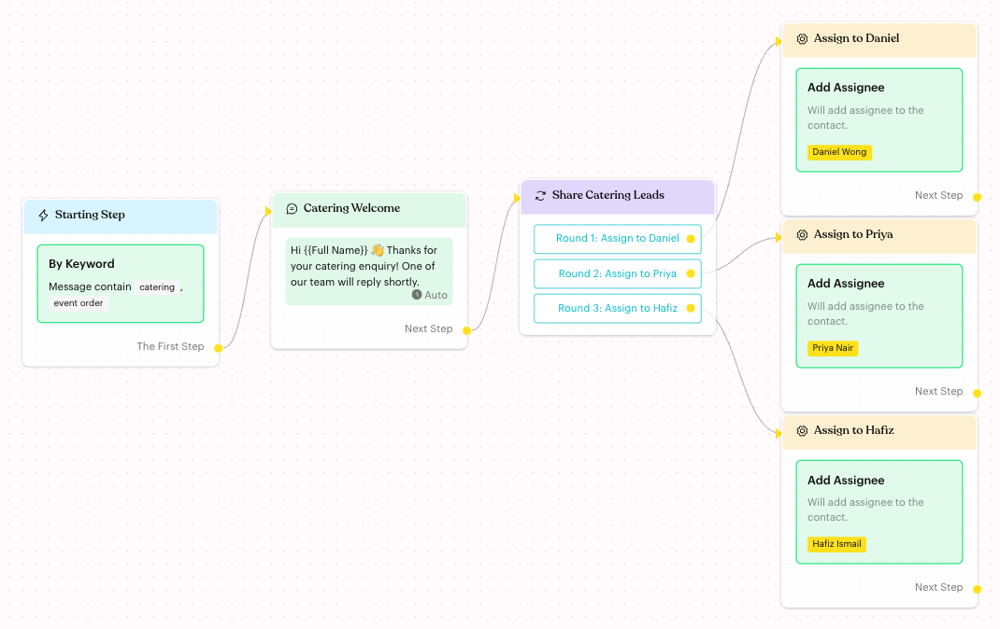
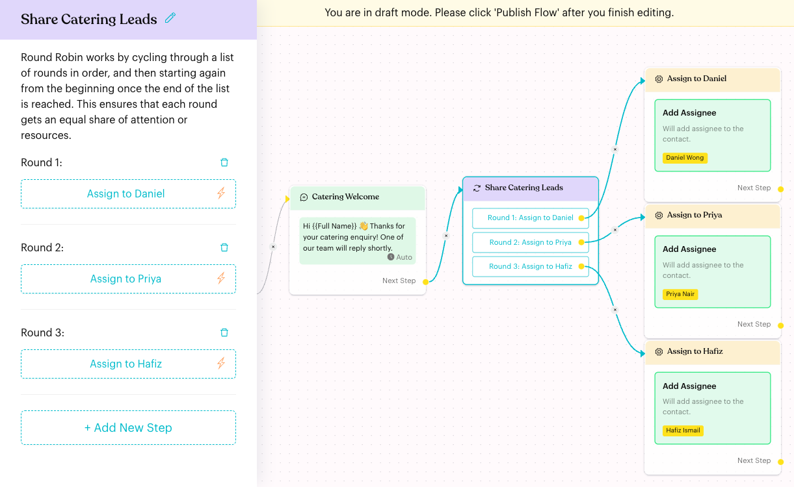
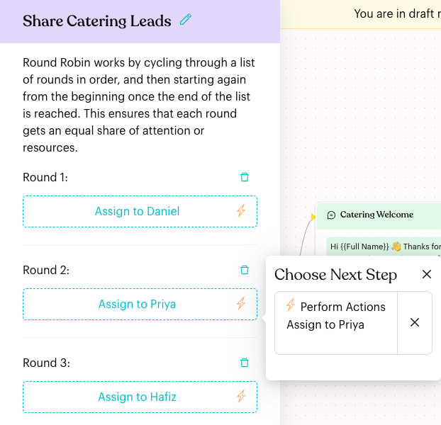

# Round Robin

## What is Round Robin?

**Round Robin** sends contacts down a list of paths ("rounds") in turn. The first contact goes to **Round 1**, the next to **Round 2**, and so on. After the last round, it starts again from **Round 1**. This way each round gets an equal share of contacts.

<figure><figcaption>
A Round Robin step sharing catering leads between three team members
</figcaption></figure>

## When to use it?

* **Lead distribution**: Share new enquiries equally between your sales team. Link each round to an [Actions](actions.md) step that assigns a different team member.
* **Support load balancing**: Spread new chats evenly across agents or inbox lists.
* **Rotating content**: Cycle through different welcome messages or offers.

## How to set it up (Step by Step)



#### Add a Round Robin step

Open your flow, click **Edit Flow**, then click **+** (**Add Node**) **> Logic > Round Robin**. A new Round Robin step starts with two rounds.



#### Add or remove rounds

Click the step to open its settings. Click **+ Add New Step** to add another round. To remove a round, click the bin icon next to it and confirm "Are you sure you want to delete this step?".

<figure><figcaption>
Round Robin settings with three rounds
</figcaption></figure>



#### Choose the next step for each round

Under each round, click **Choose Next Step** and pick what happens, for example **Perform Actions** (creates a new Actions step), **Send a Message**, or **Select Existing Step** to link a step that is already on the canvas.

Once linked, the button shows the next step's name, and the node on the canvas reads **Round 1: Assign to Daniel**, and so on. Click the linked button again to open that step's choice, or click the **X** to remove it.

<figure><figcaption>
Round 2 is linked to the Assign to Priya Actions step
</figcaption></figure>



#### Publish the flow

Click **Publish Flow**. If a round has no next step, publishing is blocked with an error (see below).



## What happens after it triggers?

* Each contact who reaches the step is sent straight to the next round in order. The first contact after publishing goes to **Round 1**.
* Luluchat remembers which round was used last, so the rotation continues across contacts, even if they arrive hours or days apart.
* After the last round, the next contact goes back to **Round 1**.
* Nothing is shown to the contact. They only see what the next step sends.

## Important behavior to know

* **Strict order, not workload-based**: Rounds are used one after another. Round Robin does not check how busy a team member is or whether they are online.
* **Equal share over time**: With 3 rounds, contacts 1, 4, 7… go to Round 1, contacts 2, 5, 8… to Round 2, and so on.
* **Deleting a round**: The remaining rounds are renumbered (Round 3 becomes Round 2). The rotation continues from where it was, so the next contact may not go to Round 1.
* **Link rounds from the panel**: New rounds have no dot on the canvas yet. Use **Choose Next Step** in the settings panel to link them.
* **No reordering**: Rounds can't be dragged into a new order. To change the order, change which step each round links to.

## Common issues & solutions

* **"In Round Robin Node "Share Catering Leads", please define the missing steps."**: The step has no rounds. Click **+ Add New Step** and link it.
* **"In Round Robin Node "Share Catering Leads", Round 2 is missing the next action."**: Round 2 has no next step. Click **Choose Next Step** under Round 2.
* **The node shows "Please add a step"**: All rounds were deleted. Add at least one round.
* **One person seems to get more contacts**: The share is equal by count, not by time. Over a short period the numbers can look uneven; they even out as more contacts pass through.

## Best practice 💡

* Pair each round with an **Actions** step that uses **Add Assignee**, and name the steps after the person (for example "Assign to Priya") so the canvas is easy to read.
* Put a **Message** before the Round Robin so the customer knows someone will reply soon.
* When a team member leaves, delete their round and remove them from the linked Actions step.

## Related Documentation

* [Automation Logics](index.md)
* [Actions](actions.md)
* [Add Assignee](actions/add-assignee.md)
* [Randomizer](randomizer.md)
* [Message Flow Editor](../message-flows-editor.md)
