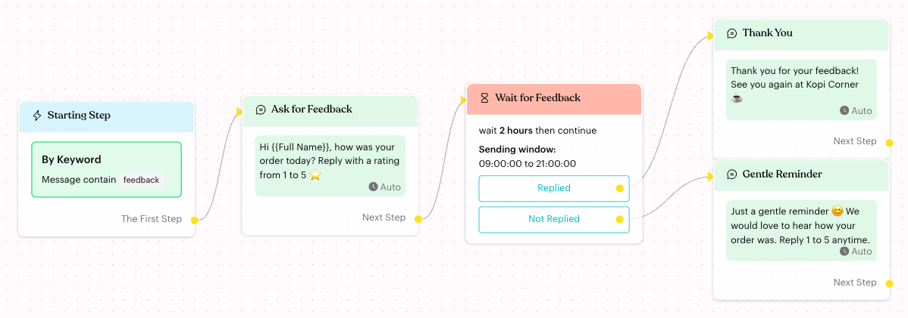
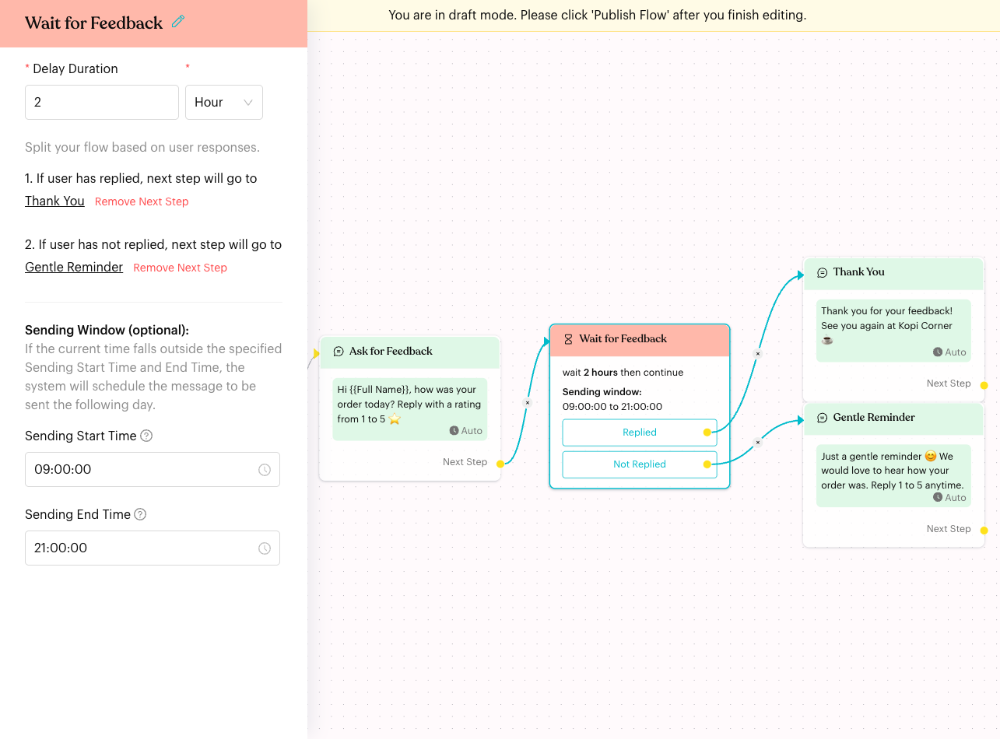

# Smart Delay

## What is Smart Delay?

**Smart Delay** pauses the flow for a set time (for example 2 hours). When the time is up, the flow continues on one of two paths:

* **Replied**: the contact sent a message while the flow was waiting.
* **Not Replied**: the contact did not reply.

You can also set an optional **Sending Window** so the next step only runs during suitable hours, such as 9:00 AM to 9:00 PM.

<figure><figcaption>
A Smart Delay that thanks customers who replied and reminds those who did not
</figcaption></figure>

## When does it trigger?

The Smart Delay starts as soon as a contact reaches it in a published, active flow. It is usually placed right after a message that asks the customer something.

Common uses:

* **Feedback follow-up**: Ask for a rating, then send a reminder only if the customer did not answer.
* **Abandoned enquiries**: Ask "How many pax?" and nudge the customer if there is no reply after a day.
* **Next-day messages**: Wait 1 day, then send a tip or offer within business hours.

## How to set it up (Step by Step)



#### Add a Smart Delay step

Open your flow, click **Edit Flow**, then click **+** (**Add Node**) **> Logic > Smart Delay**. Link the previous step's **Next Step** to it.


If a message has buttons or replies, its **Next Step** can only link to a Smart Delay. This gives the customer time to tap a button before the flow moves on.




#### Set the Delay Duration

Click the step to open its settings. Under **Delay Duration**, enter a number (1 or more) and choose **Minute**, **Hour** or **Day**. A new Smart Delay starts at 1 hour.

<figure><figcaption>
Smart Delay settings with a 2-hour delay and a sending window
</figcaption></figure>



#### Link the Replied and Not Replied paths

Under "Split your flow based on user responses.":

* **1. If user has replied**: click **Configure Next Step** and choose the step for customers who replied.
* **2. If user has not replied**: click **Configure Next Step** and choose the step for customers who stayed silent.

Once linked, the panel reads "next step will go to …". Click **Remove Next Step** to unlink. You can also drag from the **Replied** or **Not Replied** dot on the canvas to the next step.



#### (Optional) Set a Sending Window

Under **Sending Window (optional):**, pick a **Sending Start Time** and a **Sending End Time**. Set both, or leave both empty.



#### Publish the flow

Click **Publish Flow**.



## What happens after it triggers?

1. The contact waits for the full **Delay Duration**. The flow does **not** continue early, even if the contact replies straight away.
2. Any message the contact sends on the same channel during the wait marks them as replied. Submitting a form also counts.
3. When the time is up, the contact goes down **Replied** or **Not Replied**.
4. If a **Sending Window** is set and the time is up outside the window:
   * Before the start time, the next step runs after the **Sending Start Time** the same day.
   * After the end time, the next step runs after the **Sending Start Time** the next day.

   Luluchat spreads these sends over a short period (up to an hour) after the start time, so they don't all go out at once.

## Important behavior to know

* **Replies don't skip the wait**: A reply only decides which path is taken. Use a short delay if you want a fast response.
* **What counts as a reply**: Any incoming message from the contact on the same channel, including tapping a reply button. Messages your team sends don't count.
* **Sending window uses your team's time zone** and works overnight too (for example 10:00 PM to 6:00 AM).
* **Timers run 24/7**: The delay itself does not pause at night or on weekends. Use the **Sending Window** to keep messages within business hours.
* **Flow turned off**: If the flow is inactive when the delay ends, the contact does not continue.
* **Opted-out contacts**: If the contact opts out (unsubscribes) while waiting, their pending delay is cleared and nothing more is sent.
* **Unlinked path**: If the matching path has no next step, the flow ends for that contact.
* **Smart Delay vs. other waits**: The [Delay](actions/delay.md) action pauses for a few seconds. The [Wait for Reply](actions/wait-reply.md) action holds the flow until the contact replies, with an optional time limit. Smart Delay always waits the full time and then branches.

## Common issues & solutions

* **"Please enter Delay Duration"**: The duration box is empty. Enter 1 or more.
* **The node shows "Missing Start Time" or "Missing End Time" and "Sending window is not properly configured"**: Only one sending time is set. Set both, or clear both.
* **"You cannot link this node because your message contains reply or button options, and we expect the user to respond to them. The next step can only link to Smart Delay."**: You tried to link a message with buttons to another step type. Link it to a Smart Delay first, then continue from the Smart Delay.
* **Customer replied but got the reminder**: Their reply may have come in after the delay ended, or on a different channel. Check the delay length.
* **The follow-up came much later than expected**: The delay ended outside the **Sending Window**, so it was moved to the next start time.

## Best practice 💡

* Put Smart Delay right after a question, and send a gentle follow-up on **Not Replied**.
* Link **both** paths. Even a short "Thank you!" on **Replied** makes the flow feel complete.
* Use a **Sending Window** for delays of a day or more so customers aren't messaged at night.
* Keep delays reasonable. Very long delays make the conversation feel disconnected.

## Related Documentation

* [Automation Logics](index.md)
* [Delay](actions/delay.md)
* [Wait for Reply](actions/wait-reply.md)
* [Message](../content-nodes/message.md)
* [Condition](condition.md)
