# Message Flow Editor

## What is the Message Flow Editor?

The **Message Flow Editor** is the visual board where you build a message flow. Each box on the board is a step (also called a node), such as the **Starting Step**, a message or an action. Lines between the steps show the order in which they run.

The editor has two modes:

* **Published view**: What you see when you open a flow. It shows the live version of the flow and is read-only.
* **Draft mode**: What you see after you click **Edit Flow**. Here you add, change, connect and delete steps. Your changes are saved automatically as a draft and only go live when you click **Publish Flow**.

<figure>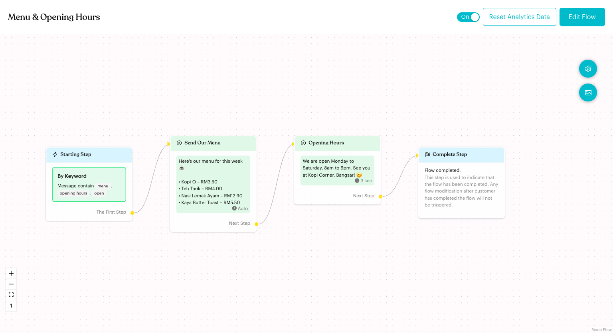<figcaption>
Published view
</figcaption></figure>

## When to use it?

* To build a new flow after you click **Create Message Flow**.
* To change the wording, buttons or order of an existing flow.
* To add a trigger, such as a keyword or a Meta ad, to the **Starting Step**.
* To set limits on how often a flow can run for the same contact (**Flow Settings**).
* To share a picture of your flow with your team (**Export as Image**).

## How to set it up (Step by Step)



#### Open the flow and click Edit Flow

Go to **Automations** > **Message Flows** and click a flow card. The flow opens in published view. Click **Edit Flow** to switch to draft mode.

A yellow bar says "You are in draft mode. Please click 'Publish Flow' after you finish editing."

<figure>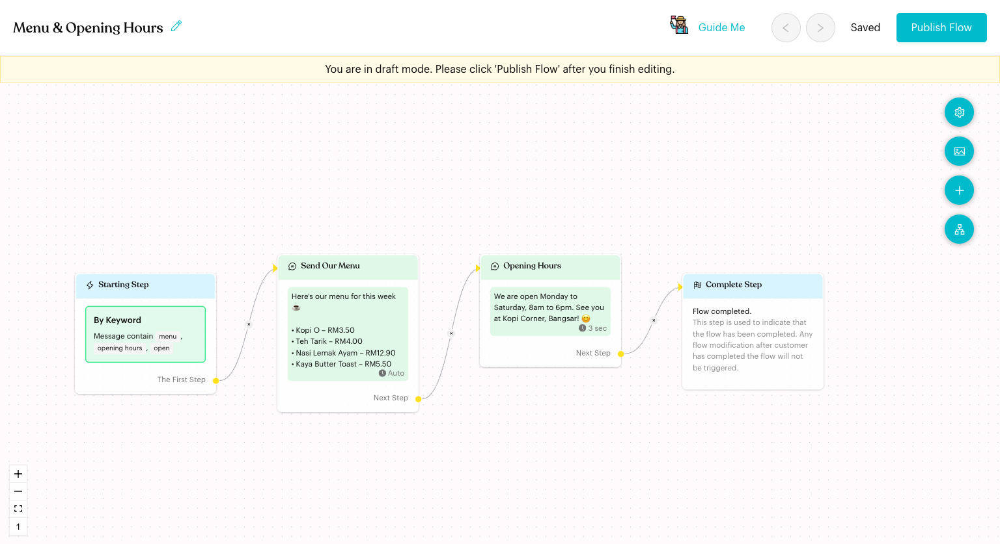<figcaption>
Draft mode
</figcaption></figure>



#### Rename the flow (optional)

In draft mode, click the pencil next to the flow name (tooltip **Click to edit title**), type the new name and press Enter.



#### Add steps

Click **+** (**Add Node**) on the right. Choose a step:

* **Starting & Complete Step**: **Trigger** (opens the **Starting Step** so you can add a trigger) and **Complete**.
* **Content**: **Message**, **Message Template** (WhatsApp Cloud (WABA) channels only), **Start Flow**, **Form** and **Minicrew AI Agent**.
* **Logic**: **Actions**, **Round Robin**, **Smart Delay**, **Condition** and **Randomizer**.

**Form** is a paid feature ("This is Paid Feature"). **Minicrew AI Agent** needs a Minicrew integration ("Integration with Minicrew is required").

<figure>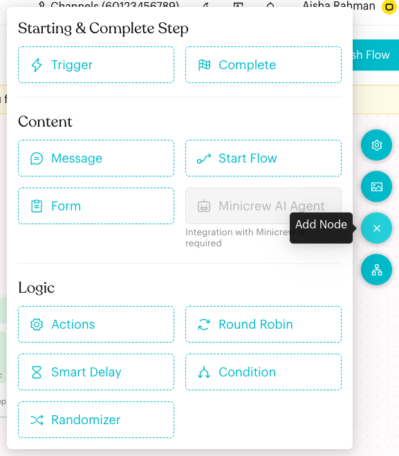<figcaption>
Add Node menu
</figcaption></figure>



#### Connect steps

Drag from the dot on the right of a step (for example **Next Step** or **The First Step**) to the step that should come next.

If you drop the line on an empty part of the board, a menu opens. Pick a step type and Luluchat adds that step already connected.

<figure>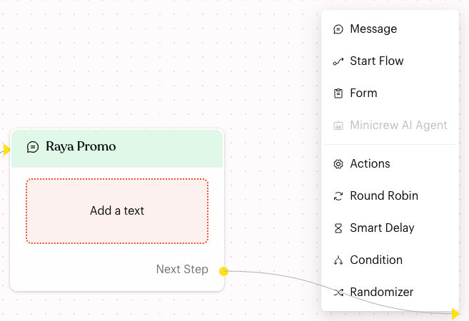<figcaption>
Drop a line on the board to add a connected step
</figcaption></figure>

To remove a connection, click the small **×** on the line and confirm "Are you sure you want to delete this link?"



#### Edit, duplicate or delete a step

Click a step to open its settings on the left. Make your changes there; they are saved automatically.

<figure>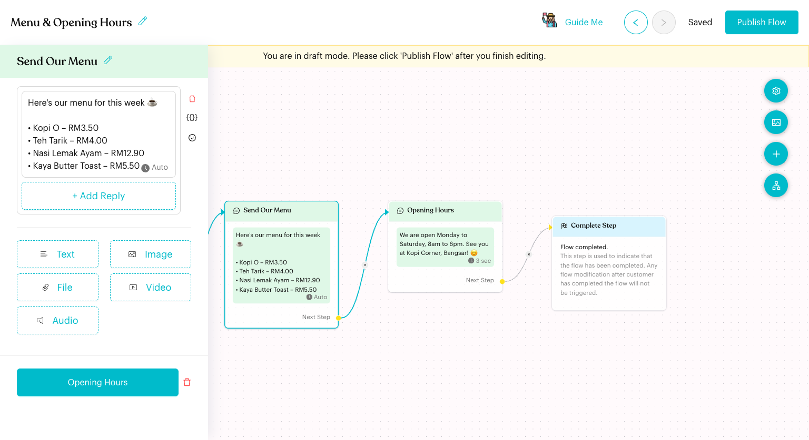<figcaption>
Step settings
</figcaption></figure>

Use the icons at the top right of a step:

* **Duplicate**: Adds a copy of the step. Not available for the **Starting Step**, **Randomizer** or **Complete** steps.
* **Delete**: Removes the step after you confirm "Are you sure you want to delete step "Opening Hours"?"

<figure>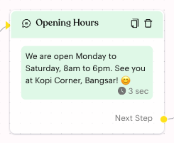<figcaption>
Duplicate and Delete icons
</figcaption></figure>



#### Undo or redo

Use the **<** (**Undo**) and **>** (**Redo**) buttons at the top. After you undo or redo, choose:

* **Confirm Changes** to keep the board as it is now.
* **Cancel** to go back to your latest version.

You can't publish until you choose one.

<figure>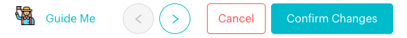<figcaption>
Confirm or cancel after undo
</figcaption></figure>



#### Tidy the board (Auto Layout)

Click the **Auto Layout** button on the right and then **OK, proceed to Sort**. Luluchat arranges the steps from left to right. Steps that aren't connected are placed below the **Starting Step**.

<figure>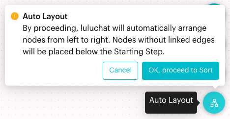<figcaption>
Auto Layout
</figcaption></figure>



#### Set Flow Settings

Click the gear button (**Flow Settings**) on the right. See [Flow Settings](#flow-settings) below.



#### Publish the flow

Click **Publish Flow**. Luluchat checks every step first. If everything is complete, you see "Flow updated." and the editor returns to the published view.

If something is missing, an **Invalid Flow Content** message lists the problems, for example: "In Message Node "Raya Promo", the Content Block "Text" is missing some text." Fix each item, or delete the step, and publish again.



## Flow Settings

Click the gear button (**Flow Settings**) to open these settings. You can change them only in draft mode. In the published view, the window says "You are currently in preview mode. Please go to Edit Flow to modify the settings."

**Flow Trigger Limitation** controls how often the same contact can get this flow:

* For flows you create: **Gets triggered maximum of X times over Y period**. Turn it **On**, then fill in "- This flow should be triggered a maximum of _1_ times for every _1_ _days_". You can choose **minutes**, **hours** or **days**.
* For the **Default Message**: **Re-trigger condition based on elapsed time**. It's **On** by default: "- This flow should be triggered once _14_ _days_ have elapsed since the last conversation." See [Default Flow](default-flow.md).

**Allow the flow to be sent in group conversations**: When **On**, this flow can be chosen for sending in group conversations. The **Mention** trigger only works when this is on.

Click **Save Settings**. You see "Setting has been saved. To apply the changes to the production environment, please remember to click "Publish Flow"."

<figure>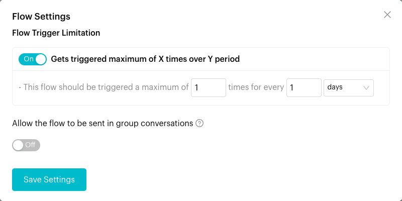<figcaption>
Flow Settings
</figcaption></figure>

The **Flow Settings** button is available for flows you create and for the **Default Message**. It isn't shown for the Away, Opt In and Opt Out flows.

## Other tools on the board

* **Export as Image** (picture button on the right): Downloads a PNG picture of the whole flow, named after the flow. Available in both views. If it fails, you see "Failed to export as image".
* **Zoom controls** (bottom left): **+** zooms in, **−** zooms out, the square fits the whole flow on screen, and **1** (**Go to Starting Step**) jumps to the **Starting Step**.
* **Guide Me** (draft mode): Starts a short tour of the editor: the board, Flow Settings, adding steps, editing a step and publishing.
* **On/Off switch** (published view): Turns the flow on or off. Hover over it to see "Flow has published" or "Flow has not published".
* **Reset Analytics Data** (published view): Clears the flow's counters, such as button clicks. Confirm "Are you sure want to reset analytic data in this flow ?" You then see "Data has been reset."

<figure>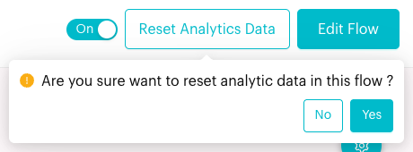<figcaption>
Reset Analytics Data
</figcaption></figure>

## What happens after it triggers?

* While you edit, every change is saved to the draft automatically. The top bar shows **Saving...** and then **Saved**.
* When you click **Publish Flow**, the draft becomes the live version. Contacts who trigger the flow from then on get the new version.

## Important behavior to know

* **Drafts don't run**: Contacts only get the published version. Always click **Publish Flow** when you finish.
* **Published but Off**: If the flow is switched off, the published view shows "Your flow isn't published yet. Please activate it now." with a switch to turn it on.

<figure>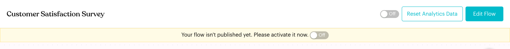<figcaption>
A published flow that is switched off
</figcaption></figure>

* **One Complete Step**: A flow can have only one **Complete** step ("You can only have one Complete Step per Flow.").
* **Buttons and next steps**: If a message has reply buttons, its **Next Step** can only link to a **Smart Delay** ("You cannot link this node because your message contains reply or button options, and we expect the user to respond to them. The next step can only link to Smart Delay.").
* **Fallback and consent flows have limits**: In the **Default Message** and **Away Message**, the **Starting Step** has no triggers. In **Opt In** and **Opt Out**, you can't add or delete steps, and the **Starting Step** only accepts **Keyword** triggers. See [Fallback & Consent Flows](../core-features/index-1/message-flows/fallback-and-consent-flows/README.md).

## Common issues & solutions

* **I can't change anything**: You're in the published view. Click **Edit Flow**.
* **Invalid Flow Content when publishing**: Read the list in the message. Common ones:
  * "In Starting Step, the Keyword Trigger is missing keywords."
  * "In Message Node "{title}", the Content Block "Text" is missing some text."
  * "The Start Flow Node "{title}" is missing the next flow."
  * "Node "{title}" has no content."
* **"You should not connect back to the same node"**: Connect the step to a different step.
* **"Please remove "{title}" node and recreate it."**: The step has a duplicate ID. Delete that step, add it again and publish.
* **I don't see the Publish Flow button**: You used undo or redo. Click **Confirm Changes** or **Cancel** first.
* **The flow didn't change for contacts**: You didn't publish. Open the flow, click **Edit Flow**, then **Publish Flow**.

## Best practice 💡

* Use **Auto Layout** after adding many steps to keep the board easy to read.
* Turn on **Flow Trigger Limitation** for promotional flows so the same contact doesn't get them again and again.
* Name each step clearly (for example "Send Our Menu" instead of "Send Message 1") so the board reads like a script.
* Use **Export as Image** to share the flow with your team for review before publishing.

## Related Documentation

* [Message Flows](message-flows.md)
* [Trigger](steps/trigger.md)
* [Complete](steps/complete.md)
* [Message](content-nodes/message.md)
* [Actions](logics/actions.md)
* [Typing Indicator](typing-indicator.md)
