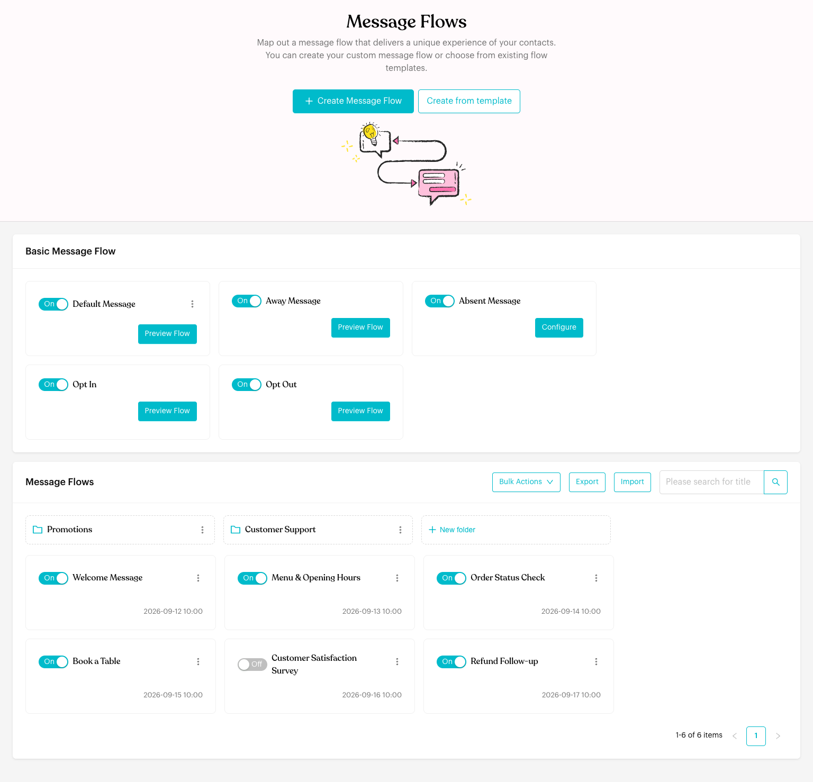
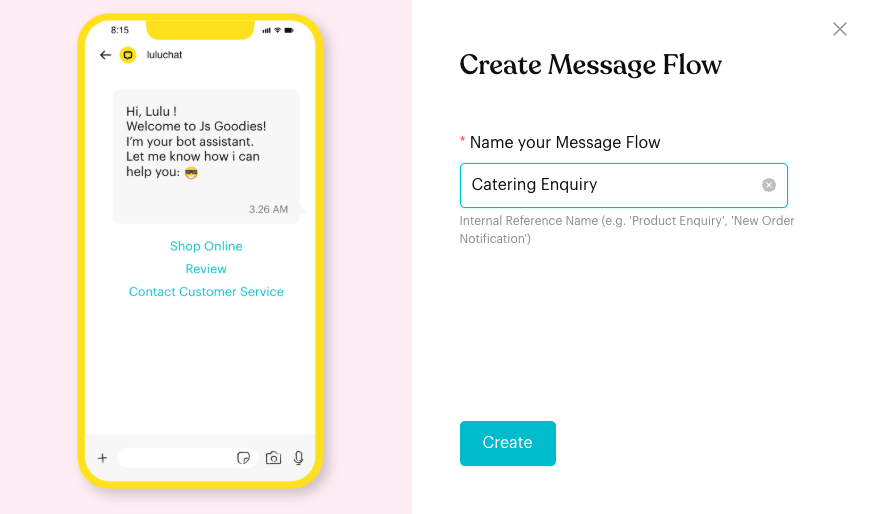
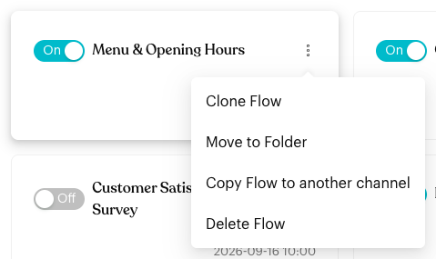
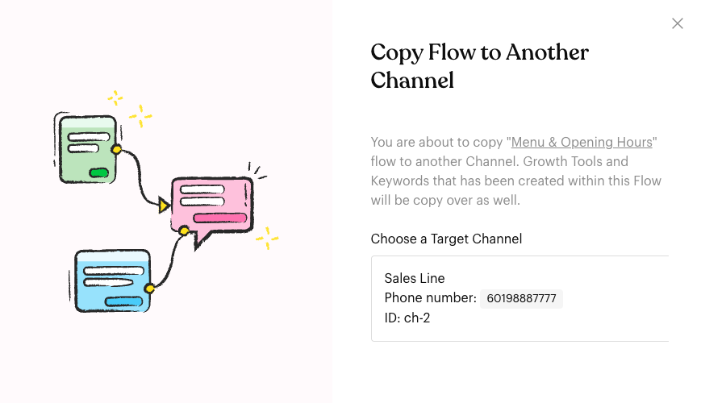
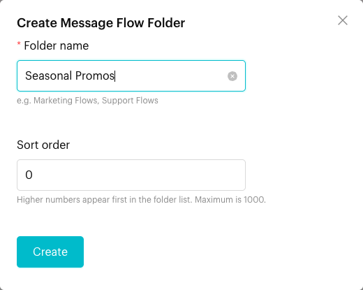
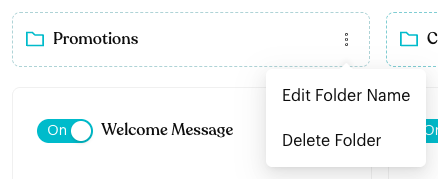
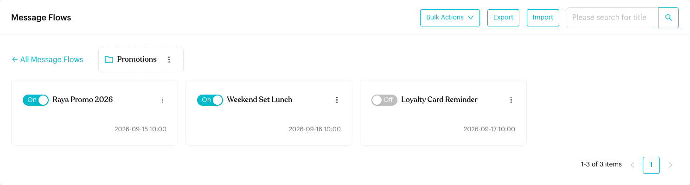
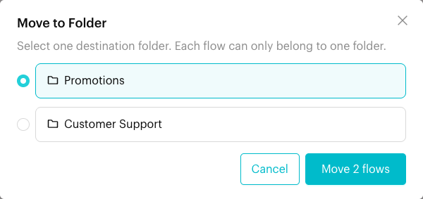
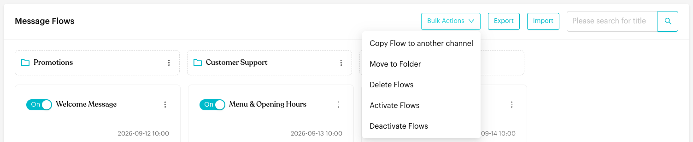
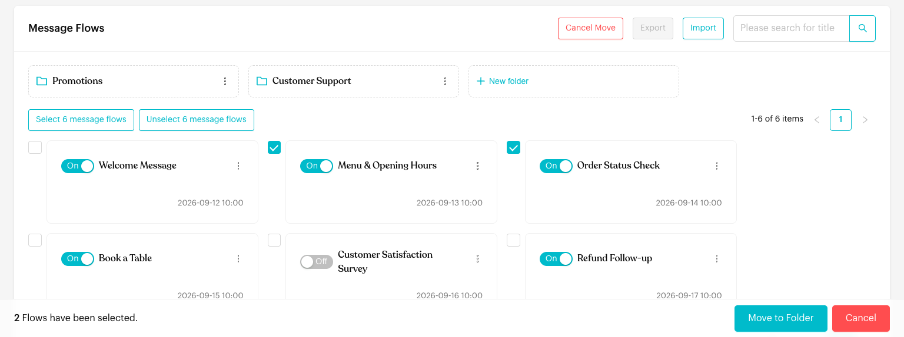

# Message Flows

## What is Message Flows?

**Message Flows** is where you create and manage your automated conversations. Each flow starts with a trigger (for example, a contact sends the keyword "menu") and then runs the steps you designed: messages, actions, delays, conditions and more.

The page has two sections:

* **Basic Message Flow**: The five built-in fallback and consent flows: **Default Message**, **Away Message**, **Absent Message**, **Opt In** and **Opt Out**. See [Fallback & Consent Flows](../core-features/index-1/message-flows/fallback-and-consent-flows/README.md).
* **Message Flows**: All the flows you create, with folders, bulk actions, export, import and search.

<figure><figcaption>
The Message Flows page
</figcaption></figure>

## Message Flow Components

Message Flows are built using different types of nodes and steps:

* [**Message Flow Editor**](message-flows-editor.md): Learn how to use the visual flow builder
* [**Typing Indicator**](typing-indicator.md): Make automated messages feel more natural with typing indicators
* [**Starting & Complete Steps**](steps/index.md): Configure how customers enter and exit flows
  * [Trigger](steps/trigger.md): Set up entry points: Keyword, WhatsApp Link, Webhook, App Event (Shopify), Meta Ad, Deal Stage, Booking Event and Mention
  * [Complete](steps/complete.md): Mark successful flow completion
* [**Content Nodes**](content-nodes/index.md): Add messaging and interactive experiences
  * [Message](content-nodes/message.md): Send text, media, and quick-reply buttons
  * [Message Template](content-nodes/message-template.md): Send official WABA templates
  * [Start Flow](content-nodes/start-flow.md): Link to other flows for modular design
  * [Form](content-nodes/form.md): Send forms to collect customer data
  * [AI Agent](content-nodes/ai-agent.md): Handle open-ended inquiries with AI
* [**Logics**](logics/index.md): Control timing, branching, and background actions
  * [Actions](logics/actions.md): Background tasks (tagging, assignment, webhooks) - includes complete reference of all available actions
  * [Round Robin](logics/round-robin.md): Distribute traffic sequentially
  * [Smart Delay](logics/smart-delay.md): Pause and branch based on replies
  * [Condition](logics/condition.md): Create if/else branching logic
  * [Randomizer](logics/randomizer.md): Split traffic randomly for A/B testing
* [**Fallback & Consent Flows**](../core-features/index-1/message-flows/fallback-and-consent-flows/README.md): Default behaviors for your channel
  * [Default Flow](default-flow.md): When a message doesn't match any keyword
  * [Away Flow](away-flow.md): When a message arrives outside your working hours
  * [Absent Flow](absent-flow.md): When a message can't be read because of WhatsApp encryption
  * [Opt-In Flow](opt-in-flow.md): When a contact subscribes to promotions
  * [Opt-Out Flow](opt-out-flow.md): When a contact unsubscribes from promotions

## When does it trigger?

A flow you create runs when:

* A contact's message matches the flow's trigger, such as a **Keyword**, a **WhatsApp Link** message or a **Meta Ad**.
* An outside event starts it, such as an **App Event**, a **Webhook** call, a **Deal Stage** change or a **Booking Event**.
* Another flow sends the contact into it with a **Start Flow** step, or a workflow, broadcast or team member sends it.

It only runs if the flow is published, switched **On**, and your channel is connected.

## How to set it up (Step by Step)



#### Open Message Flows

Go to **Automations** > **Message Flows**.



#### Create a flow

Click **Create Message Flow**. Under **Name your Message Flow**, type a name for your own reference (for example "Catering Enquiry") and click **Create**.

<figure><figcaption>
Create Message Flow
</figcaption></figure>

The flow editor opens in draft mode with a **Starting Step**, a **Send Message 1** step and a **Complete Step** already connected. On a WhatsApp Cloud (WABA) channel, the second step is a **Send Message Template 1** step instead.

To start from a ready-made design instead, click **Create from template**. On the **Flow Templates** page, pick a category, click **Preview** on a template, then click **Use This Template**. The new flow opens in draft mode.



#### Build and publish the flow

Add a trigger to the **Starting Step**, add your messages and other steps, then click **Publish Flow**. See [Message Flow Editor](message-flows-editor.md).



#### Turn the flow on or off

Back on **Message Flows**, use the switch on the flow's card. **On** means the flow can run. **Off** means it never runs, even if it is published. You see "Flow activated." or "Flow deactivated." when you change it.

Click anywhere else on the card to open the flow.



#### Use the flow card menu

Click **⋮** on a flow card to:

* **Clone Flow**: Make a copy of the flow on the same channel. Luluchat asks "Are you sure want to clone this Flow to current Channel?"
* **Move to Folder**: Put the flow in a folder.
* **Copy Flow to another channel**: Copy the flow to another channel in your team. Growth tools and keywords created in the flow are copied too.
* **Delete Flow**: Delete the flow after you confirm "Are you sure want to delete this flow?"

<figure><figcaption>
Flow card menu
</figcaption></figure>

When you choose **Copy Flow to another channel**, click the channel you want to copy it to.

<figure><figcaption>
Choose the channel to copy the flow to
</figcaption></figure>



#### Organise flows in folders

* **Create a folder**: Click **New folder**. Enter a **Folder name** and, if you like, a **Sort order** (0–1000; higher numbers appear first). Click **Create**.
* **Open a folder**: Click the folder. Click **← All Message Flows** to go back.
* **Rename or delete a folder**: Click **⋮** on the folder and choose **Edit Folder Name** or **Delete Folder**.

<figure><figcaption>
Create a folder
</figcaption></figure>

<figure><figcaption>
Folder menu
</figcaption></figure>

<figure><figcaption>
Inside a folder
</figcaption></figure>

To move flows into a folder, use **Move to Folder** in the flow card menu or in **Bulk Actions**. Pick one folder and click **Move 1 flow** (or **Move 2 flows**, and so on). When you are inside a folder, you can also choose **Unfile (remove from folder)**.

<figure><figcaption>
Move flows to a folder
</figcaption></figure>



#### Work on many flows at once

Click **Bulk Actions** and choose an action:

* **Copy Flow to another channel**
* **Move to Folder** (available once you have at least one folder)
* **Delete Flows**
* **Activate Flows**
* **Deactivate Flows**

<figure><figcaption>
Bulk Actions
</figcaption></figure>

Tick the flows you want, or click **Select 6 message flows** to tick every flow on the page (the number matches the flows shown). **Unselect 6 message flows** clears them. A bar at the bottom shows how many flows are selected. Click the action button in that bar (for example **Move to Folder**, **Delete Selected** or **Activate Selected**). Click **Cancel** to leave without changes.

<figure><figcaption>
Selecting flows for a bulk action
</figcaption></figure>



#### Export and import flows

* **Export**: Click **Export**, tick the flows you want, then click **Export Now**. Luluchat downloads a `.json` file. You can export up to 100 flows at a time.
* **Import**: Click **Import** and choose a `.json` file that was exported from Luluchat. The imported flows are added to the current channel. A message tells you how many were imported and how many failed.



#### Search

Type in **Please search for title** and press Enter (or click the search icon) to find flows by name.



## What happens after it triggers?

* The contact receives each step in the order you connected them in the editor.
* The flow's trigger and step counts (for example, how many times a button was clicked) update in the editor. You can clear them with **Reset Analytics Data**.
* If the flow has **Flow Trigger Limitation** turned on, Luluchat skips the flow when the contact has already reached the limit. See [Flow Settings](message-flows-editor.md#flow-settings).

## Important behavior to know

* **Published vs draft**: Edits are saved as a draft. Contacts only get the version you published with **Publish Flow**.
* **On/Off is separate from publishing**: A published flow that is **Off** doesn't run. Turn it **On** on the flow card or in the editor.
* **Channel must be connected**: If your channel isn't connected, the page shows "Channel not connected" and your flows won't be triggered.
* **Each flow belongs to one folder**: Moving a flow to another folder takes it out of its current folder. Deleting a folder doesn't delete its flows; they are moved back to the main list.
* **Copying to another channel**: **Copy Flow to another channel** also copies the growth tools and keywords inside the flow. For the **Default Message**, the copy replaces the target channel's existing Default Message.
* **Clone vs copy**: **Clone Flow** makes a copy on the same channel. **Copy Flow to another channel** puts the copy on a different channel.
* **Group tag**: A flow with **Allow the flow to be sent in group conversations** turned on shows a **Group** tag on its card.

## Common issues & solutions

* **"Channel not connected"**: Reconnect your channel. Flows don't run until it is connected.
* **"You can only export up to 100 flows at a time."**: Untick some flows and export in batches.
* **"Import failed"** or "1 Flow failed to import": Make sure the file is a `.json` file exported from Luluchat, then try again.
* **"Delete failed, please try again."**: The flow couldn't be deleted. Refresh the page and try again.
* **"No others Channel available."**: You only have one channel, so there is nowhere to copy the flow to.
* **"No folders available. Create a folder first."**: Create a folder with **New folder** before moving flows.
* **A flow doesn't reply**: Check that it's **On**, that you published your latest changes, and that the trigger matches what the contact sent.

## Best practice 💡

* Start from a template when one fits; it saves time.
* Use names that describe the purpose, such as "Book a Table" or "Refund Follow-up".
* Group flows into folders such as "Promotions" and "Customer Support".
* Export important flows as a backup before big changes.
* Test with a second phone before you share a keyword or link with customers.

## Related Documentation

* [Message Flow Editor](message-flows-editor.md)
* [Trigger](steps/trigger.md)
* [Fallback & Consent Flows](../core-features/index-1/message-flows/fallback-and-consent-flows/README.md)
* [Typing Indicator](typing-indicator.md)
* [Automations](index.md)
