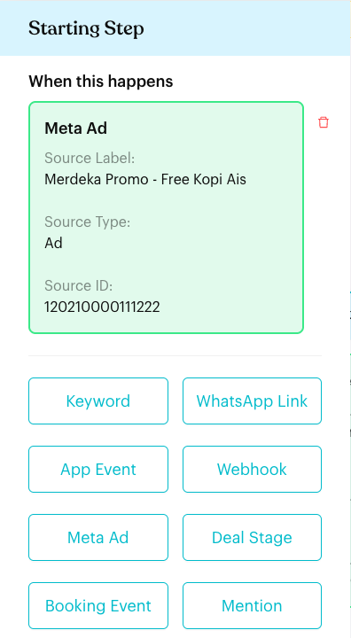
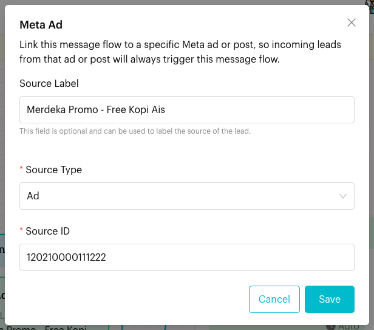
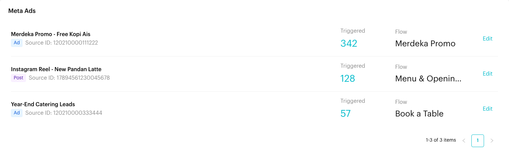

# Meta Ads

## What is the Meta Ads page?

The **Meta Ads** page lists every **Meta Ad** trigger set up in your Message Flows. A Meta Ad trigger links a Message Flow to a specific Meta (Facebook or Instagram) ad or post. When someone messages you by clicking that ad or post, Luluchat starts the linked flow straight away.

For each trigger, the page shows its label, whether it is an **Ad** or a **Post**, its Source ID, how many times it has been **Triggered**, and the flow it starts.

You don't create Meta Ad triggers on this page. You add them in a Message Flow's **Starting Step**. This page is for reviewing them and jumping to the flow to change them.

## When does it trigger?

A Meta Ad trigger starts its flow when **all** of these are true:

* A customer sends you a message by clicking a Meta ad or post (for example, a click-to-WhatsApp ad).
* Meta passes that ad's or post's ID with the message, and the ID is the same as the trigger's **Source ID**.
* The linked Message Flow is active.

## How to set it up (Step by Step)



#### Find your Ad ID or Post ID

* **Ad**: In Meta Ads Manager, find your ad and copy its **Ad ID** number.
* **Post**: In Meta Business Suite, go to **Content** > **Posts & reels**, click the **…** menu on the post and choose **Copy post ID** (or **Copy reel ID**).

See [Trigger (Starting Step)](steps/trigger.md#5-meta-ad-trigger) for screenshots of where to find these IDs.



#### Add a Meta Ad trigger to a flow

Go to **Automations** > **Message Flows** and open the flow you want customers from the ad to receive. Click **Edit Flow**, then click the **Starting Step**. Under **When this happens**, click **Meta Ad**.

<figure><figcaption>
A Meta Ad trigger in the Starting Step
</figcaption></figure>



#### Fill in the Meta Ad details

Click the **Meta Ad** box to open the **Meta Ad** window and fill in:

* **Source Label** (optional): A name to help you recognise the ad or post, for example "Merdeka Promo - Free Kopi Ais". It is also shown on the Meta Ads page.
* **Source Type**: Choose **Ad** for an Ad ID, or **Post** for a post or reel ID.
* **Source ID**: Paste the Ad ID or Post ID.

Click **Save**, then click **Publish Flow**.

<figure><figcaption>
The Meta Ad window
</figcaption></figure>



#### Check it on the Meta Ads page

Go to **Automations** > **Meta Ads**. Each row shows:

* The **Source Label** in bold.
* An **Ad** or **Post** tag and the **Source ID**.
* **Triggered**: How many times a message from this ad or post has matched the trigger.
* **Flow**: The flow it starts. Click the flow name to open it.
* **Edit**: Opens the flow in draft mode with the **Starting Step** open, so you can change the trigger.

<figure><figcaption>
The Meta Ads page
</figcaption></figure>



## What happens after it triggers?

* The linked Message Flow starts for the customer, beginning with the step connected to the Starting Step.
* The **Triggered** count for that row goes up.
* Your team can see the conversation in the Inbox as usual.

## Important behavior to know

* **Meta Ad triggers are checked first**: When a message comes from a linked ad or post, its flow starts and the message is not checked against [Growth Tools](growth-tools.md) or [Keywords](keywords.md).
* **The Source ID must match exactly**: Copy the ID from Meta rather than typing it.
* **The flow must be active**: A trigger in an inactive flow does not start the flow.
* **Flow conditions and away hours still apply**: If the flow has conditions the contact doesn't meet, it does not start. Outside your working hours, the away message may be sent instead, depending on your flow settings.
* **One flow per message**: If you link the same Source ID to more than one flow, only one of them starts. Link each ad or post to one flow only.
* **Triggered counts every match**: The count goes up each time a message from the ad or post matches, even if the flow then doesn't start (for example, because it is inactive).
* **Read-only list**: To add, change or remove a Meta Ad trigger, edit the flow's Starting Step.

## Common issues & solutions

* **"Please enter a source ID"** appears in the Meta Ad box: The trigger has no Source ID yet. Click the box, paste the ID in **Source ID** and click **Save**.
* **The flow doesn't start when I click my ad**: Check that the Source ID is correct, that the flow is active and published, and that the customer opened the chat from the ad or post itself (not from a shared link or a search).
* **Triggered stays at 0**: Meta did not send a matching ID. Check that you copied the ID of the ad that is running (not the campaign or ad set ID), or the right post or reel.
* **The wrong flow starts**: Another flow may use the same Source ID. Check the Meta Ads page for duplicate IDs.

## Best practice 💡

* Always fill in **Source Label** with the campaign name, so the Meta Ads page is easy to read.
* Use a short, focused flow for each ad, such as a welcome message with the offer and a few buttons.
* Compare the **Triggered** counts to see which ads bring in the most conversations.
* When an ad ends, remove its trigger from the flow to keep the list tidy.

## Related Documentation

* [Trigger (Starting Step)](steps/trigger.md#5-meta-ad-trigger)
* [Message Flows](message-flows.md)
* [Message Flow Editor](message-flows-editor.md)
* [Keywords](keywords.md)
* [Growth Tools](growth-tools.md)
