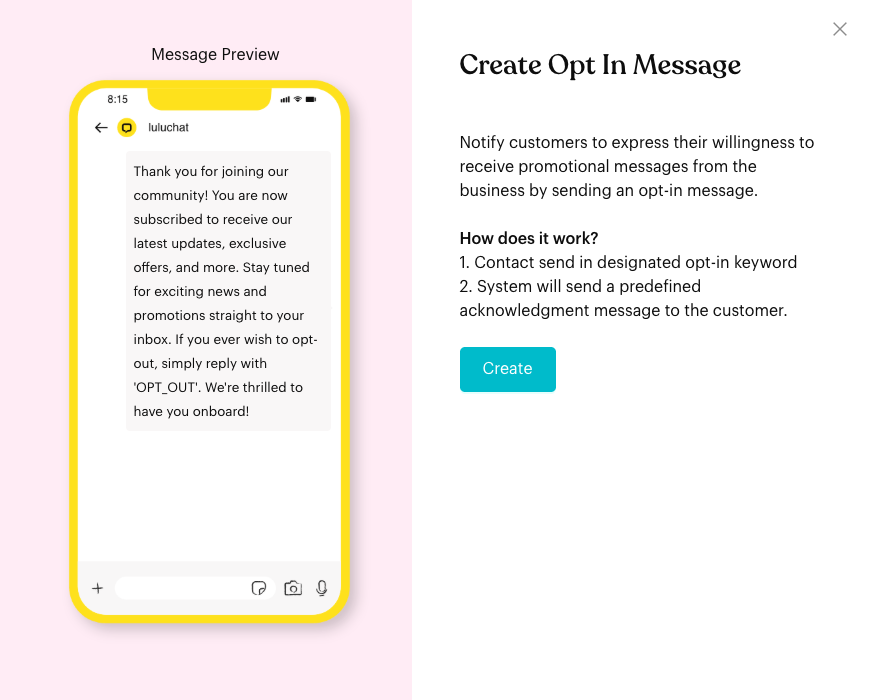
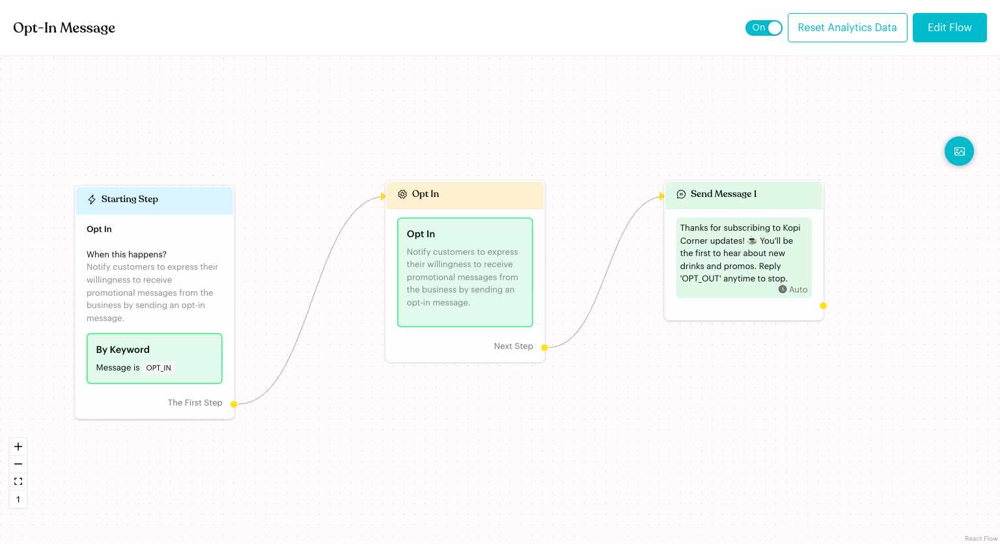

# Opt-In Flow

## What is Opt-In Flow?

The **Opt In** flow lets contacts subscribe to your promotional messages by sending a keyword. Luluchat marks the contact as opted in and sends a confirmation message.

In the app: "Notify customers to express their willingness to receive promotional messages from the business by sending an opt-in message."

## When does it trigger?

* When a contact sends the opt-in keyword. By default the keyword is `OPT_IN` (condition **is**).
* Only if the Opt In flow is published and its card is switched **On**.

## How to set it up (Step by Step)



#### Click Configure on the Opt In card

Go to **Automations** > **Message Flows**. Under **Basic Message Flow**, click **Configure** on the **Opt In** card. The **Create Opt In Message** window shows a preview and how it works:

1. Contact send in designated opt-in keyword
2. System will send a predefined acknowledgment message to the customer.

Click **Create**.

<figure><figcaption>
Create Opt In Message
</figcaption></figure>



#### Review the ready-made steps

The flow opens in draft mode with three connected steps:

* **Starting Step**: **By Keyword** — Message is `OPT_IN`.
* **Opt In**: An action that marks the contact as opted in.
* **Send Message 1**: A confirmation message.

<figure><figcaption>
Opt In flow
</figcaption></figure>



#### Change the keyword or message (optional)

* Click the **Starting Step** to change the keyword or add another **Keyword** trigger (for example "SUBSCRIBE").
* Click **Send Message 1** to change the confirmation text.



#### Publish

Click **Publish Flow**. Check that the **Opt In** card is switched **On**.



## What happens after it triggers?

* The contact is marked as opted in (subscribed) to promotional messages.
* The contact receives the confirmation message.

## Important behavior to know

* **Fixed steps**: You can't add or delete steps in the Opt In flow, and there's no **Auto Layout** or **Flow Settings**. You can edit the keyword and the message.
* **Keyword triggers only**: The **Starting Step** only offers the **Keyword** trigger.
* **Opt Out reverses it**: If the contact later sends the opt-out keyword, the [Opt-Out Flow](opt-out-flow.md) marks them as opted out.
* **Tell contacts the keyword**: Contacts need to know the exact keyword. With the default **is** condition, the whole message must be the keyword.

## Common issues & solutions

* **Nothing happens when a contact sends OPT_IN**: Check that the card is **On** and that you published the flow. Also check the keyword in the **Starting Step**.
* **"In Starting Step, the Keyword Trigger is missing keywords."**: Add at least one keyword before publishing.

## Best practice 💡

* Mention the keyword in your broadcasts and Default Message, for example "Reply OPT_IN to get our weekly promos".
* Keep the confirmation short and tell contacts how to unsubscribe ("Reply 'OPT_OUT' anytime to stop").

## Related Documentation

* [Opt-Out Flow](opt-out-flow.md)
* [Opt In action](logics/actions/opt-in.md)
* [Fallback & Consent Flows](../core-features/index-1/message-flows/fallback-and-consent-flows/README.md)
* [Trigger](steps/trigger.md)
