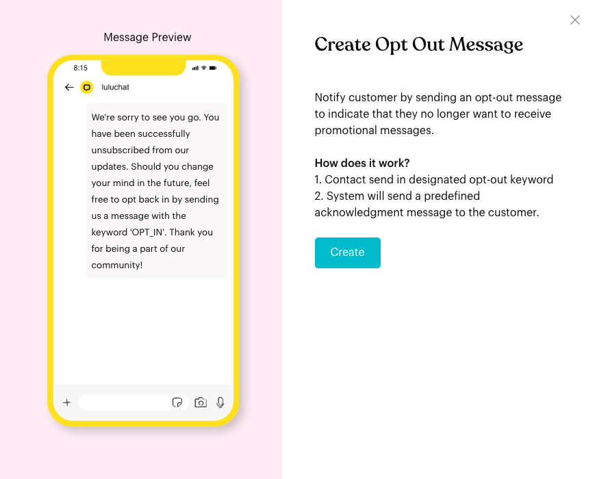
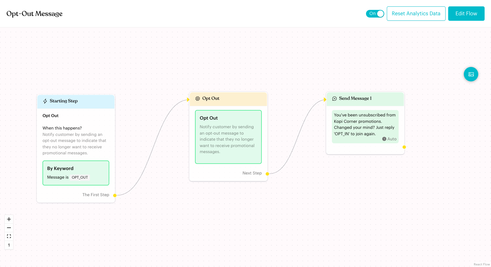

# Opt-Out Flow

## What is Opt-Out Flow?

The **Opt Out** flow lets contacts unsubscribe from your promotional messages by sending a keyword. Luluchat marks the contact as opted out and sends a confirmation message.

In the app: "Notify customer by sending an opt-out message to indicate that they no longer want to receive promotional messages."

## When does it trigger?

* When a contact sends the opt-out keyword. By default the keyword is `OPT_OUT` (condition **is**).
* Only if the Opt Out flow is published and its card is switched **On**.

## How to set it up (Step by Step)



#### Click Configure on the Opt Out card

Go to **Automations** > **Message Flows**. Under **Basic Message Flow**, click **Configure** on the **Opt Out** card. The **Create Opt Out Message** window shows a preview and how it works:

1. Contact send in designated opt-out keyword
2. System will send a predefined acknowledgment message to the customer.

Click **Create**.

<figure><figcaption>
Create Opt Out Message
</figcaption></figure>



#### Review the ready-made steps

The flow opens in draft mode with three connected steps:

* **Starting Step**: **By Keyword** — Message is `OPT_OUT`.
* **Opt Out**: An action that marks the contact as opted out.
* **Send Message 1**: A confirmation message.

<figure><figcaption>
Opt Out flow
</figcaption></figure>



#### Change the keyword or message (optional)

* Click the **Starting Step** to change the keyword or add another **Keyword** trigger (for example "STOP").
* Click **Send Message 1** to change the confirmation text.



#### Publish

Click **Publish Flow**. Check that the **Opt Out** card is switched **On**.



## What happens after it triggers?

* The contact is marked as opted out (unsubscribed) from promotional messages.
* The contact receives the confirmation message.

## Important behavior to know

* **Fixed steps**: You can't add or delete steps in the Opt Out flow, and there's no **Auto Layout** or **Flow Settings**. You can edit the keyword and the message.
* **Keyword triggers only**: The **Starting Step** only offers the **Keyword** trigger.
* **Opting back in**: If the contact later sends the opt-in keyword, the [Opt-In Flow](opt-in-flow.md) marks them as opted in again.

## Common issues & solutions

* **Nothing happens when a contact sends OPT_OUT**: Check that the card is **On** and that you published the flow. Also check the keyword in the **Starting Step**.
* **"In Starting Step, the Keyword Trigger is missing keywords."**: Add at least one keyword before publishing.

## Best practice 💡

* Keep the confirmation short, with no promotions.
* Tell the contact how to subscribe again, for example "Reply 'OPT_IN' to join again."
* Add common words such as "STOP" or "UNSUBSCRIBE" as extra keywords.

## Related Documentation

* [Opt-In Flow](opt-in-flow.md)
* [Opt Out action](logics/actions/opt-out.md)
* [Fallback & Consent Flows](../core-features/index-1/message-flows/fallback-and-consent-flows/README.md)
* [Trigger](steps/trigger.md)
