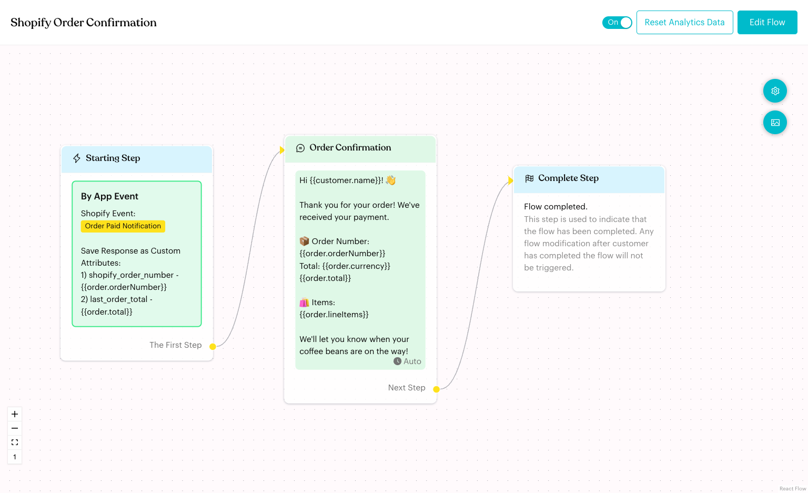
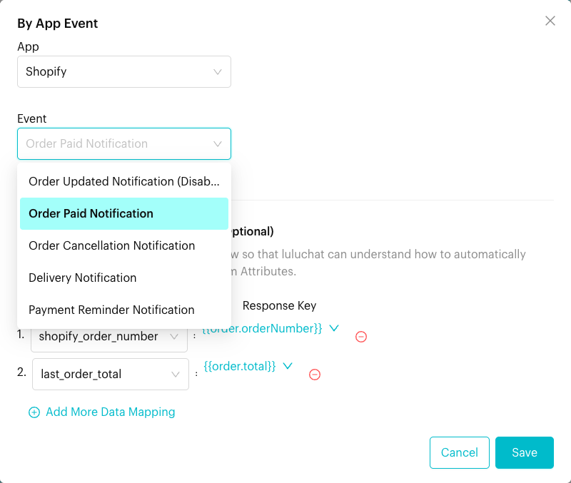
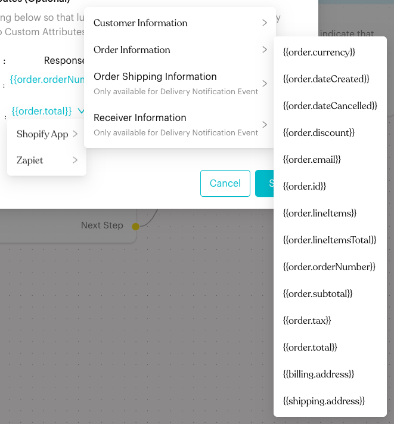
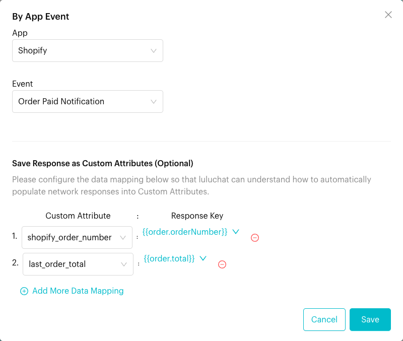
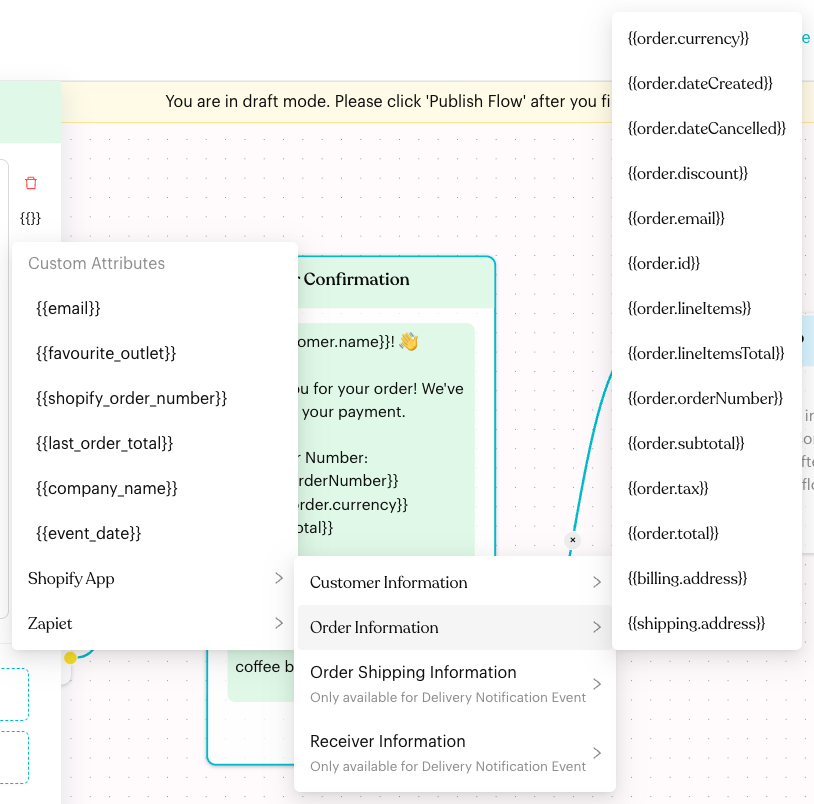

# Shopify App Event Trigger

## What is Shopify App Event Trigger?

The **App Event** trigger starts a Message Flow when something happens in your Shopify store, such as an order being paid, cancelled or shipped. Use it to send automatic WhatsApp updates to your customers, with order details filled in for you.

<figure><figcaption><p>A flow started by the Shopify Order Paid Notification event</p></figcaption></figure>

## When does it trigger?

Choose one of these Shopify events:

| Event | Starts the flow when… |
| --- | --- |
| **Order Updated Notification** | An order is edited or updated in Shopify |
| **Order Paid Notification** | A customer's payment for an order is received |
| **Order Cancellation Notification** | An order is cancelled |
| **Delivery Notification** | A fulfillment is created for an order (the order is shipped) |
| **Payment Reminder Notification** | Once a day, between 8:00 and 9:00 AM in your team's time zone, for each unpaid order whose payment is due that day |

All events except **Payment Reminder Notification** start the flow as soon as Shopify sends the event.

### Prerequisites

* Shopify is connected in Luluchat. See [Shopify Integration](../settings/account/shopify-integration.md).
* The events you want are set up and turned on. See [Shopify Webhook Configuration](../settings/account/shopify-webhook-configuration.md).

## How to set it up (Step by Step)



#### Create a flow and open the Starting Step

Go to **Automations** > **Message Flows** and create a flow, for example "Shopify Order Confirmation". Click **Edit Flow**, then click the **Starting Step**.



#### Add the App Event trigger

Click **App Event**, then click the new **By App Event** card. Select **Shopify** under **App**, then pick an **Event**.

<figure><figcaption><p>Choose a Shopify event</p></figcaption></figure>

An event marked **(Disabled)** is turned off in your Shopify app settings. The flow won't start from it until you turn it on.



#### Save Shopify data to custom attributes (optional)

Under **Save Response as Custom Attributes (Optional)**, click **Add More Data Mapping**. For each row:

1. Choose a **Custom Attribute** (for example `shopify_order_number`).
2. Under **Response Key**, click **Please select a response data** and pick a value from **Shopify App** (or **Zapiet**), for example **Order Information** > `{{order.orderNumber}}`.

Click the red minus icon to remove a row. Then click **Save**.

<figure> Order Information with the order placeholders such as {{order.currency}}, {{order.orderNumber}} and {{order.total}}"><figcaption><p>Pick the Shopify value to save</p></figcaption></figure>

<figure><figcaption><p>Order Paid Notification with two data mappings</p></figcaption></figure>



#### Write the message with Shopify placeholders

Link a **Send Message** step after the Starting Step. In the message text, click the **{{}}** (**Content Parameters**) icon, then **Shopify App**, and pick a placeholder. It's added to your text and replaced with the real order data when the message is sent.

<figure> Order Information with the order placeholders"><figcaption><p>Insert Shopify placeholders into a message</p></figcaption></figure>

**Example message:**

```
Hi {{customer.name}}! 👋

Thank you for your order! We've received your payment.

📦 Order Number: {{order.orderNumber}}
Total: {{order.currency}} {{order.total}}

🛍️ Items:
{{order.lineItems}}

We'll let you know when your coffee beans are on the way!
```



#### Publish and test

Click **Publish Flow** and make sure the flow is turned **On**. Place a test order in Shopify with your own phone number and check that the message arrives.



## What happens after it triggers?

1. Luluchat finds the customer's phone number in the order. It looks at the billing address phone first, then the order's phone, then the customer's phone and default address.
2. If there's no contact with that number yet, a new contact is created, named after the Shopify customer.
3. Your data mappings are saved to the contact's custom attributes.
4. The flow starts and the placeholders in your messages are filled in.

When an Order Paid Notification starts the example flow above, the customer receives:

```
Hi Siti Aminah! 👋

Thank you for your order! We've received your payment.

📦 Order Number: 1042
Total: MYR 86.00

🛍️ Items:
1. Kopi Corner House Blend 500g
2. Kaya Jam Jar

We'll let you know when your coffee beans are on the way!
```

## Available Shopify placeholders

These are listed under **Shopify App** in the **{{}}** menu and in **Response Key**.

**Customer Information**

* `{{customer.email}}`: Customer's email address
* `{{customer.name}}`: Customer's first and last name

**Order Information**

* `{{order.currency}}`: Currency code, for example MYR
* `{{order.dateCreated}}`: Order date (YYYY-MM-DD)
* `{{order.dateCancelled}}`: Cancellation date (YYYY-MM-DD), if cancelled
* `{{order.discount}}`: Total discount
* `{{order.email}}`: Order email address
* `{{order.id}}`: Shopify order ID
* `{{order.lineItems}}`: Numbered list of item names
* `{{order.lineItemsTotal}}`: Total price of the items
* `{{order.orderNumber}}`: Order number
* `{{order.subtotal}}`: Subtotal
* `{{order.tax}}`: Total tax
* `{{order.total}}`: Order total
* `{{billing.address}}`: Billing address
* `{{shipping.address}}`: Shipping address

Amounts are shown with two decimal places, for example `86.00`.

**Order Shipping Information** (only available for the Delivery Notification event)

* `{{shipping.total}}`: Shipping cost
* `{{shipping.trackingCompany}}`: Courier name
* `{{shipping.trackingNumber}}`: Tracking number(s)
* `{{shipping.trackingUrl}}`: Tracking link(s)

**Receiver Information** (only available for the Delivery Notification event)

* `{{receiver.name}}`: Name of the person receiving the delivery

**Zapiet** (if you use the Zapiet pickup and delivery app in Shopify)

* Pickup: `{{zapiet.checkoutMethod}}`, `{{zapiet.pickupLocationId}}`, `{{zapiet.pickupDate}}`, `{{zapiet.pickupTime}}`, `{{zapiet.pickupLocationCompany}}`, `{{zapiet.pickupLocationAddressLine1}}`, `{{zapiet.pickupLocationAddressLine2}}`, `{{zapiet.pickupLocationCity}}`, `{{zapiet.pickupLocationRegion}}`, `{{zapiet.pickupLocationPostalCode}}`, `{{zapiet.pickupLocationCountry}}`
* Delivery: `{{zapiet.deliveryLocationId}}`, `{{zapiet.deliveryDate}}`, `{{zapiet.deliveryTime}}`, `{{zapiet.deliveryTimeEnd}}`

You can also type `{{shipping.name}}` and `{{billing.name}}` for the shipping and billing recipient names. They aren't in the menu.

### Shopify placeholders vs custom attributes

* **Shopify placeholders** (such as `{{order.orderNumber}}`) only work in the flow started by the Shopify event.
* **Custom attributes** you mapped (such as `{{shopify_order_number}}`) are saved on the contact. You can use them later in other flows, filters and broadcasts.

## Important behavior to know

* **One flow per event**: Each Shopify event can only be used by one flow in a channel. To send different messages for the same event, use a [Condition](logics/condition.md) step inside that one flow.
* **Phone number required**: If the order has no phone number, the flow doesn't start.
* **Payment Reminder timing**: It runs once a day in the 8 AM hour (your team's time zone) and only for unpaid or pending orders with a payment due date of today.
* **Delivery Notification**: Starts when Shopify reports a successful fulfillment.
* **Data mapping**: A value is only saved if Shopify sent it and it fits the custom attribute's data type.
* **Placeholders depend on the event**: Shipping tracking and receiver details are only filled in for Delivery Notification.

## Common issues & solutions

* **The App Event card says "Your App Settings do not show this app as connected. To trigger this flow, please connect the app."**: Click **Go to Apps** and connect Shopify. See [Shopify Integration](../settings/account/shopify-integration.md).
* **The card says "Your App Settings show that this event is currently disabled. To trigger this flow, please enable the event."**: Click **Go to App Settings** and turn the event on.
* **"shopify event: order-paid is already registered in other automation flow."** (the event name changes): Another flow already uses this event. Remove the trigger from that flow, or add your messages to it instead.
* **"You have not install the integration yet."** when publishing: Shopify isn't connected to this channel. Connect it first.
* **Flow not triggering**:
  * Make sure the flow is published and turned **On**.
  * Check that the order has a phone number in the billing address, the order, or the customer profile.
  * Check the event's webhook in Shopify. See [Shopify Webhook Configuration](../settings/account/shopify-webhook-configuration.md).
* **Placeholders are empty**: Check that the event includes that data. For example, tracking details are only sent with Delivery Notification. Check the spelling too: placeholders are case-sensitive.
* **Custom attribute not updated**: Check the mapping is saved on the trigger, and that the attribute's data type matches the value (for example, a number attribute for `{{order.total}}`).

## Best practice 💡

* **One event, one flow**: Build one flow per Shopify event, such as "Order Confirmation" for Order Paid and "Shipping Update" for Delivery Notification.
* **Keep it short**: Show the order number, total and next step. Customers can contact you for the rest.
* **Save the order number**: Map `{{order.orderNumber}}` to a custom attribute so your team sees it on the contact.
* **Test with a real order**: Placeholders are only filled in from real Shopify events.

## Related Documentation

* [Trigger (Starting Step)](steps/trigger.md#3-app-event-trigger)
* [Shopify Integration](../settings/account/shopify-integration.md)
* [Shopify Webhook Configuration](../settings/account/shopify-webhook-configuration.md)
* [Message Flows](message-flows.md)
* [Message](content-nodes/message.md)
