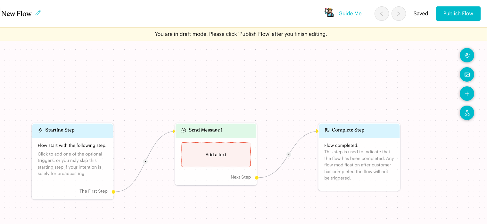
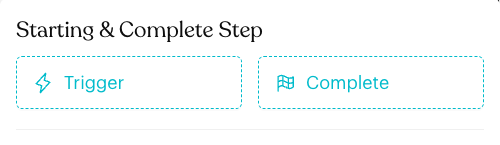
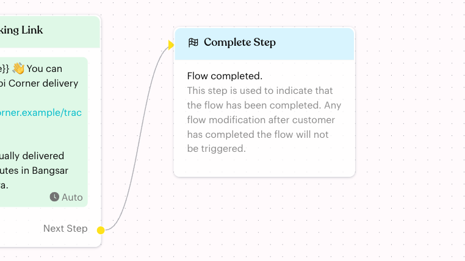
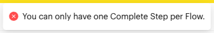

# Complete

## What is the Complete Step?

The **Complete Step** marks the end of a Message Flow. When a contact reaches it, the flow is finished for that contact.

On the flow board it shows **Flow completed.** and this note from the app: "This step is used to indicate that the flow has been completed. Any flow modification after customer has completed the flow will not be triggered."

The Complete Step has nothing to set up. It has an input on the left, so other steps can link to it, but no **Next Step** output.

## When to use it?

* At the end of a path, after the last message, so the flow has a clear finish.
* When several branches (for example from a [Condition](../logics/condition.md) or [Randomizer](../logics/randomizer.md)) should all end in the same place.
* After a customer reaches a goal, such as receiving their order tracking link or booking a table.

## How to set it up (Step by Step)



#### Check if your flow already has one

New Message Flows already include a Complete Step. A new flow starts with **Starting Step** → **Send Message 1** → **Complete Step**, already linked together.

<figure><figcaption>
A new flow already ends with a Complete Step
</figcaption></figure>



#### Add a Complete Step (if your flow doesn't have one)

Default Message and Away Message flows don't start with a Complete Step. To add one, click **Edit Flow** to enter draft mode. Click the **+** (**Add Node**) button on the right of the board. Under **Starting & Complete Step**, click **Complete**.

<figure><figcaption>
Add a Complete Step from the Starting & Complete Step section
</figcaption></figure>



#### Link your last step to it

Drag from the **Next Step** dot of your last step to the left edge of the **Complete Step**. You can link several steps to the same Complete Step.

<figure><figcaption>
The last message linked to the Complete Step
</figcaption></figure>



#### Publish the flow

Click **Publish Flow** to make the change live.



## What happens after it triggers?

* The flow ends for that contact. No more steps run.
* Changes you make to the flow later do not affect contacts who already reached the Complete Step.
* The contact can start the flow again later through any of its triggers, subject to your **Flow Trigger Limitation** in [Flow Settings](../message-flows-editor.md).

## Important behavior to know

* **One per flow**: A flow can have only one Complete Step. Link every finished branch to it.
* **No settings**: Clicking the Complete Step does not open a settings panel.
* **No output**: You can't link the Complete Step to another step. To hand the contact over to another flow, end that path with a [Start Flow](../content-nodes/start-flow.md) step instead.
* **Can't be deleted**: The Complete Step has no delete button. If you don't need it, simply leave it unlinked.
* **Don't link it straight after the Starting Step** in a flow you send from a broadcast. The flow would finish without sending anything.

## Common issues & solutions

* **"You can only have one Complete Step per Flow."**: Your flow already has a Complete Step. Link your step to the existing one instead of adding another.

<figure><figcaption>
Shown when you add a second Complete Step
</figcaption></figure>

* **I can't find the Complete button**: Make sure you clicked **Edit Flow**. You can only add steps in draft mode.
* **The Complete Step doesn't open when I click it**: This is expected. It has no settings.

## Best practice 💡

* End every branch of your flow at the Complete Step, so no path is left without an ending.
* Keep it at the far right of the board, so the flow reads from left to right.
* Use one shared Complete Step and link all finished paths to it, rather than leaving loose ends.

## Related Documentation

* [Starting & Complete Steps](index.md)
* [Trigger (Starting Step)](trigger.md)
* [Message Flow Editor](../message-flows-editor.md)
* [Start Flow](../content-nodes/start-flow.md)
