# Trigger

## What is the Trigger Step?

The **Starting Step** is the first step of every Message Flow. Its triggers decide **when** the flow starts. For example, a flow can start when a customer sends "order status", clicks a WhatsApp link on your Instagram bio, or when a Shopify order is paid.

A flow can have several triggers. The flow starts when **any one** of them fires.

<figure>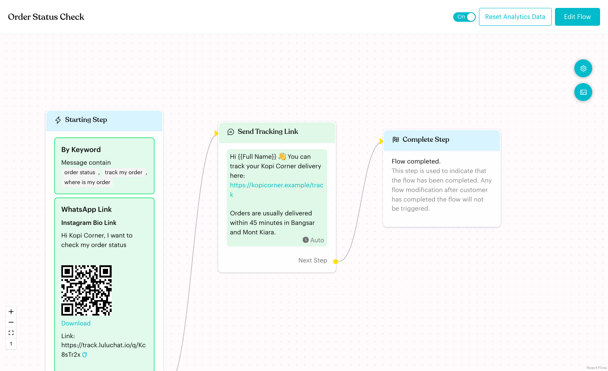<figcaption>
A flow with a Keyword and a WhatsApp Link trigger
</figcaption></figure>

## When does it trigger?

The flow starts when one of its triggers fires:

| Trigger | The flow starts when… |
| --- | --- |
| **Keyword** | A customer sends a message that matches your keywords |
| **WhatsApp Link** | A customer opens your link (or scans its QR code) and sends the pre-filled message |
| **App Event** | A Shopify event happens, such as an order being paid |
| **Webhook** | Your own system sends a request to the flow's webhook URL |
| **Meta Ad** | A customer messages you from a specific Meta (Facebook or Instagram) ad or post |
| **Deal Stage** | A deal is moved into one of the stages you chose |
| **Booking Event** | A booking event happens, such as a booking being confirmed |
| **Mention** | Someone mentions your number in a WhatsApp group |

Triggers are optional. If a flow has no triggers, the Starting Step shows "Flow start with the following step." You can still send the flow from a broadcast or start it from another flow.

## How to set it up (Step by Step)



#### Open the Starting Step

Open your flow and click **Edit Flow** to enter draft mode. Click the **Starting Step** on the board. Its settings open on the left, under **When this happens**.

<figure>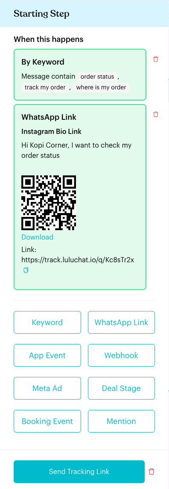<figcaption>
The Starting Step panel
</figcaption></figure>



#### Add a trigger

Click a trigger button to add it:

* **Keyword**
* **WhatsApp Link**
* **App Event**
* **Webhook**
* **Meta Ad**
* **Deal Stage** (only when the Deals module is enabled)
* **Booking Event** (only when the Bookings module is enabled)
* **Mention** (only on WhatsApp channels)

<figure>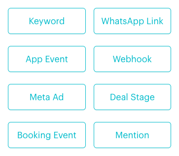<figcaption>
Trigger buttons
</figcaption></figure>

A new card appears under **When this happens**. A card is red until it is set up.

<figure>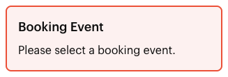<figcaption>
A new trigger that still needs settings
</figcaption></figure>



#### Set up the trigger

Click the card to open its settings, fill them in, and click **Save**. Each trigger type is explained below.

To remove a trigger, click the red bin icon next to its card.



#### Link the first step and publish

The Starting Step's **The First Step** dot links to the step that runs first. Make sure it is linked, then click **Publish Flow**.



***

## Trigger Types Explained

### 1. Keyword Trigger

**What it does**: Starts the flow when a customer's message matches the keywords you set.

**How to configure**:

1. Click **Keyword** in the Starting Step panel, then click the new **By Keyword** card.
2. Next to **If message**, click the condition (for example **is**) and choose a match condition.
3. Click **+ New Keyword**, type a keyword and press Enter. Add as many as you need. Double-click a keyword to edit it.
4. Click **Save**.

<figure>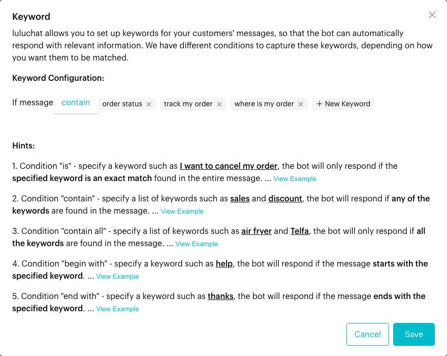<figcaption>
Keyword settings
</figcaption></figure>

<figure>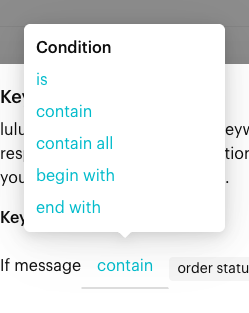<figcaption>
Match conditions
</figcaption></figure>

**Keyword Match Rules**:

| Condition | The flow starts when… | Example |
| --- | --- | --- |
| **is** | The whole message is exactly one of your keywords | Keyword "menu" matches "Menu", but not "show me the menu" |
| **contain** | The message contains **any** of your keywords | Keywords "order status", "track my order" match "Hi, can I track my order?" |
| **contain all** | The message contains **all** of your keywords | Keywords "catering", "price" match "What is the catering price?" |
| **begin with** | The message starts with one of your keywords | Keyword "help" matches "Help, my order is late" |
| **end with** | The message ends with one of your keywords | Keyword "thanks" matches "Got it, thanks" |

**Important behavior to know**:

* Keywords are not case-sensitive. "Menu" and "menu" are treated the same.
* Punctuation counts. With **is**, "menu?" does not match the keyword "menu".
* Keyword triggers only work in one-to-one chats, not in groups. For groups, use the [Mention trigger](#8-mention-trigger).
* If your keyword contains full-width punctuation (often typed with a Chinese keyboard) or an invisible character copied from a chat app, the app shows a yellow warning. Retype the keyword to fix it.
* You can see all keywords across your flows on the [Keywords](../keywords.md) page.

***

### 2. WhatsApp Link Trigger

**What it does**: Creates a short link and QR code that open WhatsApp with a message already typed. When the customer sends that message, the flow starts.

**How to configure**:

1. Click **WhatsApp Link** in the Starting Step panel, then click the new **WhatsApp Link** card.
2. In **Create WhatsApp Link**, fill in:
   * **Growth tool label**: A name for your own reference, for example "Instagram Bio Link". Customers don't see it.
   * **Phone number**: Filled in with your channel's number. You can't change it.
   * **Message**: The text that is pre-filled for the customer, for example "Hi Kopi Corner, I want to check my order status".
3. Click **Create**. The QR code and link appear. You can **Download** the QR code or copy the link.

<figure>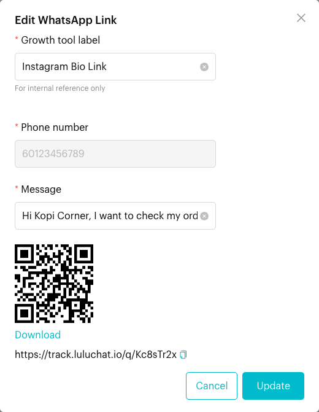<figcaption>
WhatsApp Link settings with the QR code and link
</figcaption></figure>

**When to use it**:

* **Social media and ads**: Put the link in your Instagram bio or Facebook posts.
* **Print**: Put the QR code on table stickers, receipts or flyers.
* **Tracking**: Use one link per campaign to see which one brings the most chats on the [Growth Tools](../growth-tools.md) page.

**Important behavior to know**:

* The flow only starts if the customer sends the pre-filled message **unchanged** (capital letters don't matter). If they edit it, the flow does not start from the link.
* Each WhatsApp Link trigger has its own link and QR code. A flow can have several.
* Use a different message for each link, so each message leads to the right flow.
* WhatsApp Link triggers don't work in group chats.

***

### 3. App Event Trigger

**What it does**: Starts the flow when an event happens in a connected app. Shopify is currently the only app you can choose.

**How to configure**:

1. Click **App Event** in the Starting Step panel, then click the new **By App Event** card.
2. Select **Shopify** under **App**.
3. Select an **Event**, for example **Order Paid Notification**.
4. Optionally, under **Save Response as Custom Attributes (Optional)**, click **Add More Data Mapping** to save Shopify data (such as the order number) into a contact's custom attribute.
5. Click **Save**.

<figure><figcaption>
App Event settings for Shopify
</figcaption></figure>

**Important behavior to know**:

* You must connect Shopify first. If it isn't connected, the card says "Your App Settings do not show this app as connected. To trigger this flow, please connect the app." and shows a **Go to Apps** button.
* If the event is turned off in your Shopify app settings, it shows "(Disabled)" in the list, and the card shows a **Go to App Settings** button.
* Each Shopify event can only be used by **one** flow in a channel.

For all Shopify events, placeholders and examples, see the [Shopify App Event Trigger](../shopify-app-event-trigger.md) guide.

***

### 4. Webhook Trigger

**What it does**: Starts the flow when your own system (for example your website, CRM or Zapier) sends an HTTP POST request to the flow's webhook URL.

**How to configure**:

1. Click **Webhook** in the Starting Step panel, then click the new **By Webhook** card.
2. Under **URL**, copy the **Webhook URL**. It looks like `https://webhook.luluchat.io/trigger/flow/…`.
3. In your system, send a POST request to that URL with the customer's number in `contact_number`.
4. Optionally, under **Save Response as Custom Attributes (Optional)**, click **Add More Data Mapping**. Choose a **Custom Attribute** and type the **Response Key** from your request, for example `company_name`.
5. Click **Save**.

<figure>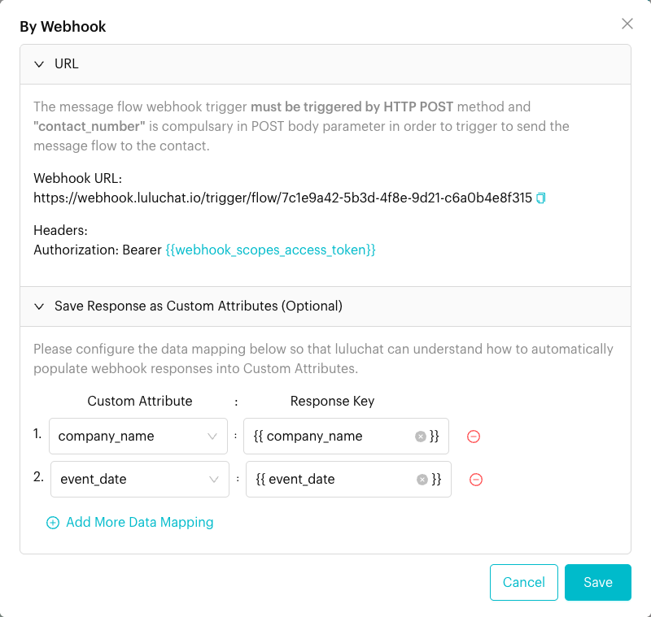<figcaption>
Webhook settings
</figcaption></figure>

**Webhook requirements**:

* The request must use **HTTP POST**.
* The body must include `contact_number` (the customer's WhatsApp number).
* If **Enable Webhook Authorization** is on in [Settings > Message Flows](../../settings/tools/message-flows.md), the panel shows a **Headers** line. Send `Authorization: Bearer` followed by an access token from [Integration](../../settings/account/integration.md). If it's off, the panel shows a link to **Webhook Settings** where you can turn it on.

**Important behavior to know**:

* **One webhook per flow**: A flow can only have one Webhook trigger.
* Each flow accepts up to 60 webhook requests per minute.
* Webhook triggers need a plan that includes them. Otherwise the request is rejected with "Sorry, your plan does not support webhook trigger feature."
* Click **Check our logs** on the card (next to "Webhook not triggered?") to see recent requests and errors.

For request examples, see the [Webhook Trigger Developer Guide](../../developer-guide/webhook-trigger.md).

***

### 5. Meta Ad Trigger

**What it does**: Starts the flow when a customer messages you from a specific Click-to-WhatsApp ad or post on Facebook or Instagram.

**How to configure**:

1. Click **Meta Ad** in the Starting Step panel, then click the new **Meta Ad** card.
2. Optionally enter a **Source Label**, for example "Raya Catering Promo 2026". It's only for your reference.
3. Choose the **Source Type**: **Ad** or **Post**.
4. Paste the **Source ID** (the ad ID or post ID).
5. Click **Save**.

<figure>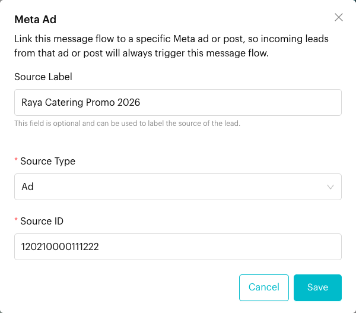<figcaption>
Meta Ad settings
</figcaption></figure>

**Where to find the ID**:

* **Ad ID**: In Meta Ads Manager, open the ad, click the **…** menu, and copy the ID.

<figure>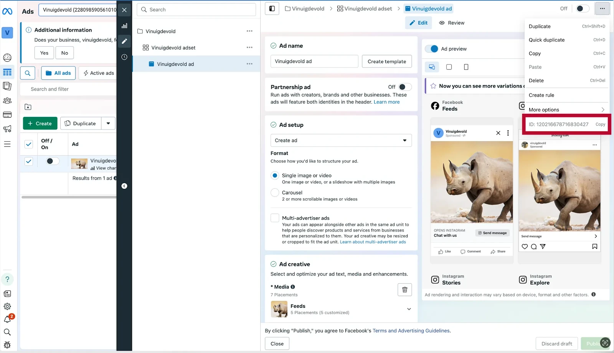<figcaption>
Copy the Ad ID in Meta Ads Manager
</figcaption></figure>

* **Post ID**: In Meta Business Suite, go to **Content** > **Posts & reels**, click **…** on the post, and choose **Copy post ID** (or **Copy reel ID**).

<figure><figcaption>
Copy the Post ID in Meta Business Suite
</figcaption></figure>

**Important behavior to know**:

* The ID must match exactly.
* The Meta Ad trigger is checked before other triggers. If a message comes from a linked ad, this flow starts even if the message also matches a keyword.
* See [Meta Ads](../../reports/meta-ads.md) for how leads from ads are reported.

***

### 6. Deal Stage Trigger

**What it does**: Starts the flow for the deal's contact when a deal is moved into one of the stages you choose.

**How to configure**:

1. Click **Deal Stage** in the Starting Step panel, then click the new **Deal Stage Changed** card.
2. Select a **Deal Pipeline**.
3. Select one or more **Deal Stages** from that pipeline.
4. Click **Save**, then publish the flow.

<figure>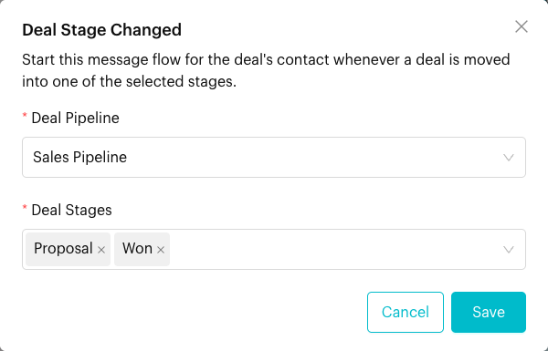<figcaption>
Deal Stage settings
</figcaption></figure>

Once saved, the card summarises the trigger:

<figure>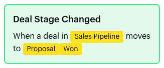<figcaption>
A configured Deal Stage trigger
</figcaption></figure>

**When to use it**:

* **Sales follow-up**: Send a message when a catering deal reaches *Proposal*.
* **Won deals**: Thank the customer and report a Purchase to Meta with the [Send Conversions API Event](../logics/actions/send-conversions-api-event.md) action.
* **Lost deals**: Start a win-back message when a deal is marked *Lost*.

**Important behavior to know**:

* Only available when the **Deals** module is enabled for your team.
* **One Deal Stage trigger per flow**. To react to more stages, select them all in the same trigger.
* Changing the pipeline clears the selected stages, because stages belong to one pipeline.
* If the pipeline or a stage is deleted later, publishing the flow fails until you select a current one.

***

### 7. Booking Event Trigger

**What it does**: Starts the flow for the booking's contact when a booking event happens on the calendars you choose.

**How to configure**:

1. Click **Booking Event** in the Starting Step panel, then click the new **Booking Event** card.
2. Select an **Event** (see the table below).
3. Select one or more **Calendars**.
4. Click **Save**, then publish the flow.

<figure>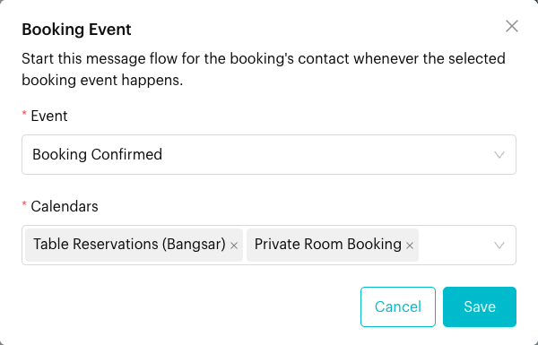<figcaption>
Booking Event settings
</figcaption></figure>

**Supported events**:

| Event | Fires when |
| --- | --- |
| **Booking Created** | A new booking is made |
| **Booking Confirmed** | A booking is confirmed |
| **Booking Cancelled** | A booking is cancelled |
| **Booking Updated** | A booking's date, time or details change |
| **Booking Reminder** | The booking reminder is sent |
| **Booking Done** | A booking is marked as done |
| **Booking No Show** | The customer is marked as a no-show |

**When to use it**:

* **Confirmation tips**: Send parking or dress-code tips once a table booking is confirmed.
* **No-show recovery**: Offer to rebook when a customer misses a booking.
* **After the visit**: Ask for a review when a booking is marked as done.

**Important behavior to know**:

* Only available when the **Bookings** module is enabled for your team.
* Each Booking Event trigger listens to one event. To react to several events, add one Booking Event trigger per event.

***

### 8. Mention Trigger

**What it does**: Starts the flow in a WhatsApp group when someone mentions your number (or replies to one of its messages). You can add keywords so it only starts for certain messages.

**How to configure**:

1. Turn on **Allow the flow to be sent in group conversations** in [Flow Settings](../message-flows-editor.md). Until then, the card is red with a warning.
2. Click **Mention** in the Starting Step panel, then click the new **By Mention** card.
3. Optionally, under **Keyword Configuration (Optional)**, choose a condition next to **If the mentioned message** and add keywords. Click **Clear Keyword** to remove them all.
4. Click **Save**.

<figure>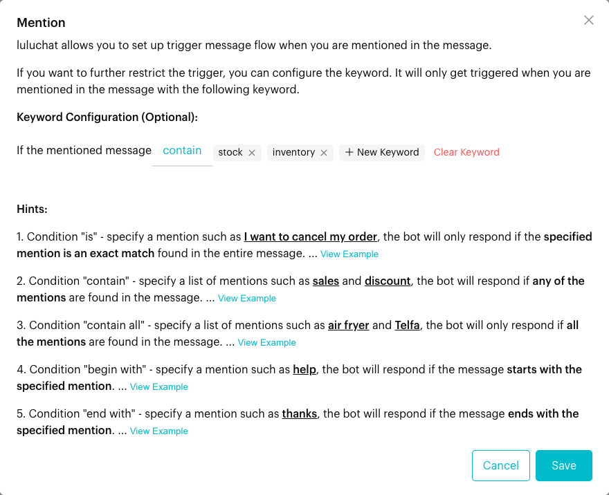<figcaption>
Mention settings
</figcaption></figure>

<figure>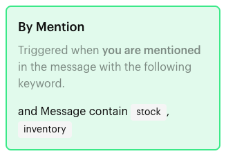<figcaption>
A configured Mention trigger
</figcaption></figure>

**Important behavior to know**:

* Only shown on WhatsApp channels, and only works in group chats.
* Without keywords, any mention starts the flow. If several flows have Mention triggers, flows with keywords are checked first.
* The match conditions work the same way as the [Keyword trigger](#1-keyword-trigger).

***

## What happens after it triggers?

* The step linked to **The First Step** runs right away, then the rest of the flow follows.
* For App Event and Webhook triggers, any data mapping is saved to the contact's custom attributes first.
* For App Event (Shopify) and Webhook triggers, the contact is created if it doesn't exist yet.

## Important behavior to know

* **One flow per message**: When a message arrives, Luluchat checks triggers in this order: **Meta Ad**, **WhatsApp Link**, **Mention**, then **Keyword**. Only one flow starts. If several flows match, only one of them runs.
* **Skipped flows**: A flow does not start if it is turned off, or if the contact doesn't meet its [Flow Settings](../message-flows-editor.md) (such as **Flow Trigger Limitation**). Luluchat then tries the next matching flow.
* **Away hours**: If your [Away Message](../away-flow.md) is on and it's outside working hours, the Away Message replies instead of keyword, link and ad flows, unless you turn on **Skip Away Message for other triggered flows**.
* **Starting Step can't be deleted**, and no step can link into it.
* **Opt-In and Opt-Out flows** only offer the **Keyword** and **Mention** triggers. **Default Message** and **Away Message** flows don't use triggers. They start based on their own rules.
* **Publish to go live**: Trigger changes only take effect after you click **Publish Flow**.

## Common issues & solutions

* **"In Starting Step, the Keyword Trigger is missing keywords."**: Open the **By Keyword** card and add at least one keyword, or delete the card.
* **"In Starting Step, the WhatsApp Link Trigger is missing a message."**: Open the **WhatsApp Link** card and fill in **Message**.
* **"In Starting Step, the Meta Ad Trigger is missing the source ID."**: Open the **Meta Ad** card and paste the ad or post ID.
* **"You can only have one Webhook per Flow."**: The flow already has a Webhook trigger. Use the existing one.
* **"You can only have one Deal Stage trigger per Flow."**: Keep one Deal Stage trigger and select all the stages you need in it.
* **"shopify event: order-paid is already registered in other automation flow."** (the event name changes): Another flow already uses this Shopify event. Remove it from the other flow first.
* **"This flow already has a booking trigger for the event: …"**: Two Booking Event triggers in this flow use the same event for the same calendar. Combine them into one.
* **"The selected deal pipeline no longer exists."** or **"The selected deal stage (…) does not belong to this pipeline."**: Open the **Deal Stage Changed** card and select a current pipeline and stages.
* **Keyword not triggering**: Check the match condition. **is** needs the whole message to match. Also check that the flow is turned on, published, and that it isn't outside working hours (see **Away hours** above).
* **WhatsApp Link not starting the flow**: The customer must send the pre-filled message without changing it.
* **Deal Stage, Booking Event or Mention button missing**: Deal Stage and Booking Event need the Deals or Bookings module. Mention is only shown on WhatsApp channels.
* **Webhook not received**: Use POST (not GET), include `contact_number`, and check the URL. Click **Check our logs** on the card to see what Luluchat received.

## Best practice 💡

* **Use specific keywords**: "cancel order" is safer than "cancel", which may match unrelated messages.
* **Give each flow its own keywords**: Avoid using the same keyword in several flows, so customers always get the right one.
* **Combine triggers**: Use a Keyword and a WhatsApp Link in the same flow to reach customers from chat and from your social pages.
* **Test after publishing**: Send your keyword or open your link from a test phone before sharing it widely.
* **Name links clearly**: Use labels like "Instagram Bio Link" or "Table QR – Bangsar" so you can compare them later.

## Related Documentation

* [Starting & Complete Steps](index.md)
* [Complete](complete.md)
* [Keywords](../keywords.md)
* [Growth Tools](../growth-tools.md)
* [Shopify App Event Trigger](../shopify-app-event-trigger.md)
* [Webhook Trigger Developer Guide](../../developer-guide/webhook-trigger.md)
* [Message Flow Editor](../message-flows-editor.md)
* [Away Message](../away-flow.md)
