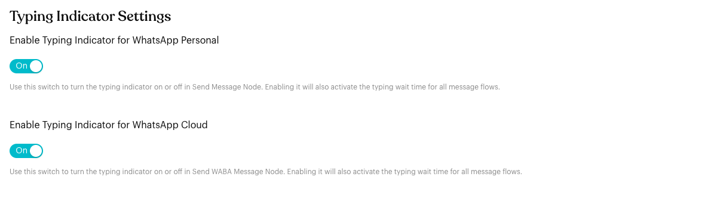
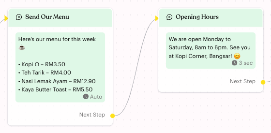
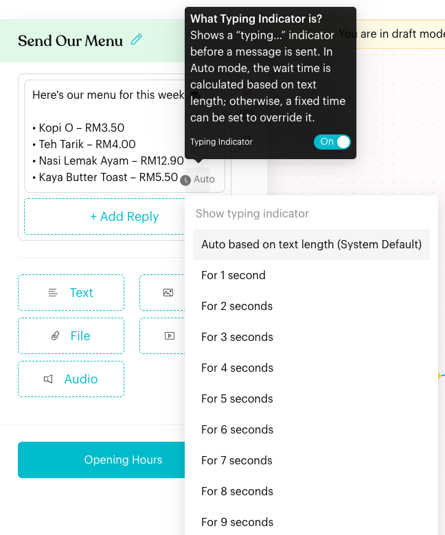

# Typing Indicator

## What is Typing Indicator?

The **Typing Indicator** shows a "typing…" status in WhatsApp before an automated message is sent, so the reply feels like it comes from a real person.

In the app it is described as: "Shows a "typing…" indicator before a message is sent. In Auto mode, the wait time is calculated based on text length; otherwise, a fixed time can be set to override it."

You control it in two places:

* **Settings** > **Tools** > **Message Flows**: Turn the typing indicator on or off for your team.
* **The Message step in the flow editor**: Choose how long the typing indicator shows for each text, image or file block.

## When does it trigger?

* When a flow sends a **Message** step on a WhatsApp Personal or WhatsApp Cloud channel.
* Only when the typing indicator is turned on in **Settings** > **Tools** > **Message Flows**.
* It shows before each text, image or file block, for the wait time set on that block.

## How to set it up (Step by Step)



#### Turn on the typing indicator

Go to **Settings** > **Tools** > **Message Flows**. Under **Typing Indicator Settings**, turn on:

* **Enable Typing Indicator for WhatsApp Personal**: For the Send Message step.
* **Enable Typing Indicator for WhatsApp Cloud**: For the Send WABA Message step.

Click **Save**. You see "Message Flow settings have been updated."

<figure><figcaption>
Typing Indicator Settings
</figcaption></figure>



#### Open a Message step

Go to **Automations** > **Message Flows**, open a flow and click **Edit Flow**. Click a **Message** step to open its settings.

Each text, image or file block shows a clock with its current wait time: **Auto** or a number of seconds (for example **3 sec**). You see the same label on the step on the board.

<figure><figcaption>
Typing wait time shown on message steps
</figcaption></figure>



#### Choose the wait time

Hover over the clock in the block. Under **Show typing indicator**, choose:

* **Auto based on text length (System Default)**: Luluchat works out the wait time from the length of the text.
* **For 1 second** to **For 15 seconds**: A fixed wait time.

The tooltip above the list also has a **Typing Indicator** switch, so you can turn the team setting on or off without leaving the editor. You see "Typing indicator setting has been updated."

<figure><figcaption>
Choose the typing wait time
</figcaption></figure>



#### Publish the flow

Click **Publish Flow** so contacts get the new timing.



## What happens after it triggers?

1. The contact sees "typing…" in WhatsApp.
2. Luluchat waits for the block's wait time (**Auto** or the seconds you chose).
3. The message is sent.

## Important behavior to know

* **Team-wide switch**: The switches in **Settings** > **Tools** > **Message Flows** (and the switch in the editor tooltip) apply to all message flows in your team.
* **Per block**: Each text, image or file block has its own wait time. New blocks start on **Auto**.
* **WhatsApp channels only**: The clock only appears on WhatsApp Personal and WhatsApp Cloud channels.
* **Greyed-out clock**: If the typing indicator is off, the clock is grey and you can't choose a time. Hover over it and turn on the **Typing Indicator** switch.
* **Which switch the editor uses**: In the flow editor, the clock on Message steps follows **Enable Typing Indicator for WhatsApp Personal**.

## Common issues & solutions

* **The clock is grey**: The typing indicator is off. Turn it on in **Settings** > **Tools** > **Message Flows**, or with the **Typing Indicator** switch in the clock's tooltip.
* **No clock at all**: Your current channel isn't a WhatsApp Personal or WhatsApp Cloud channel.
* **Contacts don't see "typing…"**: Check that the setting is on, that you published the flow after changing the wait time, and that the flow is switched **On**.
* **Replies feel slow**: Choose a shorter fixed time (for example **For 2 seconds**) instead of **Auto** for long messages.

## Best practice 💡

* Leave most blocks on **Auto**; it adjusts to the length of each message.
* Use short fixed times (2–3 seconds) for quick replies such as "Thanks! 😊".
* Test the flow on your own phone to check the pacing feels natural.

## Related Documentation

* [Message](content-nodes/message.md)
* [Message Flows Settings](../settings/tools/message-flows.md)
* [Message Flow Editor](message-flows-editor.md)
* [Message Flows](message-flows.md)
