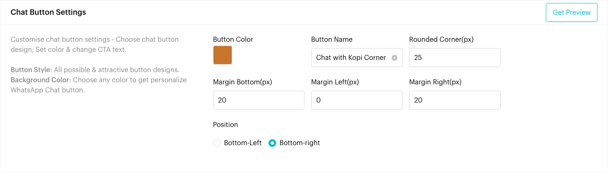
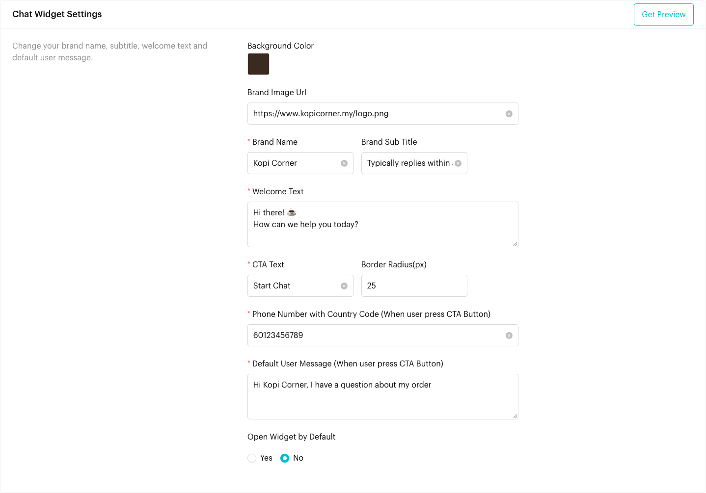
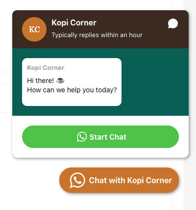
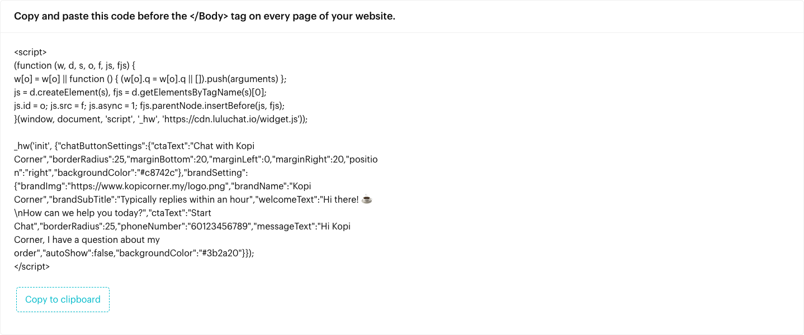

# Web Widget

## What is Web Widget?

The **Web Widget** adds a WhatsApp chat button to your website. When a visitor clicks the button, a small chat window opens with your brand name, logo and a welcome message. When they click the call-to-action button in that window, WhatsApp opens a chat with your number and a message already typed in.

You design the button and chat window on the **Web Widget** page, then click **Generate Widget Code** and paste the code into your website.

## When to use it?

* **Website enquiries**: Let visitors message you on WhatsApp instead of filling in a contact form.
* **Online store**: Answer product and delivery questions while customers are shopping.
* **Bookings**: Let visitors ask about availability with one click.

## How to set it up (Step by Step)



#### Open Web Widget

Go to **Automations** > **Web Widget**. The page is called **Generate WhatsApp Live Chat Widget** and has two sections: **Chat Button Settings** and **Chat Widget Settings**.



#### Design the chat button

Under **Chat Button Settings**, set how the floating button looks:

* **Button Color**: Click the colour box and pick a colour.
* **Button Name**: The text on the button, for example "Chat with Kopi Corner".
* **Rounded Corner(px)**: How rounded the button corners are.
* **Margin Bottom(px)**, **Margin Left(px)**, **Margin Right(px)**: The space between the button and the edge of the page.
* **Position**: **Bottom-Left** or **Bottom-right**.

<figure><figcaption>
Chat Button Settings
</figcaption></figure>



#### Set up the chat window

Under **Chat Widget Settings**, set what visitors see after clicking the button:

* **Background Color**: The colour of the chat window header.
* **Brand Image Url**: A link to your logo image, for example `https://www.yourwebsite.com/logo.png`.
* **Brand Name** (required) and **Brand Sub Title**, for example "Kopi Corner" and "Typically replies within an hour".
* **Welcome Text** (required): The greeting shown in the chat window.
* **CTA Text** (required) and **Border Radius(px)**: The text and corner rounding of the button inside the chat window, for example "Start Chat".
* **Phone Number with Country Code (When user press CTA Button)** (required): The WhatsApp number visitors will chat with, for example `60123456789`.
* **Default User Message (When user press CTA Button)** (required): The message typed in for the visitor when WhatsApp opens.
* **Open Widget by Default**: **Yes** opens the chat window automatically when the page loads. **No** shows only the button until the visitor clicks it.

<figure><figcaption>
Chat Widget Settings
</figcaption></figure>



#### Preview it

Click **Get Preview** in either section. The widget appears in the bottom corner of the Web Widget page itself, using your current settings. Click the button to open the chat window and check how it looks.

<figure><figcaption>
Preview of the button and chat window
</figcaption></figure>



#### Generate the code

Click **Generate Widget Code**. Your settings are saved ("Widget setting updated.") and a code box appears below the form: "Copy and paste this code before the &lt;/Body&gt; tag on every page of your website."

Click **Copy to clipboard**.

<figure> tag on every page of your website, showing a script that loads https://cdn.luluchat.io/widget.js and calls _hw('init') with the widget settings, and a Copy to clipboard button"><figcaption>
The widget code
</figcaption></figure>



#### Add the code to your website

Paste the code just before the closing `</body>` tag on every page where you want the widget. Many website builders have a "custom code" or "footer code" setting for this. Publish your website and open it to check that the button appears.



## What happens after a visitor clicks?

1. The chat window opens with your brand, welcome text and CTA button.
2. When the visitor clicks the CTA button, WhatsApp (app or web) opens a chat with your phone number, with the **Default User Message** already typed in.
3. When the visitor sends the message, it arrives in your Luluchat Inbox like any other WhatsApp message. If the message matches a [keyword](keywords.md), that Message Flow starts.

## Important behavior to know

* **Your settings are inside the code**: The generated code contains all your settings. After you change anything, click **Generate Widget Code** again and replace the old code on your website.
* **Every page needs the code**: The widget only appears on pages where the code is added.
* **Settings are saved when you generate the code**: **Get Preview** only previews your changes. They are saved when you click **Generate Widget Code**.
* **Open by default**: With **Open Widget by Default** set to **Yes**, the chat window opens on every page load, which can cover part of your page.
* **Phone number format**: Enter the number with the country code and digits only, such as `60123456789`, without `+`, spaces or dashes.
* **Logo**: **Brand Image Url** must be a public link to an image, such as a logo already on your website.

## Common issues & solutions

* **"Please enter your Brand Name"**, **"Please enter your Welcome Text"**, **"Please enter your CTA Text"**, **"Please enter your Phone Number with Country Code"** or **"Please enter your Default User Message"**: Fill in the required field, then click **Generate Widget Code** again.
* **The widget doesn't show on my website**: Check that the code is pasted before `</body>` on that page, that the website was published, and clear your browser or website cache.
* **The widget shows old settings**: Generate the code again and replace the old code on your website.
* **WhatsApp opens the wrong number**: Fix **Phone Number with Country Code**, generate the code again and replace it on your website.
* **The logo doesn't appear**: Open the **Brand Image Url** in your browser to check that it loads.
* **The button covers other content**: Change **Position** or the margins, then preview again.

## Best practice 💡

* Match the button and header colours to your website.
* Keep the welcome text and default message short, and make the default message tell you where the visitor came from, for example "Hi Kopi Corner, I have a question about my order".
* Set up a [keyword](keywords.md) that matches the default message, so visitors get an instant reply.
* Test the widget on both desktop and mobile.

## Related Documentation

* [Keywords](keywords.md)
* [Growth Tools](growth-tools.md)
* [Message Flows](message-flows.md)
