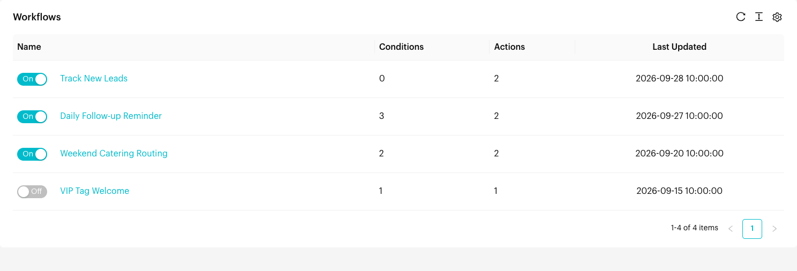
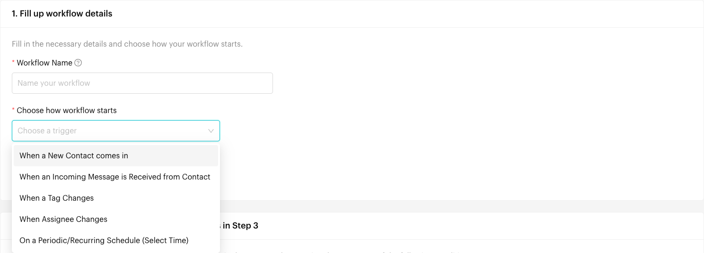
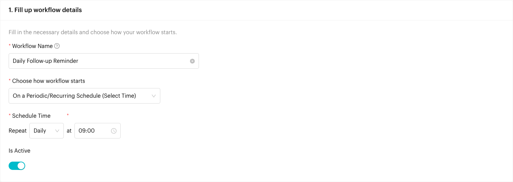
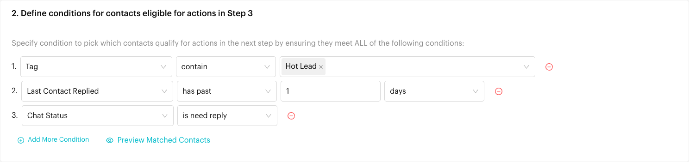
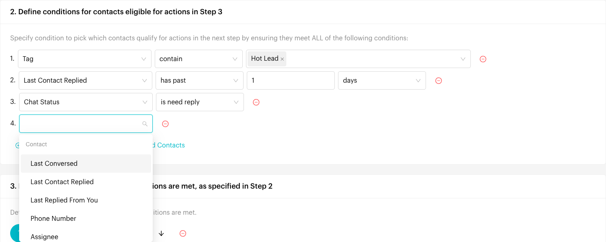
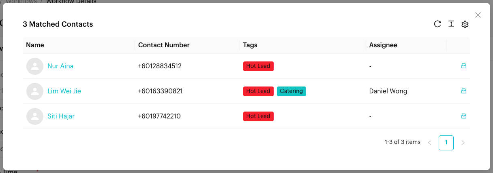
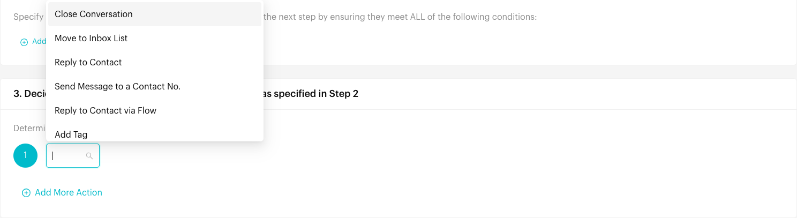
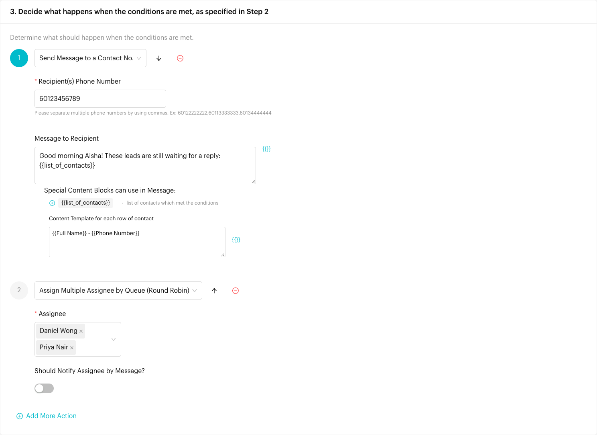
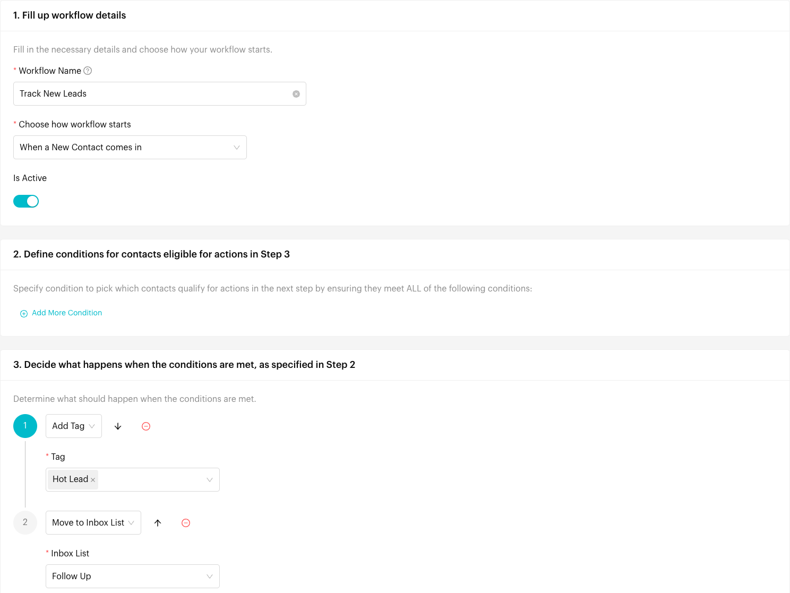

# Workflows

## What is Workflows?

A **Workflow** runs a list of actions automatically, such as adding a tag, assigning a chat, moving it to an inbox list or sending a message. Each workflow has three parts:

1. **How it starts**: When something happens (a new contact, an incoming message, a tag or assignee change), or on a schedule (hourly, daily, weekly or monthly).
2. **Conditions**: Which contacts qualify. A contact must meet **all** of the conditions.
3. **Actions**: What happens to the contacts that qualify, in the order you set.

Unlike a Message Flow, a workflow doesn't hold a conversation with the customer. It is best for routing, tagging, follow-up reminders and other work your team would otherwise do by hand.

## When does it trigger?

A workflow only runs while it is switched **On**. It starts in one of these ways (**Choose how workflow starts**):

| Option | When it runs |
| --- | --- |
| **When a New Contact comes in** | A new contact messages your channel for the first time. |
| **When an Incoming Message is Received from Contact** | A contact sends you a message. |
| **When a Tag Changes** | A tag is added to or removed from a contact. |
| **When Assignee Changes** | A chat's assignee changes. |
| **On a Periodic/Recurring Schedule (Select Time)** | On the schedule you set. Each time, it finds every contact that meets the conditions and runs the actions for them. |

For the first four options, the workflow checks the conditions for the contact involved. The actions only run if that contact meets all of them.

## How to set it up (Step by Step)



#### Open Workflows

Go to **Automations** > **Workflows**. The list shows each workflow's **Name** with its **On**/**Off** switch, the number of **Conditions** and **Actions**, and when it was **Last Updated**.

Click **Create Workflow** to make a new one, or click a workflow's name to edit it.

<figure><figcaption>
The Workflows list
</figcaption></figure>



#### Fill up workflow details

In **1. Fill up workflow details**:

* **Workflow Name** (required): A name for your team, for example "Daily Follow-up Reminder".
* **Choose how workflow starts** (required): Pick one of the options in the table above.
* **Is Active**: On by default. Turn it off to save the workflow without running it.

<figure><figcaption>
Choose how the workflow starts
</figcaption></figure>



#### Set the schedule (periodic workflows only)

If you chose **On a Periodic/Recurring Schedule (Select Time)**, a **Schedule Time** row appears. Pick how often to **Repeat**:

* **Hourly**: **at every** _minute(s)_ **minutes** past the hour. You can pick several (0, 5, 10 … 55).
* **Daily**: **at** a time.
* **Weekly**: **on** one or more days, **at** a time.
* **Monthly**: **on** one or more dates (1st to 31st) **of the month**, **at** a time.

<figure><figcaption>
A daily schedule at 9:00
</figcaption></figure>



#### Add conditions

In **2. Define conditions for contacts eligible for actions in Step 3**, click **Add More Condition**. For each condition, pick a field, an operator and a value. Contacts must meet **ALL** of the conditions. Click the red minus icon to remove a condition.

<figure><figcaption>
Three conditions: all must be met
</figcaption></figure>

The fields are grouped like this:

| Group | Fields | Operators |
| --- | --- | --- |
| **Contact** | **Last Conversed**, **Last Contact Replied**, **Last Replied From You** | **in upcoming**, **in last**, **has past** (a number of minutes, hours or days), **in between**, **in between time**, **is before**, **is before time**, **is after**, **is after time**, **is**, **is on** (days of the week), **is unknown**, **is known** |
| | **Phone Number** | **is**, **is not**, **contain**, **doest not contain**, **starts with** |
| | **Assignee** | **is**, **is assigned**, **is unassigned** |
| | **Collaborator** | **include**, **include all**, **does not include**, **does not include all**, **is known**, **is none** |
| **Tag** | **Tag** | **contain**, **does not contain**, **contain all** |
| **Event Time** | **Occurrence Time** (when the workflow runs) | Same as **Last Conversed** |
| | **Occurrence Date** (the day the workflow runs) | **is today**, **in upcoming**, **in last**, **has past**, **in between**, **is before**, **is after**, **is**, **is on**, **is unknown**, **is known** |
| **Conversation** | **Last Assignee** | **is**, **is assigned**, **is unassigned** |
| | **Last List** | **is**, **in**, **is assigned**, **is unassigned** |
| | **Time assigned**, **Time of Responsed after assigned**, **Time of Conversation Opened**, **Time of First Response**, **Time of List Assigned**, **Time of Conversation Closed** | Same as **Last Conversed** |
| **Chat** | **Chat Status** | **is need reply**, **is awaiting reply** |
| **Deals** (one field per deal pipeline) | _Pipeline name_ | **is** (one stage), **in** (several stages) |
| **Custom Attributes** (one field per attribute) | _Attribute name_ | Depends on the attribute type: text (**is**, **is not**, **contain**, **doest not contain**, **starts with**), number (**is equal to**, **is not equal to**, **greater than**, **lesser than**) or date and time (as above) |

**Deals** only appears if your plan includes Deals and you have at least one pipeline. **Custom Attributes** only appears if you have created custom attributes. Use **Occurrence Date** with **is on** to run a workflow only on certain days, for example **Saturday** and **Sunday**.

<figure><figcaption>
Pick a field for the condition
</figcaption></figure>



#### Preview matched contacts (optional)

Click **Preview Matched Contacts** to see which contacts meet your conditions right now. The window shows the number of matched contacts and, for each one, the **Name**, **Contact Number**, **Tags** and **Assignee**. Click a name to open the contact's details, or the inbox icon (**Go to Inbox**) to open the chat in a new tab.

<figure><figcaption>
Contacts that meet the conditions now
</figcaption></figure>



#### Add actions

In **3. Decide what happens when the conditions are met, as specified in Step 2**, click **Add More Action** and pick an action. Fill in its fields. Use the arrow icons (**Move Up** / **Move Down**) to change the order, and the red minus icon to remove an action. Actions run in the order shown.

<figure><figcaption>
Pick an action
</figcaption></figure>

| Action | What it does | Fields |
| --- | --- | --- |
| **Close Conversation** | Closes the conversation. | None |
| **Move to Inbox List** | Moves the chat to one of your [custom lists](../inbox/custom-lists.md). | **Inbox List** |
| **Reply to Contact** | Sends a message to the contact. | **Message to Contact** |
| **Send Message to a Contact No.** | Sends a message to one or more phone numbers, such as your own, for example a daily summary. | **Recipient(s) Phone Number** (separate several numbers with commas), **Message to Recipient** |
| **Reply to Contact via Flow** | Sends a Message Flow to the contact. | **Message Flow** |
| **Add Tag** / **Remove Tag** | Adds or removes tags on the contact. | **Tag** |
| **Unassign Existing Assignee** | Removes the chat's assignee. | None |
| **Assign Assignee** | Assigns the chat to one team member. | **Assignee**, **Should Notify Assignee by Message?** |
| **Remove Assignee** | Removes the assignee if it is a specific person, or any assignee. | **Assignee** (a person or **Any assignee**) |
| **Add Collaborators** | Adds team members as collaborators. | **Collaborators**, **Should Notify Collaborators by Message?** |
| **Remove Collaborators** | Removes specific collaborators, or all of them. | **Collaborators** (people or **All collaborators**) |
| **Assign Multiple Assignee by Queue (Round Robin)** | Shares chats between several team members in turn. | **Assignee** (several), **Should Notify Assignee by Message?** |
| **Send Broadcast** | Sends a Message Flow as a broadcast to the contacts. | **Message Flow**, **Archive contacts after broadcast?** |
| **Add to Deal Stage** | Creates a deal in a pipeline stage. | **Deal Pipeline**, **Stage**, **Deal Owner**, **Tag** |
| **Update Deal Stage** | Moves the contact's deal to another stage. Skipped if the contact has no deal. | **Deal Pipeline**, **Stage** |

**Send Broadcast** only appears if your plan includes Broadcasts. **Add to Deal Stage** and **Update Deal Stage** only appear if your plan includes Deals.

In message fields, click **{{}}** to insert contact details such as the contact's name. When **Should Notify Assignee by Message?** is on, a **Message to Assignee** field appears.

In **Send Message to a Contact No.**, you can add the special block **{{list_of_contacts}}** (a list of contacts which met the conditions). Use **Content Template for each row of contact** to set what each line shows, for example `{{Full Name}} - {{Phone Number}}`.

<figure><figcaption>
A daily summary message, then round-robin assignment
</figcaption></figure>



#### Save and switch it on

Click **Submit**. You see "Workflow "_name_" created successfully." (or "Workflow "_name_" updated successfully.") and return to the list.

To pause or resume a workflow, use its **On**/**Off** switch in the list. You see "Workflow activated." or "Workflow deactivated.".



## What happens after it triggers?

* For **event-based** workflows, the actions run for the contact involved, if that contact meets all the conditions.
* For **periodic** workflows, each time the schedule runs, the actions run for every contact that meets the conditions at that moment.
* Actions run in the order shown in step 3.

## Important behavior to know

* **Off means nothing runs**: A workflow with **Is Active** off (or switched **Off** in the list) doesn't run.
* **ALL conditions must be met**: There is no "any of" option. To handle different cases, create separate workflows.
* **No conditions**: An event-based workflow with no conditions runs for every contact that triggers it. A periodic workflow needs at least one condition to pick contacts.
* **Each action once**: Each action type can only be used once per workflow, except **Send Message to a Contact No.**, which you can add several times.
* **Inactive flows can't be picked**: In **Message Flow**, inactive flows are marked **[INACTIVE]** and can't be selected.
* **Changing a field resets the condition**: If you change a condition's field, its operator and value are cleared.
* **Workflow limit**: Your plan may limit how many workflows you can create.

## Example: Tracking New Leads

When a new contact messages your WhatsApp number for the first time, tag them as a lead and move them to a "Follow Up" list so your team can find them easily.



#### Set the trigger

Click **Create Workflow**. Enter **Workflow Name** "Track New Leads" and, in **Choose how workflow starts**, select **When a New Contact comes in**. Leave the conditions empty, so it runs for every new contact.



#### Add the actions

1. Click **Add More Action**, select **Add Tag** and choose the "Hot Lead" tag.
2. Click **Add More Action** again, select **Move to Inbox List** and choose your "Follow Up" list.

<figure><figcaption>
The Track New Leads workflow
</figcaption></figure>



#### Save and check

Click **Submit**. Make sure the workflow is **On** in the list. From now on, every new contact is tagged "Hot Lead" and moved to "Follow Up" as soon as they message you.



Other ideas:

* **Daily follow-up reminder**: Periodic, daily at 9:00. Conditions: **Tag** contain "Hot Lead", **Last Contact Replied** has past 1 days, **Chat Status** is need reply. Action: **Send Message to a Contact No.** to your own number with **{{list_of_contacts}}**.
* **Weekend routing**: When an Incoming Message is Received from Contact. Conditions: **Tag** contain "Catering", **Occurrence Date** is on Saturday and Sunday. Actions: **Assign Assignee** and **Move to Inbox List**.

## Common issues & solutions

* **"Please input Workflow Name."** or **"Please select Trigger Type."**: Fill in the required fields in step 1.
* **"Please select a interval"**, **"Please select a day"**, **"Please select a date"**, **"Please select a minute"** or **"Please select a time"**: Finish the **Schedule Time** settings for a periodic workflow.
* **"Please select"**, **"Please select a tag"** or another "Please select…" / "Please enter…" message under a condition or action: That condition or action is missing a value.
* **"Duplicated actions"**: The same action type was added twice. Remove one. Only **Send Message to a Contact No.** can be used more than once.
* **"Sorry, your team has reached the maximum workflow limit."**: Delete or reuse an existing workflow, or upgrade your plan.
* **Nothing happened**: Check that the workflow is **On**, that the event really happened on this channel, and use **Preview Matched Contacts** to check that the contact meets all the conditions.
* **A periodic workflow didn't pick anyone**: Add at least one condition, and check the schedule time.

## Best practice 💡

* Name workflows by purpose and trigger, for example "Daily Follow-up Reminder".
* Start with narrow conditions and use **Preview Matched Contacts** before switching a workflow on.
* Use **Send Message to a Contact No.** with **{{list_of_contacts}}** to send your team a daily summary.
* Combine tags and inbox lists to keep leads organised.
* Switch off workflows you no longer need instead of leaving them running.

## Related Documentation

* [Custom Lists](../inbox/custom-lists.md)
* [Tags](../settings/data/tags.md)
* [Custom Attributes](../settings/data/custom-attributes.md)
* [Message Flows](message-flows.md)
* [Broadcasts](../broadcasts.md)
* [Deals](../deals/index.md)
