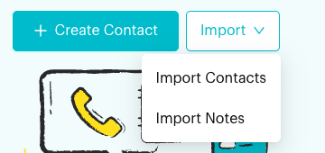
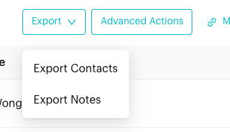
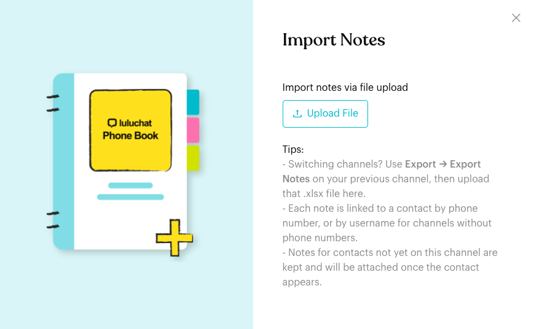

# Import & Export

## What is Import & Export?

On the **Contacts** page you can move data in and out of Luluchat with a spreadsheet:

* **Import Contacts**: Add many contacts at once, or update existing ones.
* **Export Contacts**: Download your contact list.
* **Export Notes**: Download every note on the current channel.
* **Import Notes**: Upload notes from a notes export, for example to bring them over from another channel.

The **Import** button is at the top of the Contacts page. The **Export** button is above the contacts table.

## When to use it?

* **Moving to Luluchat**: Import your customer list from another system.
* **Batch updates**: Export contacts, change tags, names or custom attributes in the file, then import it back.
* **Reports and backups**: Export contacts or notes to keep a copy or use them in another tool.
* **Switching channels**: When a customer moves to a new channel (for example a new WhatsApp number), export the notes from the old channel and import them into the new one. Your team keeps the history of what was noted about each customer.

## How to set it up (Step by Step)

### Import contacts



#### Open Import Contacts

On the **Contacts** page, click **Import**, then **Import Contacts**.

<figure><figcaption>
The Import menu
</figcaption></figure>


**Import Contacts** isn't available on Messenger and Instagram channels. **Import Notes** is.




#### Download the template

Click **Download Template** to get a CSV file in the right format. Fill in your contacts (name, phone number, tags and so on).

* **Tags**: Separate several tags with commas, for example `VIP, Customer, Newsletter`. Tags that don't exist yet are created for you.
* **Phone numbers**: Always include the country code, for example `60123456789`.
* **Mandarin or other non-English text**: Save the file as **CSV UTF-8**.



#### Upload the file

Click **Upload File** and choose your file. The import starts as soon as the file is uploaded and runs in the background. A **Contacts Import in Progress** message appears, and you get a notification when it's done.



### Export contacts



#### Filter the list (optional)

Use the filters above the table (for example a tag) if you only want some of your contacts.



#### Export

Click **Export**, then **Export Contacts**. An Excel file with your contacts downloads.

<figure><figcaption>
The Export menu
</figcaption></figure>



### Export notes

Click **Export**, then **Export Notes**. An Excel file (`.xlsx`) with all notes on the current channel downloads. It has these columns:

| Column | What it contains |
| --- | --- |
| **Phone** | The contact's phone number. |
| **Username** | The contact's username, for channels without phone numbers (Messenger, Instagram). |
| **Contact Name** | The contact's name. |
| **Note** | The note text. |
| **Commented By** | The team member (or system, such as **Automation**) who wrote the note. |
| **Is Pinned** | **Yes** or **No**. |
| **Pinned Time** | When the note was pinned. |
| **Created At** | When the note was written. |

Times are in your team's time zone.

### Import notes



#### Export the notes you want to bring over

Switch to the channel that has the notes (see [Switch Team and Channel](../switch-team-channel.md)), then click **Export > Export Notes**.



#### Switch to the channel you are importing into

Switch to the new channel and open the **Contacts** page.



#### Upload the file

Click **Import > Import Notes**, then **Upload File**, and choose the `.xlsx` file you exported. The file can be up to 2 MB.

<figure><figcaption>
The Import Notes window
</figcaption></figure>

A **Notes Import in Progress** message appears. The import runs in the background, and you get a notification when it's done.



#### Check the result

Open **Notifications** (the bell icon). If every row was imported, the notification says so. If some rows failed, the notification has a **Download file** button. The result file lists each row with its status (**Created**, **Skipped** or **Failed**) and the reason. It's available for 24 hours.



## What happens after it triggers?

* **Contacts import**: New contacts are added. Contacts that already exist (same phone number) are updated with the data in your file.
* **Notes import**: Each note is added to the matching contact on the current channel, keeping its author, its original date, and whether it was pinned. The notes appear in the chat and in the contact's [Notes](../inbox/contact-info/notes.md).

## Important behavior to know

* **How notes find their contact**: A note is matched by **Phone** first. If there's no phone number, it's matched by **Username** (for Messenger and Instagram contacts).
* **Notes for contacts who aren't on the channel yet**:
  * With a phone number, the note is saved for that number and appears once the contact is on this channel.
  * With only a username, the note is held and attached automatically once a contact with that username appears.
* **No duplicates**: A note with the same contact, text and **Created At** as an existing note is skipped. Importing the same file twice won't create copies.
* **Commented By must be a team member**: The name must match the full name of someone on your team (capital letters don't matter), or a system author such as **Automation**, **Workflow**, **Broadcast**, **Form** or **AI Agent**.
* **Use an export as your file**: The file must have all eight columns from **Export Notes**. Notes longer than 1,000 characters aren't imported.
* **Held notes aren't exported**: **Export Notes** only includes notes that are attached to a contact.
* **Background processing**: Imports run in the background, and larger files take longer. You can keep using Luluchat while they run.

## Common issues & solutions

* **"This file is not a note import template. Required column "…" not found."**: Your file is missing a column. Start from an **Export Notes** file and don't rename or delete its columns.
* **"The import file could not be read. Please upload a valid CSV or XLSX file."**: Re-export the notes and upload the new `.xlsx` file without converting it.
* **A row failed with "Commented By "…" is not a user of this team"**: The person who wrote the note isn't on this team, or their name is spelled differently. Add them to the team or change the name in the file to a current team member.
* **A row failed with "No phone and no username - the contact cannot be matched on this channel"**: Add the contact's phone number or username to that row.
* **A row failed with "Created At is missing or not a valid date"**: Keep the date format from the export (for example `2026-09-30 14:05:00`).
* **A row was skipped with "Note already exists"**: The note was imported before. Nothing to do.
* **I can't see the Export button**: Exporting needs the contact export permission. Ask your team owner.

## Best practice 💡

* When you move to a new channel, import your contacts first, then the notes, so most notes attach straight away.
* If the new channel is in a different team, add the note authors to that team first (with the same names), so **Commented By** matches.
* Download the result file soon after a notes import that had errors. It expires after 24 hours.
* Export your notes before clearing or disconnecting a channel, to keep a copy.

## Related Documentation

* [Contacts](index.md)
* [Bulk Updates & Actions](bulk-actions.md)
* [Notes](../inbox/contact-info/notes.md)
* [Switch Team and Channel](../switch-team-channel.md)
