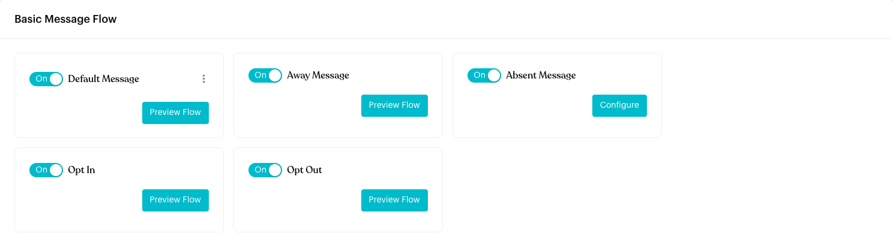
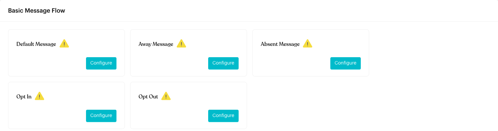

# Fallback & Consent Flows

## What are Fallback & Consent Flows?

Fallback and consent flows are five built-in flows that every channel can have. You find them at the top of **Automations** > **Message Flows**, under **Basic Message Flow**:

| Card | What it does | Page |
| --- | --- | --- |
| **Default Message** | Replies when a contact's message doesn't match any keyword. | [Default Flow](../../../../automations/default-flow.md) |
| **Away Message** | Replies when a message arrives outside your working hours (or during a period, or from contacts with certain tags or in a list). | [Away Flow](../../../../automations/away-flow.md) |
| **Absent Message** | Replies with a message and a numbered list of flows when Luluchat can't read a message because of WhatsApp end-to-end encryption. | [Absent Flow](../../../../automations/absent-flow.md) |
| **Opt In** | Subscribes a contact to promotional messages when they send the opt-in keyword (`OPT_IN` by default). | [Opt-In Flow](../../../../automations/opt-in-flow.md) |
| **Opt Out** | Unsubscribes a contact from promotional messages when they send the opt-out keyword (`OPT_OUT` by default). | [Opt-Out Flow](../../../../automations/opt-out-flow.md) |

<figure><figcaption>
The Basic Message Flow cards
</figcaption></figure>

## When to use it?

* **Default Message**: Always. It makes sure every contact gets a reply.
* **Away Message**: When you don't reply around the clock and want contacts to know when you're back.
* **Absent Message**: On WhatsApp channels, to give contacts a way forward when their message can't be read yet.
* **Opt In** and **Opt Out**: When you send promotions and want contacts to subscribe or unsubscribe themselves.

## How to set it up (Step by Step)



#### Find the cards

Go to **Automations** > **Message Flows**. A card that isn't set up yet shows a warning sign (tooltip: "Please configure this flow") and a **Configure** button.

<figure><figcaption>
Cards that aren't set up yet
</figcaption></figure>



#### Click Configure

Click **Configure** on the card. A window explains how the flow works.

* For **Default Message**, **Away Message**, **Opt In** and **Opt Out**, click **Create**. The flow opens in the editor in draft mode with a ready-made message.
* For **Absent Message**, fill in the message and options in the window and click **Save changes**.



#### Edit and publish

Change the message to suit your business, then click **Publish Flow**. For the Away Message, set your working hours first.



#### Turn it on or off

Use the switch on the card. Click **Preview Flow** to open a flow again later.



## What happens after it triggers?

The contact receives the flow's messages and actions, just like any other flow. The Opt In and Opt Out flows also update the contact's subscription status.

## Important behavior to know

* **One of each per channel**: Each channel has at most one of each of these flows.
* **They can't be deleted**: There is no delete option on these cards. Switch a card **Off** to stop it.
* **Fewer editor options**: The Default and Away flows have no triggers on the **Starting Step**. The Opt In and Opt Out flows have a fixed set of steps. See each page for details.

## Common issues & solutions

* **The card still shows "Configure"**: The flow hasn't been created yet. Click **Configure** and then **Create** (or **Save changes** for the Absent Message).
* **A flow doesn't reply**: Check that its card is switched **On** and that you published the flow.

## Best practice 💡

* Set up the **Default Message** and **Away Message** as soon as your channel is connected.
* Keep these messages short and give one clear next step, such as "Reply MENU to see our menu".

## Related Documentation

* [Default Flow](../../../../automations/default-flow.md)
* [Away Flow](../../../../automations/away-flow.md)
* [Absent Flow](../../../../automations/absent-flow.md)
* [Opt-In Flow](../../../../automations/opt-in-flow.md)
* [Opt-Out Flow](../../../../automations/opt-out-flow.md)
* [Message Flows](../../../../automations/message-flows.md)
